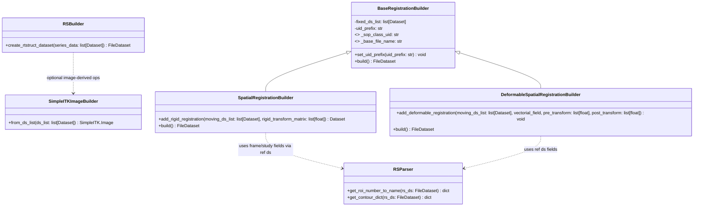

# pydicomRT Architecture

This document provides an overview of pydicomRT’s modules, data flows, key components, and recommended extension points. It is intended to help developers quickly understand how to use and extend the library.

---

## Goals and Design Principles

- Clear APIs: concise, intuitive tools to build/parse RTSTRUCT and REG.
- Interoperability: seamless with `pydicom`, `numpy`, and `SimpleITK` for common medical imaging tasks.
- Extensibility: modular packages (`rs`, `reg`, `dose`, `ct`, `utils`) to enable easy replacement and extension.

---

## Layout and Modules

- `src/pydicomrt/rs`: RT Structure related functionality
  - `builder.py`: create RTSTRUCT `FileDataset`
  - `add_new_roi.py`: add new ROI definitions
  - `make_contour_sequence.py`: generate contour sequences from 3D masks
  - `parser.py`: parse RTSTRUCT, including ROI and contour info
  - `checker.py`: basic IOD validation
  - `rs_to_volume.py`: convert between RTSTRUCT and volumetric masks
  - `rs_ds_iod.py`: RTSTRUCT IOD field definitions

- `src/pydicomrt/reg`: Spatial/Deformable Registration
  - `builder.py`: build DICOM Spatial REG (rigid/affine) and Deformable REG (DVF) datasets
  - `parser.py`: parse REG datasets (matrix and grid fields)
  - `check.py`: IOD checks for REG
  - `method/`: SimpleITK-based registration implementations
    - `rigid.py`: rigid registration
    - `bspline.py`: B-spline registration
    - `demons.py`, `soft_demons.py`: demons-based deformable registration
  - `ds_reg_ds_iod.py`, `s_reg_ds_iod.py`: deformable/spatial REG IOD definitions
  - `type_transform.py`: type transformations/utilities

- `src/pydicomrt/dose`: dose data
  - `builder.py`: create Dose `FileDataset`
  - `dose_ds_iod.py`: Dose IOD definitions

- `src/pydicomrt/ct`
  - `ct_ds_iod.py`: CT IOD definitions

- `src/pydicomrt/utils`: utilities
  - `image_series_loader.py`: load and sort DICOM image series
  - `coordinate_transform.py`: coordinate transforms (pixel/patient)
  - `sitk_transform.py`: SimpleITK conversions and resampling helpers
  - `validate_dcm_info.py`: DICOM metadata checks

---

## Data Flows and Typical Workflows

### 1) RTSTRUCT creation and parsing

1. Load CT image series (`Dataset` list) using `utils/image_series_loader.py`.
2. Create an RTSTRUCT with `rs/builder.py:create_rtstruct_dataset`.
3. Optionally add an ROI using `rs/add_new_roi.py:create_roi_into_rs_ds`.
4. Convert a 3D mask to contour sequences via `rs/make_contour_sequence.py:add_contour_sequence_from_mask3d`.
5. Save with `FileDataset.save_as(...)`; parse back with `rs/parser.py`.

Direction: Volume (3D mask) ↔ Contours (RTSTRUCT)

### 2) Image registration (REG / Deformable REG)

1. Load both fixed and moving series with `utils/image_series_loader.py`.
2. Convert to SimpleITK using `utils/sitk_transform.py:SimpleITKImageBuilder`.
3. Choose algorithm from `reg/method`: `rigid.py`, `bspline.py`, or `demons.py`.
4. Rigid result (`sitk.Transform`) → convert to row‑major 4x4 and write with `reg/builder.py:SpatialRegistrationBuilder.add_rigid_registration`.
5. Deformable result → DVF and `sitk.Transform`; write with `DeformableSpatialRegistrationBuilder.add_deformable_registration`.

Direction: Moving →(Rigid/Deformable Transform)→ Fixed space

### 3) Dose/other

Dose construction and IOD definitions are in `dose/`; currently focused on structure and basic builders.

---

## Flow Charts

```mermaid
flowchart TD
  subgraph RTSTRUCT_Workflow[RTSTRUCT Workflow]
    A1[Load DICOM series<br/>utils.load_sorted_image_series] --> A2[Create RTSTRUCT<br/>rs.create_rtstruct_dataset]
    A2 --> A3[Add ROI<br/>rs.create_roi_into_rs_ds]
    A3 --> A4[Mask -> Contours<br/>rs.add_contour_sequence_from_mask3d]
    A4 --> A5[Save RTSTRUCT .dcm]
    A5 -.parse.-> A6[Parse RS<br/>rs.parser]
  end

  subgraph REG_Workflow[Registration Workflow]
    B1[Load Fixed/Moving series] --> B2[Build SITK images<br/>utils.SimpleITKImageBuilder]
    B2 --> B3{Preprocess?}
    B3 -- yes --> B3a[Clip/Resample]
    B3 -- no --> B4
    B3a --> B4{Rigid pre-align?}
    B4 -- yes --> B4a[rigid_registration]
    B4 -- no --> B5
    B4a --> B5{Deformable?}
    B5 -- demons/bspline --> B6[demons_registration/bspline_registration]
    B5 -- none --> B7[Use rigid only]
    B6 --> B8[Resample Moving to Fixed]
    B7 --> B8
    B4a -.export.-> C1[Build DICOM REG<br/>SpatialRegistrationBuilder]
    B6 -.export.-> C2[Build Deformable REG<br/>DeformableSpatialRegistrationBuilder]
    C1 --> C3[Save REG .dcm]
    C2 --> C4[Save DR .dcm]
  end
```

---

## Key Classes and Interfaces

- `rs/builder.py`: create `FileDataset` with necessary IOD fields (patient, study, series, frame of reference).
- `reg/builder.py`:
  - `SpatialRegistrationBuilder`: builds rigid/affine DICOM REG, populates referenced images, frame of reference, and matrix sequences.
  - `DeformableSpatialRegistrationBuilder`: builds deformable REG with DVF grid (`GridDimensions`, `GridResolution`, `VectorGridData`) and pre/post transforms.
- `utils/sitk_transform.py`:
  - `SimpleITKImageBuilder`: build `SimpleITK.Image` from DICOM `Dataset` list.
  - Resampling helpers: e.g., `resample_to_reference_image` to map Moving to Fixed with a transform.

### Class Diagram

Notes:
- `RSBuilder` and `RSParser` represent functional modules in `rs/` implemented as functions; they are shown as pseudo‑classes for readability.
- Registration method modules (`rigid.py`, `bspline.py`, `demons.py`) expose functions returning `sitk.Transform` or DVF and are not shown as classes.

---

## Dependencies and Compatibility

- Python >= 3.8
- Core dependencies: `pydicom`, `numpy`, `SimpleITK` (plus `opencv-python`, `scipy` for some flows).
- UID generation:
  - RTSTRUCT: `rs/builder.py` uses `pydicom.uid.generate_uid`; set `DICOM_UID_PREFIX` to customize root.
  - REG: `reg/builder.py` allows `set_uid_prefix` to influence generated UIDs.

---

## Extension Points

- New registration method: add a module under `src/pydicomrt/reg/method/` exposing a consistent interface (input SITK images, output `sitk.Transform` or DVF + image) and reuse the builders to emit DICOM.
- Custom ROI post‑processing: extend `rs/contour_process_method.py` or pre‑process masks before using `add_contour_sequence_from_mask3d`.
- Validation and IOD coverage: extend `checker.py` and IOD definition files to improve conformance.

---

## Pitfalls and Best Practices

- Orientation and coordinates: ensure SimpleITK images match DICOM `ImageOrientationPatient` / `ImagePositionPatient` to avoid inverted transforms.
- Slice ordering: use `utils/image_series_loader.py:load_sorted_image_series` to sort by slice direction (correct Z order).
- REG matrix export: DICOM REG uses the Fixed frame; matrices are row‑major 4x4. Verify transform direction and format.
- DVF grid: ensure `GridDimensions` / `GridResolution` match the actual DVF sampling; `VectorGridData` is a flattened vector field with correct type/order.

---

## Examples

- Rigid + demons deformable workflow: `example/try_demon_reg.py`
- Image sorting: `example/try_sort_dcms.py`

---

## Future Work

- Richer REG/DR validation and parsing tools (`parser.py`, `check.py`)
- Dose processing workflows and examples
- Friendlier CLI/utility commands
