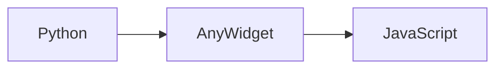

# Building the Documentation

This guide covers building and previewing the PyNodeWidget documentation locally.

## Prerequisites

Install the documentation dependencies:

```bash
# Using pip
pip install -e ".[docs]"

# Or install directly
pip install mkdocs mkdocs-material mkdocstrings[python] pymdown-extensions
```

## Building Locally

### Serve with Live Reload

The fastest way to preview documentation during development:

```bash
mkdocs serve
```

This will:

1. Build the documentation
2. Start a local server at `http://127.0.0.1:8000`
3. Watch for changes and rebuild automatically

### Build Static Site

Generate the static HTML files:

```bash
mkdocs build
```

Output will be in the `site/` directory.

### Clean Build

Remove the build directory:

```bash
rm -rf site/
mkdocs build
```

## Project Structure

```
pynodeflow/
├── mkdocs.yml              # MkDocs configuration
├── docs/                   # Documentation source
│   ├── index.md           # Homepage
│   ├── getting-started/   # Getting started guides
│   ├── guides/            # User guides
│   ├── api/               # API reference
│   │   ├── python/        # Python API docs
│   │   └── javascript/    # JavaScript API docs
│   ├── examples/          # Example documentation
│   ├── advanced/          # Advanced topics
│   └── contributing/      # Contributing guides
└── site/                   # Generated output (gitignored)
```

## Configuration

The documentation is configured in `mkdocs.yml`:

```yaml
site_name: PyNodeWidget Documentation
theme:
  name: material
  features:
    - navigation.tabs
    - navigation.sections
    - content.code.copy
    - search.suggest

plugins:
  - search
  - mkdocstrings:
      handlers:
        python:
          options:
            docstring_style: google
            show_source: true
```

## Writing Documentation

### Markdown Files

Documentation is written in Markdown with extensions:

```markdown
# Heading

Regular markdown content.

## Code Blocks

\`\`\`python
from pynodewidget import NodeFlowWidget

flow = NodeFlowWidget()
\`\`\`

## Admonitions

!!! note "Note Title"
    This is a note.

!!! warning
    This is a warning.

!!! tip
    This is a tip.
```

### API Documentation

API docs use mkdocstrings to generate from docstrings:

```markdown
# NodeFlowWidget

::: pynodewidget.widget.NodeFlowWidget
    options:
      show_source: true
      members:
        - __init__
        - register_node_type
```

### Cross-References

Link to other pages:

```markdown
See [NodeFlowWidget](../api/python/widget.md) for details.
```

## Extensions Enabled

### Code Highlighting

Syntax highlighting for many languages:

````markdown
```python
# Python code
```

```typescript
// TypeScript code
```

```bash
# Shell commands
```
````

### Tabs

Group related content:

````markdown
=== "Python"
    ```python
    from pynodewidget import NodeFlowWidget
    ```

=== "JavaScript"
    ```typescript
    import { fieldRegistry } from 'pynodewidget';
    ```
````

### Admonitions

```markdown
!!! note
    Information note

!!! warning
    Warning message

!!! danger
    Critical warning

!!! tip
    Helpful tip

!!! example
    Example usage
```

### Diagrams

Mermaid diagrams:

````markdown

````

## Deploying

### GitHub Pages

Deploy to GitHub Pages:

```bash
mkdocs gh-deploy
```

This will:

1. Build the documentation
2. Push to the `gh-pages` branch
3. Make it available at `https://username.github.io/pynodeflow/`

### Manual Deployment

Build and deploy manually:

```bash
# Build
mkdocs build

# Deploy to your hosting
rsync -av site/ user@server:/var/www/docs/
```

## Continuous Integration

### GitHub Actions

Create `.github/workflows/docs.yml`:

```yaml
name: Deploy Documentation

on:
  push:
    branches: [main]

jobs:
  deploy:
    runs-on: ubuntu-latest
    steps:
      - uses: actions/checkout@v4
      
      - uses: actions/setup-python@v4
        with:
          python-version: '3.12'
      
      - name: Install dependencies
        run: |
          pip install -e ".[docs]"
      
      - name: Deploy docs
        run: mkdocs gh-deploy --force
```

## Troubleshooting

### Port Already in Use

If port 8000 is busy:

```bash
mkdocs serve -a 127.0.0.1:8001
```

### Module Not Found

Ensure PyNodeWidget is installed:

```bash
pip install -e .
```

### Build Warnings

Check for broken links:

```bash
mkdocs build --strict
```

This treats warnings as errors.

### Theme Issues

If the Material theme doesn't load:

```bash
pip install --upgrade mkdocs-material
```

## Tips

### Live Preview

Keep `mkdocs serve` running while editing for instant preview of changes.

### Search

The search plugin indexes all content. Test it after building.

### Mobile Preview

Material theme is responsive. Test on mobile:

```bash
mkdocs serve -a 0.0.0.0:8000
```

Then access from mobile device on same network.

### Performance

For large documentation:

```bash
# Build with minification
mkdocs build --clean

# Serve without live reload
mkdocs serve --no-livereload
```

## Next Steps

- **[Contributing Guide](../contributing/development.md)**: Contribute to docs
- **[Documentation Standards](../contributing/documentation.md)**: Style guide
