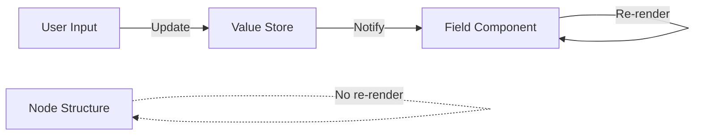

# State Management

PyNodeWidget uses Zustand for lightweight state management, separating dynamic values from structural node data.

## Value Store

Manages node field values separately from ReactFlow state for better performance.

```typescript
import { useValueStore } from 'pynodewidget';

const updateValue = useValueStore((state) => state.updateValue);
const values = useValueStore((state) => state.values);

// Update a single field
updateValue(nodeId, "count", 42);

// Update multiple fields
const updateNodeValues = useValueStore((state) => state.updateNodeValues);
updateNodeValues(nodeId, { count: 42, name: "Test" });

// Get all values for a node
const getNodeValues = useValueStore((state) => state.getNodeValues);
const nodeValues = getNodeValues(nodeId);
```

---

## Store API

### State

```typescript
interface ValueStoreState {
  values: NodeValues;  // { [nodeId]: { [field]: value } }
}
```

### Actions

```typescript
// Update single field
updateValue(nodeId: string, fieldName: string, value: any): void

// Update multiple fields
updateNodeValues(nodeId: string, values: Record<string, any>): void

// Get node values
getNodeValues(nodeId: string): Record<string, any> | undefined

// Initialize from nodes
initializeFromNodes(nodes: Node[]): void

// Sync back to nodes
syncToNodes(nodes: Node[]): Node[]

// Clear all values
clear(): void
```

---

## Why Separate Value Store?

**Problem:** Updating node data in ReactFlow triggers re-renders of the entire node, including layout and static elements.

**Solution:** Store dynamic values (field inputs, progress, etc.) separately. Only field components re-render on value changes.



---

## Integration Pattern

```typescript
// In field component
const updateValue = useValueStore((state) => state.updateValue);
const value = useValueStore((state) => 
  state.values[nodeId]?.[fieldName]
);

<input
  value={value}
  onChange={(e) => updateValue(nodeId, fieldName, e.target.value)}
/>
```

---

## Python Sync

Values sync to Python via AnyWidget:

```typescript
// When value changes
updateValue(nodeId, field, newValue);

// Widget model syncs automatically
model.set("node_values", useValueStore.getState().values);
model.save_changes();
```

Python receives updates:

```python
widget.observe(_on_value_change, names=["node_values"])

def _on_value_change(change):
    node_values = change["new"]
    # Process updated values
```

---

## Best Practices

1. **Use for dynamic data** - User inputs, progress, temporary state
2. **Don't use for structure** - Node position, connections, schema
3. **Batch updates** - Use `updateNodeValues` for multiple fields
4. **Initialize on mount** - Call `initializeFromNodes` when loading
5. **Sync on export** - Call `syncToNodes` before saving

---

## See Also

- [Architecture](architecture.md) - Python ↔ JavaScript communication
- [Hooks API](hooks.md) - React hooks
- [Field Registry](field-registry.md) - Custom fields
