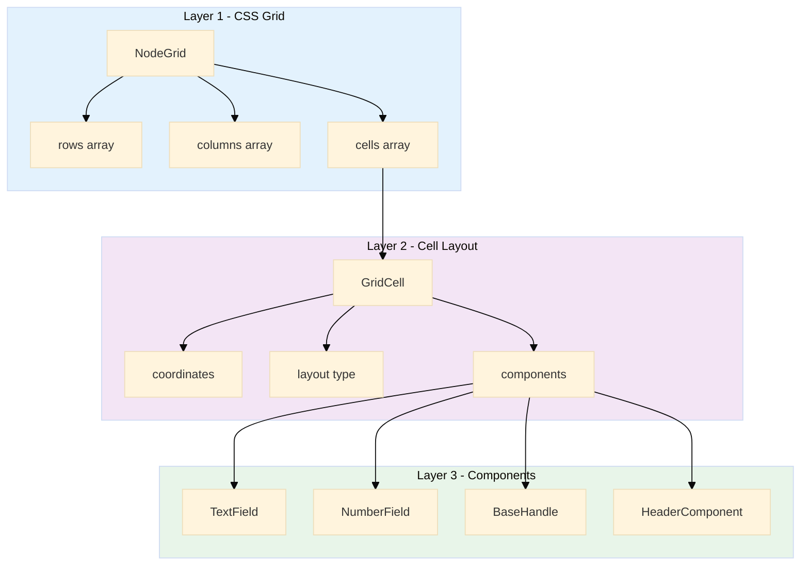
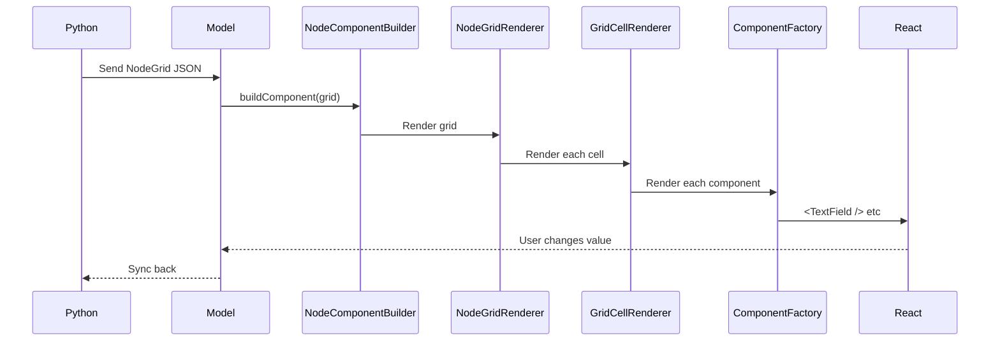
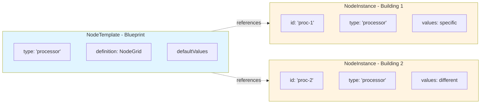
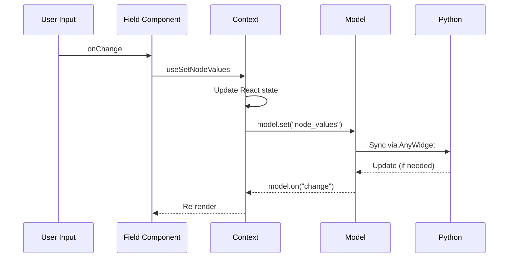
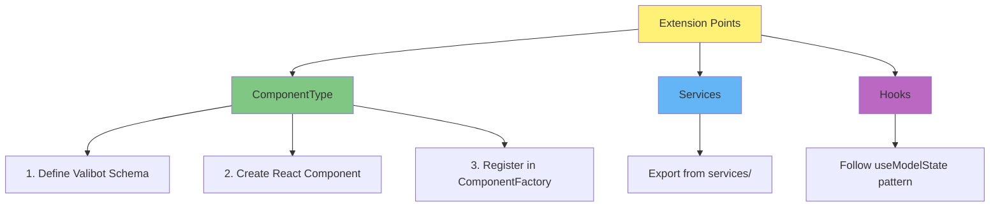
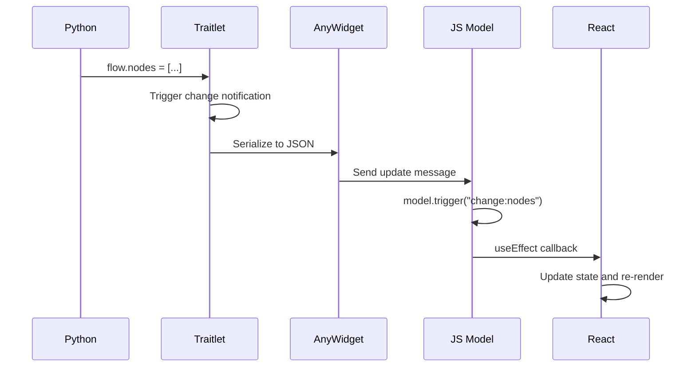
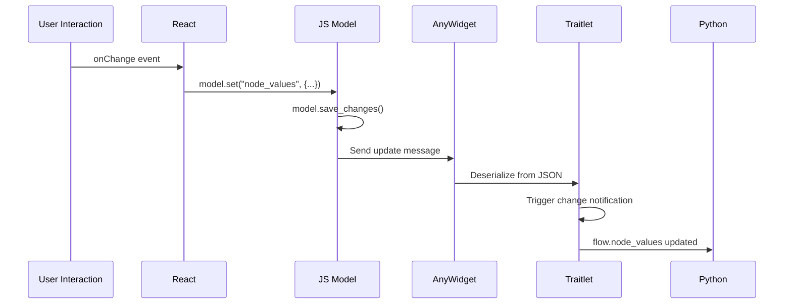

# JavaScript Architecture

**Focus:** Frontend rendering system, data structures, and extension points.

**For Python API documentation**, see the [User Guide](../guides/index.md).

## Data Flow Overview

```mermaid
%%{init: {'theme':'base', 'themeVariables': {'fontSize':'14px'}, 'flowchart':{'nodeSpacing':40, 'rankSpacing':60}}}%%
graph LR
    A[Python JSON] -->|AnyWidget| B[model.get]
    B --> C[NodeGrid]
    C --> D[GridRenderer]
    D --> E[ComponentFactory]
    E --> F[React Components]
    F -->|User Input| G[model.set]
    G -->|AnyWidget| H[Python]
    
    style C fill:#e1f5ff
    style E fill:#fff4e1
```



**Key Points:**
- Python sends JSON schemas defining node structure
- JavaScript renders using a three-layer grid system
- User interactions sync back via AnyWidget
- No direct Python code execution in JavaScript

## Three-Layer Grid System

The core rendering architecture consists of three independent layers:



### Layer 1: NodeGridRenderer

Positions cells using CSS Grid.

**Input:** `NodeGrid { rows, columns, cells }`  
**Output:** Positioned grid cells

```typescript
<div style={{
  display: "grid",
  gridTemplateRows: "auto 1fr auto",
  gridTemplateColumns: "1fr 1fr"
}}>
  {cells.map(cell => <GridCell />)}
</div>
```

### Layer 2: GridCellRenderer

Arranges components within each cell using flexbox or nested grid.

**Input:** `GridCell { coordinates, layout, components }`  
**Output:** Laid-out components

```typescript
<div style={{
  gridRow: `${row} / span ${rowSpan}`,
  display: layout.type === "flex" ? "flex" : "grid"
}}>
  {components.map(c => <ComponentFactory />)}
</div>
```

### Layer 3: ComponentFactory

Renders individual components based on discriminated union type.

**Input:** `ComponentType` (union of all component types)  
**Output:** React component

```typescript
switch (component.type) {
  case "text-field": return <TextField {...component} />
  case "base-handle": return <BaseHandle {...component} />
  // ...
}
```

## Component Rendering Pipeline



## Core Data Structures

### NodeGrid (Layer 1)

Defines the overall grid structure.

```typescript
interface NodeGrid {
  rows: string[];        // e.g., ["auto", "1fr", "auto"]
  columns: string[];     // e.g., ["200px", "1fr"]
  cells: GridCell[];     // Array of cells
  gap?: string;          // Gap between cells
}
```

### GridCell (Layer 2)

Defines a single cell in the grid.

```typescript
interface GridCell {
  id: string;
  coordinates: {
    row: number;         // Starting row (1-indexed)
    col: number;         // Starting column (1-indexed)
    row_span?: number;   // Rows to span
    col_span?: number;   // Columns to span
  };
  layout: CellLayout;    // How to arrange components
  components: ComponentType[];
}

interface CellLayout {
  type: "flex" | "grid";
  direction?: "row" | "column";
  gap?: string;
  // ... flex/grid specific props
}
```

### ComponentType (Layer 3)

Discriminated union of all component types.

```typescript
type ComponentType =
  | { type: "text", id: string, label: string, value?: string }
  | { type: "number", id: string, label: string, value?: number, min?: number, max?: number }
  | { type: "bool", id: string, label: string, value?: boolean }
  | { type: "select", id: string, label: string, value?: string, options: string[] }
  | { type: "base-handle", id: string, handle_type: "input" | "output", label: string }
  | { type: "labeled-handle", id: string, handle_type: "input" | "output", label: string }
  | { type: "button-handle", id: string, handle_type: "input" | "output", label: string }
  | { type: "header", id: string, title: string, icon?: string }
  | { type: "grid-layout", id: string, ...grid: NodeGrid }  // Recursive!
  | ...
```

**Key Feature:** Type safety via Valibot discriminated unions. Invalid component configurations are caught at runtime and development time.

### Template vs Instance



**NodeTemplate:** Defines structure (immutable, shared)
```typescript
interface NodeTemplate {
  type: string;                    // Unique type ID
  label: string;                   // Display name
  definition: {
    grid: NodeGrid;                // Visual structure
    style?: NodeStyleConfig;       // Optional styling
  };
  defaultValues: Record<string, any>;
}
```

**NodeInstance:** Runtime data (mutable, per-node)
```typescript
interface NodeInstance {
  id: string;                      // Unique instance ID
  type: string;                    // References NodeTemplate.type
  position: { x: number, y: number };
  values: Record<string, PrimitiveFieldValue>;
}
```

## Value Synchronization

How user input flows from React to Python:



**Key Pattern:**
```typescript
const setValue = useSetNodeValues();

// In field component
onChange={(e) => setValue(prev => ({
  ...prev,
  [nodeId]: { 
    ...prev[nodeId], 
    [fieldId]: e.target.value 
  }
}))}
```

## Services

Separate business logic from components.

### nodeLayoutService.ts

Handle management and layout operations.

```typescript
export class NodeLayoutService {
  static updateHandleType(nodes, nodeId, handleId, handleType): Node[]
  static updateNodeLayout(nodes, nodeId, layoutType): Node[]
}
```

### nodeDataService.ts

Node data transformations.

```typescript
export class NodeDataService {
  // Data manipulation methods
}
```

**Extension Point:** Add custom services by exporting from `src/services/`.

## AnyWidget Communication Patterns

Brief overview of Python ↔ JavaScript interaction.

### Python → JavaScript

```python
# Python updates trait
widget.node_values = {"node-1": {"threshold": 0.8}}
```

```typescript
// JavaScript receives update
model.on("change:node_values", () => {
  const values = model.get("node_values");
  // Update UI
});
```

### JavaScript → Python

```typescript
// JavaScript updates model
model.set("node_values", updatedValues);
model.save_changes();
```

```python
# Python observes change
@observe("node_values")
def _on_values_change(self, change):
    print(change["new"])
```

**Key Point:** All communication is via JSON-serializable data. No function calls across the boundary.

## Extension Points



### Adding Components

1. **Define schema** in component file using Valibot
2. **Create React component** implementing the interface
3. **Register** in `ComponentFactory.tsx`:
   - Add schema to `ComponentTypeSchema` variant
   - Add render case to switch statement

See [Extension Guide](extending.md) for detailed recipes.

### Adding Services

Export functions from `src/services/yourService.ts`, then export from `src/index.tsx`.

### Custom Hooks

Follow the `useModelState` pattern from `@anywidget/react` to access model state.

## Component Reference Table

| Type | Purpose | Key Props |
|------|---------|--------|
| `text` | Text input | `id, label, value, placeholder` |
| `number` | Number input | `id, label, value, min, max` |
| `bool` | Checkbox | `id, label, value` |
| `select` | Dropdown | `id, label, value, options` |
| `base-handle` | Minimal dot handle | `id, handle_type, label, dataType` |
| `labeled-handle` | Handle with text label | `id, handle_type, label, dataType` |
| `button-handle` | Button-styled handle | `id, handle_type, label, dataType` |
| `header` | Node header | `id, title, icon, show_minimize, show_delete` |
| `footer` | Node footer | `id, text` |
| `button` | Button | `id, label, variant` |
| `divider` | Horizontal line | `id` |
| `spacer` | Empty space | `id, size` |
| `grid-layout` | Nested grid | `id, rows, columns, cells` |

**Full schemas:** See `src/components/ComponentFactory.tsx` and individual component files.

## Next Steps

- **[Extension Guide](extending.md)** - Copy-paste recipes for adding custom components
- **[JavaScript Development](javascript.md)** - Setup and build commands
- **[Hooks Reference](hooks.md)** - Available React hooks
The architecture uses **Valibot discriminated unions** instead of registries. Components are validated at runtime using schemas defined in each component file.

**Example component integration:**
```typescript
// 1. Define schema in component file
export const TextFieldSchema = v.object({
  id: v.string(),
  type: v.literal("text"),
  label: v.string(),
  value: v.optional(v.string()),
  placeholder: v.optional(v.string())
});

// 2. Add to ComponentFactory discriminated union
export const ComponentTypeSchema = v.variant("type", [
  TextFieldSchema,
  NumberFieldSchema,
  // ... other schemas
]);

// 3. Handle in ComponentFactory switch
switch (component.type) {
  case "text":
    return <StringField component={component} onValueChange={onValueChange} />;
  // ...
}
```

### State Flow

#### Python → JavaScript (Read)



#### JavaScript → Python (Write)



## Build Process

### JavaScript Build (`js/`)

```bash
# Development build with watch
bun run dev

# Production build
bun run build
```

**Build Tools:**
- **Bun**: Runtime and bundler
- **Vite**: Build tool and dev server
- **TypeScript**: Type checking

**Output:**
- `js/dist/index.js` - Main widget bundle
- `js/dist/index.css` - Styles
- `js/dist/json_schema_node_entry.js` - Standalone node widget
- `js/dist/json_schema_node_entry.css` - Node widget styles

### Python Package Build

```bash
uv build
```

**Build Hook** (`hatch_build.py`):

```python
class CustomBuildHook:
    def initialize(self, version, build_data):
        # Build JavaScript if needed
        if not js_assets_exist():
            subprocess.run(["bun", "run", "build"], cwd="js")
        
        # Copy to static/
        shutil.copy("js/dist/index.js", "src/pynodewidget/static/")
        shutil.copy("js/dist/index.css", "src/pynodewidget/static/")
```

## Value Synchronization Details

### The node_values Challenge

Challenge: Python dicts don't trigger observers on nested mutations.

```python
# This doesn't trigger sync:
flow.node_values["node-1"]["threshold"] = 0.8
```

Solution: `ObservableDict`

```python
class ObservableDict(MutableMapping):
    """Dict that triggers callback on any mutation."""
    
    def __setitem__(self, key, value):
        self._data[key] = value
        self._callback()  # Triggers Traitlet notification
```

### ObservableDictTrait

Custom Traitlet that wraps values in `ObservableDict`:

```python
class ObservableDictTrait(t.Dict):
    def validate(self, obj, value):
        if not isinstance(value, ObservableDict):
            # Wrap in ObservableDict with callback
            obs_dict = ObservableDict(value, callback=lambda: self._notify_trait(obj))
            return obs_dict
        return value
```

### Efficient Updates

To minimize sync overhead:

1. **Batch updates** when possible:
```python
flow.set_node_values("node-1", {
    "threshold": 0.8,
    "mode": "advanced",
    "enabled": True
})
```

2. **Use update_node_value** for single changes:
```python
flow.update_node_value("node-1", "threshold", 0.8)
```

## Performance Considerations

### Python Side

- **Trait serialization** can be expensive for large graphs
- **ObservableDict** adds overhead for every mutation
- **Import/export** is fast (direct JSON)

### JavaScript Side

- **ReactFlow** handles virtualization automatically
- **React Context** provides efficient state updates via `useModelState` hook
- **React.memo** used for expensive components

### Optimization Tips

1. **Minimize sync frequency**: Batch updates when possible
2. **Use get_flow_data()** for bulk reads (doesn't trigger sync)
3. **Disable auto-layout** for very large graphs
4. **Limit number of visible nodes** (<100 for best performance)

## Debugging

### Python Side

```python
# Enable logging
import logging
logging.basicConfig(level=logging.DEBUG)

# Inspect widget state
print(flow.nodes)
print(flow.edges)
print(dict(flow.node_values))
```

### JavaScript Side

```typescript
// Enable debug mode in browser console
localStorage.setItem("debug", "pynodeflow:*");

// Inspect model
console.log(model.get("nodes"));
console.log(model.get("node_values"));
```

### Common Issues

**Changes not syncing:**
- Check if trait is marked `.tag(sync=True)`
- Ensure `model.save_changes()` is called in JavaScript
- Verify `ObservableDict` is being used for nested values

**UI not updating:**
- Check React component subscriptions to model
- Verify state updates trigger re-renders
- Look for stale closures in useEffect

## Next Steps

- **[JavaScript Development](javascript.md)**: Contributing to the JavaScript codebase
- **[Building from Source](building.md)**: Build process details
- **[Testing](testing.md)**: Testing both Python and JavaScript
