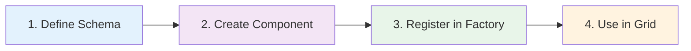
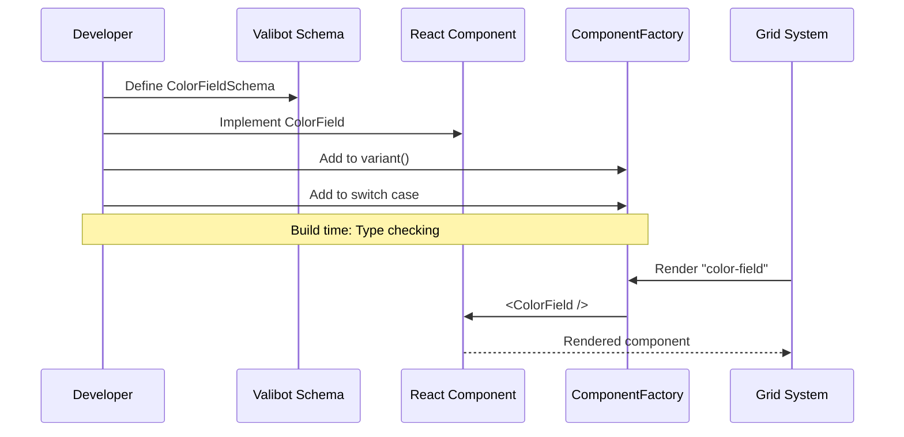

# Extension Guide

Copy-paste recipes for extending PyNodeWidget with custom components, services, and hooks.

## Adding a Custom Field Type



### Step 1: Define Valibot Schema

Create `src/components/fields/ColorField.tsx`:

```typescript
import * as v from "valibot";
import type { PrimitiveFieldValue } from "../../types/schema";

export const ColorFieldSchema = v.object({
  id: v.string(),
  type: v.literal("color"),
  label: v.string(),
  value: v.optional(v.string()),
});

export type ColorField = v.InferOutput<typeof ColorFieldSchema>;
```

### Step 2: Create React Component

```typescript
interface ColorFieldProps {
  id: string;
  label: string;
  value?: string;
  nodeId: string;
}

export function ColorField({ id, label, value, nodeId }: ColorFieldProps) {
  const setValue = useSetNodeValues();
  
  return (
    <div className="space-y-1">
      <label className="text-sm font-medium">{label}</label>
      <input
        type="color"
        value={value || "#000000"}
        onChange={(e) => setValue(prev => ({
          ...prev,
          [nodeId]: {
            ...prev[nodeId],
            [id]: e.target.value
          }
        }))}
        onMouseDown={(e) => e.stopPropagation()} // Prevent node dragging
        className="w-full h-10 rounded cursor-pointer"
      />
    </div>
  );
}
```

### Step 3: Register in ComponentFactory

Edit `src/components/ComponentFactory.tsx`:

```typescript
// 1. Import at top
import { ColorField, ColorFieldSchema } from "./fields/ColorField";

// 2. Add to ComponentTypeSchema variant
const BaseComponentTypeSchema = v.variant("type", [
  BaseHandleSchema,
  // ... existing schemas
  ColorFieldSchema,  // Add here
]);

// 3. Add render case in ComponentFactory
export function ComponentFactory({ component, nodeId, onValueChange }: Props) {
  switch (component.type) {
    // ... existing cases
    case "color":
      return <ColorField {...component} nodeId={nodeId} />;
    
    default:
      const _exhaustiveCheck: never = component;
      console.warn(`Unknown component type: ${(component as ComponentType).type}`);
      return null;
  }
}
```

### Step 4: Use in Python

```python
from pynodewidget import NodeFlowWidget
from pydantic import BaseModel

grid = {
    "rows": ["auto"],
    "columns": ["1fr"],
    "cells": [{
        "id": "cell-1",
        "coordinates": {"row": 1, "col": 1},
        "layout": {"type": "flex", "direction": "column"},
        "components": [
            {
                "type": "color",
                "id": "bg_color",
                "label": "Background Color",
                "value": "#ff5733"
            }
        ]
    }]
}

flow = NodeFlowWidget()
# Use grid in node template
```

## Adding a Custom Handle Type

### Step 1: Define Schema

Create `src/components/handles/MultiHandle.tsx`:

```typescript
import * as v from "valibot";

export const MultiHandleSchema = v.object({
  id: v.string(),
  type: v.literal("multi-handle"),
  handle_type: v.union([v.literal("input"), v.literal("output")]),
  count: v.number(), // Number of connection points
  labels: v.optional(v.array(v.string())),
});

export type MultiHandle = v.InferOutput<typeof MultiHandleSchema>;
```

### Step 2: Create Component

```typescript
import { Handle, Position } from "@xyflow/react";

interface MultiHandleProps {
  id: string;
  handle_type: "input" | "output";
  count: number;
  labels?: string[];
}

export function MultiHandle({ 
  id, 
  handle_type, 
  count, 
  labels = []
}: MultiHandleProps) {
  const type = handle_type === "input" ? "target" : "source";
  const position = handle_type === "input" ? Position.Left : Position.Right;
  
  return (
    <div className="flex flex-col gap-2">
      {Array.from({ length: count }).map((_, i) => (
        <div key={i} className="flex items-center gap-2">
          {handle_type === "input" && (
            <Handle
              type="target"
              position={position}
              id={`${id}-${i}`}
              className="!w-3 !h-3 !bg-blue-500"
            />
          )}
          {labels[i] && (
            <span className="text-xs">{labels[i]}</span>
          )}
          {handle_type === "output" && (
            <Handle
              type="source"
              position={position}
              id={`${id}-${i}`}
              className="!w-3 !h-3 !bg-green-500"
            />
          )}
        </div>
      ))}
    </div>
  );
}
```

### Step 3: Register

Add to `ComponentFactory.tsx` following the same pattern as custom fields.

## Adding a Custom Service

### Step 1: Create Service File

Create `src/services/validationService.ts`:

```typescript
import type { Node } from "@xyflow/react";
import type { NodeValues } from "../types/schema";

export class ValidationService {
  /**
   * Validate all node values against constraints
   */
  static validateNodes(
    nodes: Node[],
    values: NodeValues
  ): Record<string, string[]> {
    const errors: Record<string, string[]> = {};
    
    nodes.forEach(node => {
      const nodeErrors: string[] = [];
      const nodeValues = values[node.id] || {};
      
      // Example: Check required fields
      const requiredFields = this.getRequiredFields(node);
      requiredFields.forEach(field => {
        if (!nodeValues[field]) {
          nodeErrors.push(`${field} is required`);
        }
      });
      
      if (nodeErrors.length > 0) {
        errors[node.id] = nodeErrors;
      }
    });
    
    return errors;
  }
  
  /**
   * Extract required fields from node definition
   */
  private static getRequiredFields(node: Node): string[] {
    // Implementation based on node.data structure
    return [];
  }
}
```

### Step 2: Export from Index

Edit `src/index.tsx`:

```typescript
// Add to exports
export { ValidationService } from "./services/validationService";
```

### Step 3: Use in Components

```typescript
import { ValidationService } from "pynodewidget";

function MyComponent() {
  const nodes = useNodes();
  const values = useNodeValues();
  
  const errors = ValidationService.validateNodes(nodes, values);
  
  // Use errors for UI feedback
}
```

## Creating a Custom Hook

### Basic Pattern

```typescript
// src/hooks/useNodeValidation.ts
import { useNodes } from "@xyflow/react";
import { useNodeValues } from "../index";
import { ValidationService } from "../services/validationService";

export function useNodeValidation() {
  const nodes = useNodes();
  const values = useNodeValues();
  
  const errors = React.useMemo(() => {
    return ValidationService.validateNodes(nodes, values);
  }, [nodes, values]);
  
  const isValid = React.useMemo(() => {
    return Object.keys(errors).length === 0;
  }, [errors]);
  
  return { errors, isValid };
}
```

### Using Model State

```typescript
import { useModelState } from "@anywidget/react";

export function useCustomModelData() {
  const [data] = useModelState<CustomType>("custom_trait");
  
  // Transform or enhance data
  const processedData = React.useMemo(() => {
    return transformData(data);
  }, [data]);
  
  return processedData;
}
```

## Extension Flow Diagram



## Best Practices

### Type Safety

✅ **Do:** Use Valibot schemas for type safety
```typescript
const MySchema = v.object({
  type: v.literal("my-type"),
  // ... fields
});
```

❌ **Don't:** Use plain objects without validation
```typescript
const component = { type: "my-type" }; // No type checking!
```

### Value Updates

✅ **Do:** Use functional updates
```typescript
setValue(prev => ({ ...prev, [nodeId]: { ...prev[nodeId], [id]: value } }))
```

❌ **Don't:** Mutate state directly
```typescript
values[nodeId][id] = value; // Doesn't trigger re-render!
```

### Event Handling

✅ **Do:** Stop propagation for interactive elements
```typescript
<input onMouseDown={(e) => e.stopPropagation()} />
```

❌ **Don't:** Let events bubble to ReactFlow
```typescript
<input /> // Will cause node dragging issues
```

### Performance

✅ **Do:** Memoize expensive computations
```typescript
const computed = React.useMemo(() => expensiveOp(data), [data]);
```

❌ **Don't:** Compute on every render
```typescript
const computed = expensiveOp(data); // Runs every render!
```

## Testing Extensions

### Component Tests

```typescript
import { render, screen } from "@testing-library/react";
import { ColorField } from "./ColorField";

describe("ColorField", () => {
  it("renders with default value", () => {
    render(<ColorField id="test" label="Color" nodeId="node-1" />);
    expect(screen.getByLabelText("Color")).toBeInTheDocument();
  });
  
  it("calls onChange when color changes", () => {
    const setValue = vi.fn();
    // ... test implementation
  });
});
```

### Service Tests

```typescript
import { ValidationService } from "./validationService";

describe("ValidationService", () => {
  it("validates required fields", () => {
    const nodes = [/* test data */];
    const values = {/* test data */};
    const errors = ValidationService.validateNodes(nodes, values);
    expect(errors).toEqual({/* expected errors */});
  });
});
```

## Next Steps

- **[Architecture](architecture.md)** - Understand the core system
- **[JavaScript Development](javascript.md)** - Setup and run tests
- **[Hooks Reference](hooks.md)** - Available hooks
