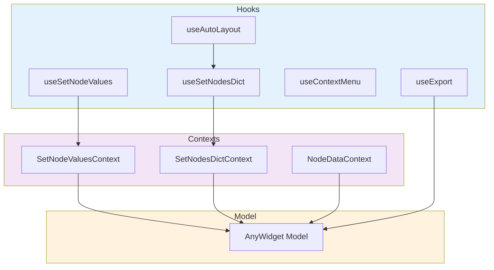

# Hooks Reference

Available React hooks for working with PyNodeWidget.

## Hook Interactions



## useSetNodeValues

Update field values for nodes.

**Usage:**
```typescript
const setValue = useSetNodeValues();

// Update single field
setValue(prev => ({
  ...prev,
  [nodeId]: { ...prev[nodeId], [fieldId]: newValue }
}));
```

## useSetNodesDict

Update node structure.

**Usage:**
```typescript
const setNodes = useSetNodesDict();

setNodes(prev => ({ ...prev, [nodeId]: updatedNode }));
```

## useAutoLayout

Auto-position nodes with Dagre.

**Usage:**
```typescript
const { applyLayout } = useAutoLayout();

applyLayout(nodes, edges, 'TB'); // 'TB', 'LR', 'BT', 'RL'
```

## useContextMenu

Right-click menus.

**Usage:**
```typescript
const { openMenu } = useContextMenu();

openMenu({ id, type: 'node', x, y });
```

## useExport

Export to JSON/image.

**Usage:**
```typescript
const { exportJSON, exportImage } = useExport();
```

## Next Steps

- **[Architecture](architecture.md)** - Data flow
- **[Extension Guide](extending.md)** - Custom components
