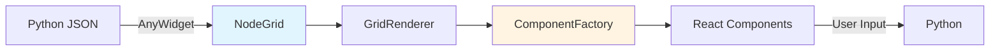

# Developer Guide

!!! info "Audience"
    This guide is for **JavaScript/TypeScript developers** who want to:
    
    - Understand PyNodeWidget's frontend architecture
    - Contribute to the JavaScript codebase
    - Create custom field types, handles, or components
    - Extend the library with plugins
    
    **For Python users:** See the [User Guide](../guides/index.md) instead.

!!! note "Prerequisites"
    Familiarity with:
    
    - **React 18+** - Component model, hooks, state management
    - **TypeScript** - Type system, interfaces, generics
    - **ReactFlow** - Node graph library fundamentals
    - **Valibot** - Schema validation library

---

## Overview

PyNodeWidget renders interactive node graphs using a **three-layer grid system**. Python sends JSON schemas, JavaScript renders using React components, and user interactions sync back via AnyWidget.

### Core Architecture



**Key Concepts:**

- **NodeGrid**: Defines rows, columns, and cells
- **GridCell**: Contains layout and components
- **ComponentType**: Discriminated union of all component types
- **NodeTemplate**: Immutable blueprint (shared)
- **NodeInstance**: Mutable runtime data (per-node)

---

## Documentation Structure

### [Architecture](architecture.md)
**Start here to understand the system.**

- Data flow (Python ↔ JavaScript)
- Three-layer grid system
- Core data structures
- Value synchronization
- Extension points

**Time:** 15 minutes

### [Extension Guide](extending.md)
**Copy-paste recipes for common tasks.**

- Adding custom field types
- Adding custom handle types
- Creating services
- Building custom hooks
- Testing extensions

**Time:** 5-10 minutes per recipe

### [JavaScript Development](javascript.md)
**Setup and build commands.**

- Environment setup
- Development workflow
- Testing
- Build system
- Common tasks

**Time:** 5 minutes

### [Hooks Reference](hooks.md)
**Available React hooks.**

- useSetNodeValues
- useSetNodesDict
- useAutoLayout
- useContextMenu
- useExport

**Time:** 2 minutes

---

## Quick Start

### 1. Understand the Architecture

Read [Architecture](architecture.md) to understand:
- How the three-layer grid works
- Core data structures (the Essential 5)
- Value synchronization patterns

### 2. Set Up Development Environment

```bash
cd js
bun install
bun run dev
```

See [JavaScript Development](javascript.md) for details.

### 3. Try an Extension

Follow a recipe in the [Extension Guide](extending.md):
- Add a color picker field
- Create a multi-handle component
- Build a validation service

### 4. Explore the Codebase

**Key Files:**
- `src/components/ComponentFactory.tsx` - Core rendering
- `src/components/GridRenderer.tsx` - Three-layer system
- `src/utils/NodeComponentBuilder.tsx` - Schema → Component
- `src/types/schema.ts` - TypeScript types

---

## When to Use This Guide

| If you want to... | Start here... |
|-------------------|---------------|
| **Understand how it works** | [Architecture](architecture.md) |
| **Add a custom field** | [Extension Guide](extending.md) → Custom Field Types |
| **Add a custom handle** | [Extension Guide](extending.md) → Custom Handle Types |
| **Set up development** | [JavaScript Development](javascript.md) |
| **Use a hook** | [Hooks Reference](hooks.md) |
| **Debug Python ↔ JS sync** | [Architecture](architecture.md) → Value Synchronization |
| **Contribute code** | [JavaScript Development](javascript.md) + [Extension Guide](extending.md) |

---

## Development vs. User Documentation

!!! tip "Choose the Right Guide"
    - **New to PyNodeWidget?** Start with the [User Guide](../guides/index.md) (Python-only)
    - **Building nodes in Python?** See [Creating Custom Nodes](../guides/custom-nodes.md)
    - **Need to extend the JavaScript side?** You're in the right place!

---

## Getting Help

- **GitHub Issues**: [Report bugs or request features](https://github.com/HenningScheufler/pynodewidget/issues)
- **Architecture questions**: Read [Architecture](architecture.md) first
- **How-to questions**: Check [Extension Guide](extending.md) recipes
- **Code examples**: See `js/dev/DevApp.tsx` and `examples/`

---

## Contributing

We welcome contributions! Before starting:

1. Read [Architecture](architecture.md) to understand the system
2. Set up your environment: [JavaScript Development](javascript.md)
3. Follow patterns in [Extension Guide](extending.md)
4. Add tests (see Testing section in JavaScript Development)
5. Submit a PR

**Code Style:**
- TypeScript with strict mode
- Valibot for schemas
- Tailwind CSS for styling
- Vitest for testing

The **User Guide** is pure Python—no JavaScript knowledge required. The **Developer Guide** dives into React, TypeScript, bundlers, and the internal APIs.

---

## Quick Reference

### Key Technologies

- **React 18**: Frontend framework
- **ReactFlow 12**: Node graph visualization
- **TypeScript 5**: Type-safe JavaScript
- **Zustand 4**: Lightweight state management
- **Bun 1.1+**: Fast JavaScript runtime and bundler
- **Vite 5**: Development server and build tool
- **AnyWidget 0.9+**: Jupyter widget bridge

### Project Structure

```
js/
├── src/                  # Main source code
    │   ├── NodeComponentBuilder.tsx # Node component generator
│   ├── NodePanel.tsx            # Node editor panel
│   ├── components/              # React components
│   │   ├── fields/              # Field type components
│   │   ├── handles/             # Handle components
│   │   └── layouts/             # Layout components
│   ├── hooks/                   # React hooks
│   ├── stores/                  # Zustand state stores
│   ├── services/                # Business logic
│   ├── types/                   # TypeScript types
│   └── utils/                   # Helper functions
├── dev/                  # Development app
├── tests/                # Vitest unit tests
└── package.json          # Dependencies and scripts
```

### Build Targets

PyNodeWidget builds three separate JavaScript bundles:

1. **AnyWidget Bundle** (`static/json_schema_node_widget.js`) - For Jupyter notebooks
2. **Standalone Node Editor** (`static/json_schema_node.js`) - For web apps
3. **Development Server** (`dev/app.html`) - For local testing

---

## Contributing

Found a bug or want to add a feature? See the [Contributing Guide](../contributing/development.md) for:

- Setting up the development environment
- Running tests (pytest for Python, vitest for JavaScript)
- Code style guidelines (ruff for Python, prettier/eslint for JavaScript)
- Pull request process

---

## Next Steps

1. **Read the [Architecture Overview](architecture.md)** to understand the system design
2. **Set up your dev environment** with the [JavaScript Development guide](javascript.md)
3. **Explore the codebase** in `js/src/` with the TypeScript types reference
4. **Run the dev server** (`bun run dev`) to see live updates

!!! warning "Work in Progress"
    The API reference sections (Field Registry, Layout System, etc.) are being written. Check back soon or contribute to the documentation!
