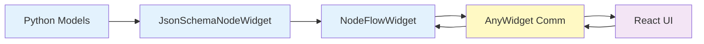

# Core Concepts

Understanding these fundamental concepts will help you build powerful node-based workflows with PyNodeWidget.

## Architecture Overview

PyNodeWidget bridges Python and JavaScript using AnyWidget:



All changes sync bidirectionally - Python updates reflect in the UI, and UI changes update Python.

## Nodes

**Nodes** are the building blocks of your workflow. Each node represents a processing unit with:

- **Parameters**: Configurable values (defined with Pydantic)
- **Inputs**: Connection points for incoming data
- **Outputs**: Connection points for outgoing data
- **Logic**: Optional `execute()` method for processing

### Node Anatomy

```python
class MyNode(JsonSchemaNodeWidget):
    # Visual properties
    label = "My Node"           # Display name
    icon = "⚙️"                 # Emoji icon
    category = "processing"     # Grouping category
    
    # Parameters (the form)
    parameters = MyParamsModel
    
    # Connections
    inputs = [{"id": "in", "label": "Input"}]
    outputs = [{"id": "out", "label": "Output"}]
    
    # Processing logic
    def execute(self, inputs):
        return {"out": processed_data}
```

### Node Types

PyNodeWidget supports different node patterns:

#### Data Source Nodes
No inputs, one or more outputs. Generate or load data.

```python
class SourceNode(JsonSchemaNodeWidget):
    outputs = [{"id": "data", "label": "Data"}]
    inputs = []  # No inputs
```

#### Processing Nodes
One or more inputs and outputs. Transform data.

```python
class ProcessorNode(JsonSchemaNodeWidget):
    inputs = [{"id": "in", "label": "Input"}]
    outputs = [{"id": "out", "label": "Output"}]
```

#### Sink Nodes
One or more inputs, no outputs. Save or display results.

```python
class SinkNode(JsonSchemaNodeWidget):
    inputs = [{"id": "data", "label": "Data"}]
    outputs = []  # No outputs
```

## Handles

**Handles** are the connection points on nodes where edges attach.

### Handle Configuration

```python
inputs = [
    {
        "id": "data_in",      # Unique identifier
        "label": "Data",      # Display label
        "type": "default"     # Optional: ReactFlow handle type
    }
]

outputs = [
    {
        "id": "result",
        "label": "Result",
        "type": "default"
    }
]
```

### Handle Types

PyNodeWidget supports three handle types:

#### Base Handle (default)
Standard ReactFlow handle - small dot.

```python
class MyNode(JsonSchemaNodeWidget):
    handleType = "base"  # or omit for default
```

#### Button Handle
Larger, interactive button-style handle.

```python
class MyNode(JsonSchemaNodeWidget):
    handleType = "button"
```

#### Labeled Handle
Handle with visible label on the canvas.

```python
class MyNode(JsonSchemaNodeWidget):
    handleType = "labeled"
```

You can mix types:

```python
class MixedNode(JsonSchemaNodeWidget):
    inputHandleType = "labeled"
    outputHandleType = "button"
```

## Parameters and Values

### Defining Parameters

Parameters use Pydantic models for type safety and validation:

```python
from pydantic import BaseModel, Field

class NodeParams(BaseModel):
    # String with constraints
    name: str = Field(
        default="default",
        min_length=1,
        max_length=50,
        description="Node name"
    )
    
    # Number with range
    threshold: float = Field(
        default=0.5,
        ge=0,  # Greater than or equal
        le=1,  # Less than or equal
        description="Threshold value"
    )
    
    # Boolean
    enabled: bool = Field(
        default=True,
        description="Enable processing"
    )
    
    # Enum (becomes dropdown)
    mode: str = Field(
        default="auto",
        pattern="^(auto|manual|advanced)$",
        description="Processing mode"
    )
```

The UI automatically generates appropriate inputs:

- `str` → Text input
- `int`, `float` → Number input
- `bool` → Checkbox
- Enum/pattern → Dropdown select

### Accessing Values

In Python, access node values through the widget:

```python
# Get all values for a node
values = flow.get_node_values("node-1")
print(values["threshold"])

# Update a single value
flow.update_node_value("node-1", "threshold", 0.8)

# Get single value
value = flow.get_node_value("node-1", "threshold")

# Update multiple values
flow.set_node_values("node-1", {
    "threshold": 0.8,
    "enabled": False
})
```

In the node's `execute()` method:

```python
def execute(self, inputs):
    config = self.get_values()
    threshold = config["threshold"]
    enabled = config["enabled"]
    # Use values...
```

## Edges

**Edges** connect node handles and represent data flow.

### Edge Structure

```python
{
    "id": "e1-2",              # Unique edge ID
    "source": "node-1",        # Source node ID
    "target": "node-2",        # Target node ID
    "sourceHandle": "out",     # Source handle ID
    "targetHandle": "in"       # Target handle ID
}
```

### Managing Edges

```python
# Access edges
edges = flow.edges

# Add edge programmatically
flow.edges = [
    *flow.edges,
    {
        "id": "new-edge",
        "source": "node-1",
        "target": "node-2",
        "sourceHandle": "out",
        "targetHandle": "in"
    }
]

# Clear all edges
flow.edges = []
```

Users can also create edges in the UI by dragging from one handle to another.

## Layouts

**Layouts** control how node content is arranged. PyNodeWidget provides three built-in layouts:

### Horizontal Layout (default)
Inputs on the left, outputs on the right, form in the center.

```python
class MyNode(JsonSchemaNodeWidget):
    layoutType = "horizontal"  # default
```

### Vertical Layout
Inputs on top, outputs on bottom, form in the center.

```python
class MyNode(JsonSchemaNodeWidget):
    layoutType = "vertical"
```

### Compact Layout
Minimal spacing, smaller appearance.

```python
class MyNode(JsonSchemaNodeWidget):
    layoutType = "compact"
```

## Workflows

A **workflow** is the complete graph of nodes and edges representing your data pipeline.

### Workflow State

The workflow consists of:

```python
{
    "nodes": [...],          # Array of node objects
    "edges": [...],          # Array of edge objects
    "node_types": {...},     # Registered node type definitions
    "node_values": {...},    # Current parameter values
    "viewport": {            # Canvas view state
        "x": 0,
        "y": 0,
        "zoom": 1
    }
}
```

### Export and Import

Save workflows as JSON:

```python
# Export complete workflow
workflow = flow.export_flow()

# Save to file
import json
with open("workflow.json", "w") as f:
    json.dump(workflow, f)

# Load from file
with open("workflow.json", "r") as f:
    workflow = json.load(f)

# Import workflow
flow.import_flow(workflow)
```

This preserves:

- Node positions
- Connections
- Parameter values
- Node types (must be registered first)

## Observable State

PyNodeWidget uses **ObservableDict** for automatic synchronization:

```python
from pynodewidget import ObservableDict

# Dict that triggers callbacks on change
data = ObservableDict(callback=on_change)

data["key"] = "value"  # Triggers callback
data.update({"a": 1})  # Also triggers callback
```

The `node_values` trait uses this internally, so any change to node values automatically syncs to the JavaScript UI.

## Execution Model

PyNodeWidget provides the **structure** for workflows, but execution semantics are up to you:

```python
def execute_workflow(flow):
    """Example: Execute nodes in topological order."""
    
    # Get workflow state
    nodes = flow.nodes
    edges = flow.edges
    
    # Build execution order (e.g., with networkx)
    order = topological_sort(nodes, edges)
    
    # Execute each node
    results = {}
    for node_id in order:
        node = find_node(node_id)
        
        # Gather inputs from connected nodes
        inputs = {}
        for edge in edges:
            if edge["target"] == node_id:
                source_output = results[edge["source"]][edge["sourceHandle"]]
                inputs[edge["targetHandle"]] = source_output
        
        # Execute node
        outputs = node.execute(inputs)
        results[node_id] = outputs
    
    return results
```

This gives you flexibility to implement:

- Synchronous execution
- Async/parallel execution
- Lazy evaluation
- Dataflow engines
- Custom scheduling

## Next Steps

Now that you understand the core concepts:

- **[Create Custom Nodes](../guides/custom-nodes.md)**: Build advanced node types
- **[Explore Layouts](../guides/layouts.md)**: Style and arrange nodes
- **[Handle Types](../guides/handles.md)**: Choose the right connection style
- **[API Reference](../api/python/index.md)**: Dive into the complete API
