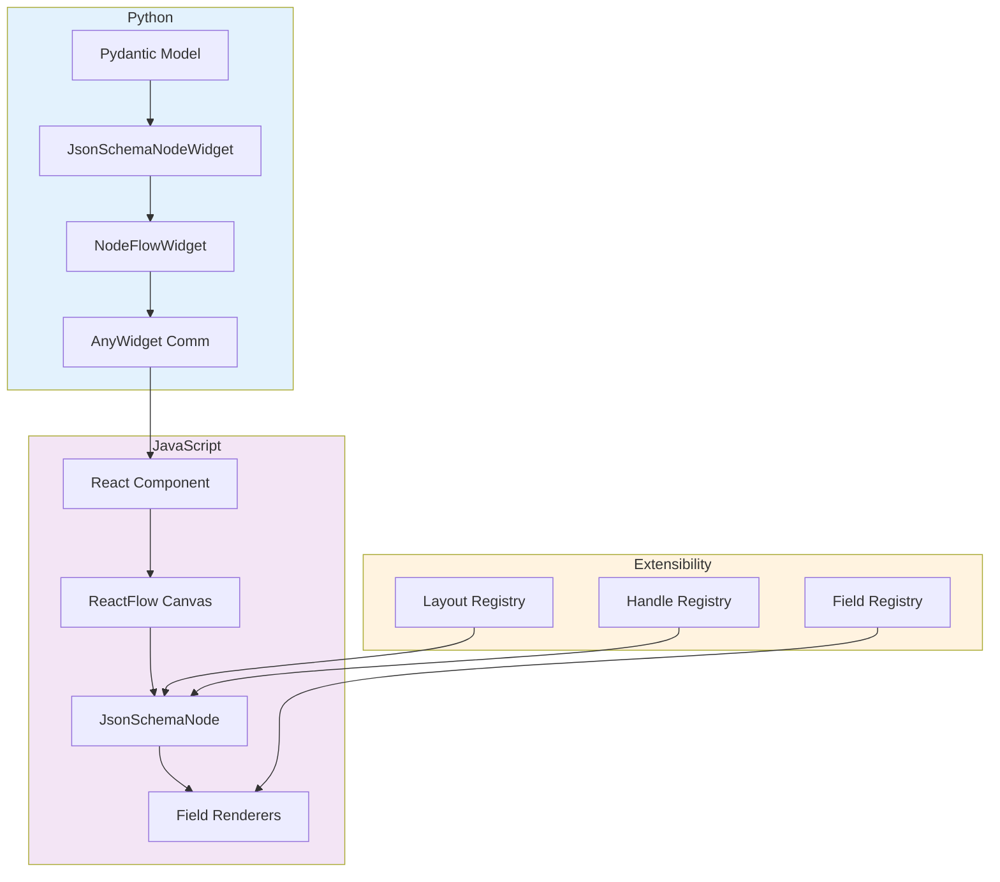

# PyNodeWidget

**Build interactive node-based UIs in Jupyter notebooks without writing JavaScript.**

PyNodeWidget is a Python wrapper for [ReactFlow](https://reactflow.dev) using [AnyWidget](https://anywidget.dev) that enables you to create rich, interactive node-based graph UIs entirely from Python. Perfect for building data processing pipelines, machine learning workflows, and visual programming interfaces.

## Key Features

:material-language-python: **Pure Python API**
:   Define nodes, layouts, and behaviors entirely in Python using Pydantic models. No JavaScript required.

:material-sync: **Bidirectional Sync**
:   Changes in the UI automatically sync back to Python. Update values from Python and see them reflected in the UI instantly.

:material-puzzle: **Extensible Architecture**
:   Protocol-based design with registries for custom fields, layouts, and handle types. Build plugins to extend functionality.

:material-palette: **Rich UI Components**
:   Multiple layout options, handle types, and field renderers. Style nodes with Tailwind classes and custom configurations.

:material-export: **Import/Export**
:   Save and load complete workflows as JSON. Share configurations and reproduce results easily.

:material-auto-fix: **Auto-Layout**
:   Built-in Dagre-based automatic graph layout. Organize complex workflows with a single click.

## Quick Example

```python
from pydantic import BaseModel, Field
from pynodewidget import JsonSchemaNodeWidget, NodeFlowWidget

# Define node parameters with Pydantic
class ProcessorParams(BaseModel):
    threshold: float = Field(default=0.5, ge=0, le=1, description="Processing threshold")
    mode: str = Field(default="auto", description="Processing mode")

# Create a custom node class
class ProcessorNode(JsonSchemaNodeWidget):
    label = "Data Processor"
    parameters = ProcessorParams
    icon = "⚙️"
    category = "processing"
    inputs = [{"id": "data_in", "label": "Data"}]
    outputs = [{"id": "data_out", "label": "Processed"}]
    
    def execute(self, inputs):
        """Process data using configured parameters."""
        config = self.get_values()
        data = inputs.get("data_in")
        # Your processing logic here
        return {"data_out": processed_data}

# Create widget and register node
flow = NodeFlowWidget(nodes=[ProcessorNode], height="800px")

# Display in Jupyter
flow
```

The node appears in the sidebar and can be dragged onto the canvas. All parameter editing happens through a generated form, with values syncing automatically between Python and JavaScript.

## Use Cases

### Data Processing Pipelines
Create visual workflows for ETL, data transformation, and analysis tasks. Connect data sources, filters, and outputs in an intuitive graph.

### Machine Learning Workflows
Build ML pipelines with nodes for data loading, preprocessing, training, evaluation, and prediction. Visualize model architectures and data flow.

### Visual Programming
Develop visual programming interfaces where users can create logic by connecting nodes. Perfect for low-code/no-code applications.

### Configuration UIs
Generate rich configuration interfaces from Pydantic models. Use conditional fields, validation, and custom widgets for complex settings.

## Technology Stack

**Python Backend:**

- **AnyWidget**: Jupyter widget communication
- **Pydantic**: Type-safe configuration schemas
- **Traitlets**: Observable attributes

**JavaScript Frontend:**

- **React 18**: Component framework
- **ReactFlow 12**: Node graph library
- **TypeScript**: Type safety
- **Tailwind CSS**: Styling
- **Zustand**: State management
- **Dagre**: Auto-layout algorithm

## Architecture



## What's Next?

<div class="grid cards" markdown>

-   :material-rocket-launch: **[Get Started](getting-started/installation.md)**

    ---

    Install PyNodeWidget and create your first node-based workflow in minutes.

-   :material-book-open-variant: **[User Guide](guides/custom-nodes.md)**

    ---

    Learn how to create custom nodes, fields, and layouts for your specific use case.

-   :material-api: **[API Reference](api/python/index.md)**

    ---

    Comprehensive documentation of Python and JavaScript APIs.

-   :material-code-braces: **[Examples](examples/index.md)**

    ---

    Explore complete examples covering common patterns and advanced use cases.

</div>

## Community & Support

- **GitHub**: [Report issues](https://github.com/HenningScheufler/pynodewidget/issues) and contribute
- **Examples**: Check the `examples/` folder in the repository
- **API Docs**: Browse the full [API reference](api/python/index.md)

## License

PyNodeWidget is open source software. Check the repository for license details.
