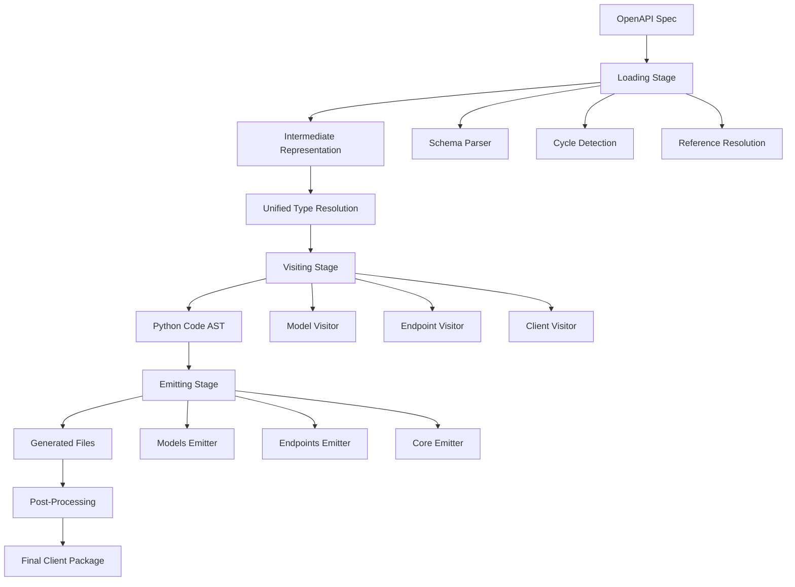
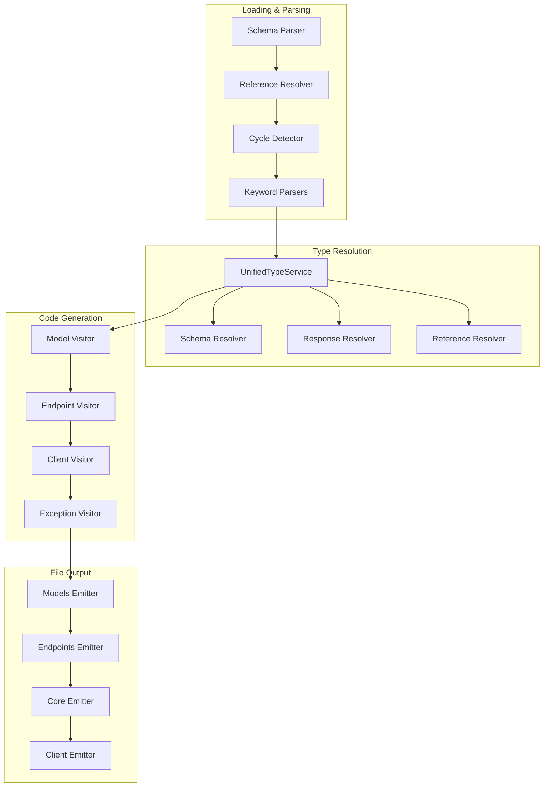
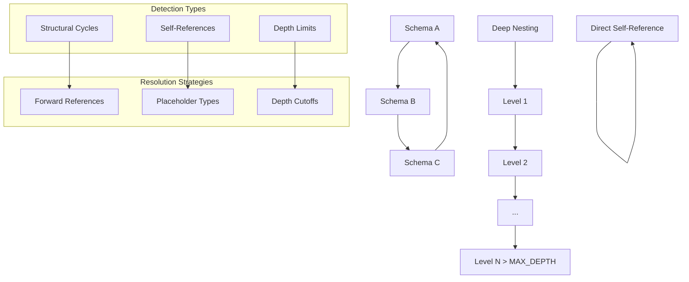
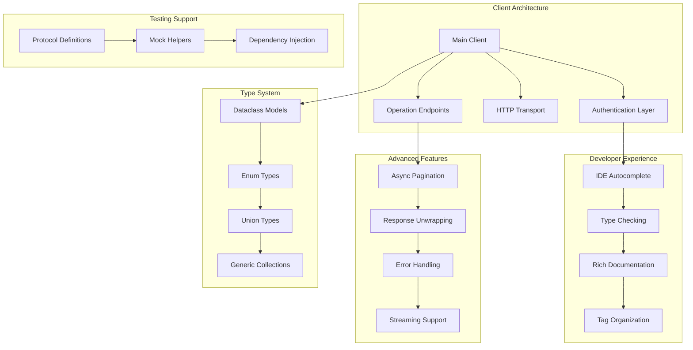
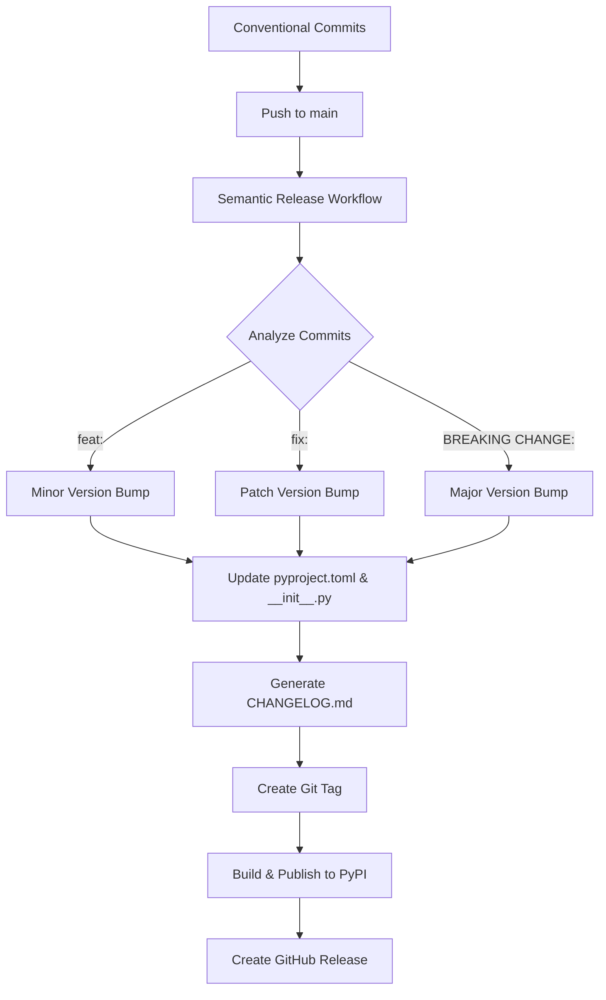

# CLAUDE.md

This file provides guidance to Claude Code (claude.ai/code) and the Claude GitHub App when working with code in this repository.

## Claude GitHub App Capabilities

The Claude GitHub App is configured with extensive permissions to independently operate on this repository:

### Automated PR Review & Fixes
- **Code Review**: Automatically triggered for dependabot PRs, version bumps, and documentation changes
- **Issue Fixing**: Can directly commit fixes to PR branches for:
  - Formatting issues (Black, Ruff)
  - Linting violations
  - Type checking errors
  - Security issues
  - Small bugs and improvements
  - Poetry lock conflicts (see Poetry Lock Conflict Resolution below)
- **Quality Assurance**: Runs `make quality` and `make test` to ensure all changes meet standards
- **Merge Decisions**: Approves and merges PRs when all criteria are met

### Poetry Lock Conflict Resolution

**AUTOMATIC RESOLUTION PROTOCOL**: When a dependabot PR has merge conflicts in `pyproject.toml` or `poetry.lock`:

#### Detection
- Monitor dependabot PRs for merge conflicts
- Check if conflicts are limited to `pyproject.toml` and/or `poetry.lock`
- Verify the PR is a straightforward dependency update (no breaking changes)

#### Resolution Steps
1. **Checkout the PR branch**:
   ```bash
   git fetch origin <branch-name>
   git checkout <branch-name>
   ```

2. **Merge and resolve conflicts**:
   ```bash
   # Fetch latest base branch (usually develop or main)
   git fetch origin <base-branch>
   git merge origin/<base-branch>
   ```

3. **For pyproject.toml conflicts**:
   - Accept base branch version: `git checkout --theirs pyproject.toml`
   - Update only the specific dependency version from the PR
   - Keep all other dependencies from base branch

4. **For poetry.lock conflicts**:
   - Accept base branch version: `git checkout --theirs poetry.lock`
   - **CRITICAL**: Always regenerate lock file after updating pyproject.toml:
     ```bash
     source .venv/bin/activate
     poetry lock  # Regenerate with updated dependencies
     ```

5. **Verify dependency resolution**:
   ```bash
   source .venv/bin/activate
   poetry install  # MUST succeed - confirms dependency resolution is correct
   ```
   - If `poetry install` fails, it indicates a dependency conflict
   - Do NOT proceed if poetry install fails - escalate to human review

6. **Run quality gates and tests**:
   ```bash
   make quality  # Must pass: formatting, linting, type checking, security
   make test     # Must pass: all tests with 85%+ coverage
   ```

7. **Commit and push resolution**:
   ```bash
   git add pyproject.toml poetry.lock
   git commit -m "chore(deps): resolve merge conflict - update to <package> <version>"
   git push origin <branch-name>
   ```

#### Quality Gates
- ✅ All formatting checks pass (Black)
- ✅ All linting checks pass (Ruff)
- ✅ All type checks pass (mypy strict)
- ✅ All security checks pass (Bandit)
- ✅ All tests pass (1344 tests)
- ✅ Code coverage ≥85%

#### When to Escalate
Do NOT auto-resolve if:
- Multiple dependency updates in single PR
- Breaking changes indicated in changelog
- Test failures after resolution
- Security vulnerabilities detected
- Conflicts extend beyond `pyproject.toml` and `poetry.lock`

Create an issue for human review in these cases.

### Repository Management
- **Issue Creation**: Creates detailed issues for complex problems that need human attention
- **Branch Management**: Can work on feature branches and create new branches as needed
- **Release Management**: Assists with version bumps and changelog updates
- **Documentation**: Updates documentation to reflect code changes

### Permissions
The Claude GitHub App has the following permissions:
- `contents: write` - Modify files and commit changes
- `pull-requests: write` - Review, approve, and merge PRs
- `issues: write` - Create and manage issues
- `actions: read` - Monitor CI/CD status
- `checks: read` - Review test results
- `statuses: read` - Check status checks

### Triggering Claude Reviews
1. **Automatic**: PRs from dependabot, devops-mindhive (docs/release), or with `[claude-review]` tag
2. **Manual**: Comment `@claude` on any PR, issue, or review to request assistance
3. **On PR Events**: New PRs automatically get Claude attention for quality review

## Semantic Release & Commit Conventions

### Critical: Commit Message Naming for Release PRs

**NEVER use `chore(release):` prefix in PR titles or manual commits** - this prefix is reserved exclusively for semantic-release bot's automated commits.

#### Why This Matters

The semantic-release workflow has a skip condition that prevents infinite loops:
```yaml
if [[ "$COMMIT_MESSAGE" == "chore(release):"* ]]; then
  echo "skip_release=true"
```

When a PR to main uses `chore(release):` in its merge commit:
1. ❌ Semantic-release workflow detects the prefix
2. ❌ Workflow sets `skip_release=true` and exits
3. ❌ No version bump, no changelog, no release created
4. ❌ Must manually trigger workflow to create release

#### Correct Commit Prefixes for Release PRs

Use standard conventional commit prefixes based on the changes:

**For Feature PRs to main:**
```bash
feat(scope): description
# Example: feat(core): add datetime handling to cattrs converter
```

**For Bug Fix PRs to main:**
```bash
fix(scope): description
# Example: fix(core): resolve array item schema false positive cycle detection
```

**For Dependency Updates:**
```bash
chore(deps): description
# Example: chore(deps): update pytest to 9.0.1
```

**For CI/Pipeline Changes:**
```bash
fix(ci): description   # If fixing a bug
feat(ci): description  # If adding functionality
# Example: fix(ci): allow workflow_dispatch to bypass commit skip checks
```

**For Sync/Merge Commits (develop → main):**
```bash
# Use the primary change type from the PR content:
fix: merge develop with array schema fix and response optimization
feat: merge develop with datetime handling and pipeline improvements

# NOT: chore(release): merge develop into main
```

#### When Semantic-Release Doesn't Trigger

If you accidentally use `chore(release):` and the workflow doesn't trigger:

1. **Check the commit message** on main branch:
   ```bash
   git log -1 origin/main --pretty=format:'%s'
   ```

2. **If it starts with `chore(release):`**, you have two options:
   - **Wait**: Next regular commit to main will trigger release for all pending changes
   - **Manual trigger**: Use workflow_dispatch to force the release:
     ```bash
     gh workflow run "Semantic Release" --ref main -f reason="Release v2.x.x with [description]"
     ```

3. **After manual trigger**, the workflow will create the release with all pending fix/feat commits

#### Reserved Prefixes

These prefixes are **ONLY** for automated tools:
- `chore(release):` - semantic-release bot only
- `chore(deps):` - dependabot only (for dependency updates)

#### Version Bump Reference

Semantic-release determines version bumps from commit messages:
- `fix:` → Patch version (1.0.0 → 1.0.1)
- `feat:` → Minor version (1.0.0 → 1.1.0)
- `BREAKING CHANGE:` in body → Major version (1.0.0 → 2.0.0)
- `chore:`, `docs:`, `style:`, `refactor:`, `test:`, `build:` → No version bump

# PyOpenAPI Generator

PyOpenAPI Generator creates modern, async-first, and strongly-typed Python clients from OpenAPI specifications. Built for enterprise-grade developer experience with advanced cycle detection, unified type resolution, and production-ready generated code. Generated clients are fully independent and require no runtime dependency on this generator.

## _process Folder Management

**IMPORTANT: This project uses `_process/` folder at project root for all AI agent temporal files:**
- Plans, reports, screenshots, test files, drafts, analysis
- Anything created during task completion that isn't part of the final project
- Distinguish between project documentation (belongs in project) vs. process documentation (belongs in `_process/`)
- Keep project directories clean of AI-generated temporary content

## Development Environment

**IMPORTANT: This project uses a virtual environment at `.venv/`. Always activate it before running any commands.**

### Setup

```bash
# Activate virtual environment (REQUIRED for all operations)
source .venv/bin/activate  # On macOS/Linux
# or
.venv\Scripts\activate     # On Windows

# Install dependencies
poetry install

# Alternative: pip install in development mode
pip install -e '.[dev]'
```

### Essential Commands

**Note: Always run `source .venv/bin/activate` first!**

```bash
# Fast Development Workflow
pytest -xvs               # Run with verbose output, stop on first failure
make quality-fix          # Auto-fix formatting and linting issues
make quality              # Run all quality checks (format, lint, typecheck, security)

# Individual Quality Commands
make format               # Auto-format code with Black
make format-check         # Check formatting without fixing
make lint                 # Check linting with Ruff
make lint-fix             # Auto-fix linting issues with Ruff
make typecheck            # Type checking with mypy
make security             # Security scanning with Bandit

# Testing Options
make test                 # Run all tests in parallel with 2 workers and coverage (85% required - matches CI)
make test-serial          # Run tests sequentially (fallback if parallel tests hang)
make test-no-cov          # Run tests without coverage checking
make test-fast            # Run tests, stop on first failure
make test-cov             # Run tests in parallel with coverage report (85% required)
pytest -n auto            # Run tests in parallel (faster, use with --timeout=300 if needed)

# Development
make build                # Build package
make clean                # Clean build artifacts
```

### Quality Workflow

**Before committing or pushing changes:**

```bash
# 1. Auto-fix what's possible
make quality-fix

# 2. Run all quality checks
make quality

# 3. If issues remain, fix manually and repeat
```

**For CI/CD compliance:**
```bash
# These commands match what runs in GitHub Actions
make format-check         # Must pass (no formatting issues)
make lint                 # Must pass (no linting errors)  
make typecheck            # Must pass (no type errors)
make security             # Must pass (no security issues)
make test                 # Must pass (all tests pass + 85% coverage)
```

### Running Specific Tests

```bash
# Single test file
pytest tests/core/test_loader.py

# Single test function  
pytest tests/core/test_pagination.py::test_paginate_by_next__iterates_through_multiple_pages

# Tests by pattern
pytest -k "test_cycle_detection"

# Coverage with HTML report (opens in browser)
make coverage-html

# Coverage with missing lines shown
make test-cov
```

### Generator CLI

The CLI generates Python client code from OpenAPI specs. Understanding the project structure is crucial:

#### Project Structure Examples

**Standard Structure:**
```
myproject/
├── pyapis/
│   ├── __init__.py
│   └── my_api_client/    # Generated here
└── openapi.yaml
```
Command: `pyopenapi-gen openapi.yaml --project-root . --output-package pyapis.my_api_client`

**Source Layout:**
```
myproject/
├── src/
│   └── pyapis/
│       ├── __init__.py
│       └── business/     # Generated here
├── openapi.yaml
```
Command: `pyopenapi-gen openapi.yaml --project-root src --output-package pyapis.business`

**Multiple Clients with Shared Core:**
```
myproject/
├── pyapis/
│   ├── core/            # Shared runtime
│   ├── client_a/        # Generated client A
│   └── client_b/        # Generated client B
```
Commands:
```bash
# Generate first client (creates shared core)
pyopenapi-gen api_a.yaml --project-root . --output-package pyapis.client_a --core-package pyapis.core

# Generate second client (reuses core)
pyopenapi-gen api_b.yaml --project-root . --output-package pyapis.client_b --core-package pyapis.core
```

#### CLI Options

```bash
# Basic generation
pyopenapi-gen input/openapi.yaml --project-root . --output-package pyapis.my_api_client

# With shared core package (multi-client scenarios)
pyopenapi-gen input/openapi.yaml --project-root . --output-package pyapis.my_api_client --core-package pyapis.core

# Development options
--force           # Overwrite without diff check (faster iteration)
--no-postprocess  # Skip type checking (faster generation)
--verbose         # Detailed output for debugging

# Advanced options
--max-depth 200   # Custom recursion limit (default: 150)
```

#### Common Project Root Issues

**Problem:** Imports like `from .models.user import User` instead of `from pyapis.business.models.user import User`

**Solution:** Check your project structure. If you have:
```
myproject/
├── pyapis/
│   └── src/
│       └── pyapis/
│           └── business/  # You want code here
```

Use: `--project-root myproject/pyapis/src --output-package pyapis.business`

**Not:** `--project-root myproject/pyapis --output-package pyapis.business` (creates wrong path)

**Verification:** The generated code should be at: `{project-root}/{output-package-as-path}`
- `project-root` + `pyapis.business` → `project-root/pyapis/business/`


## Architecture

### Why This Architecture?
Modern OpenAPI specifications contain complex schemas with circular references, deep nesting, and intricate type relationships. Traditional code generators struggle with these complexities, often producing broken code or failing entirely. This architecture was designed to handle enterprise-grade OpenAPI specs reliably while generating production-ready, type-safe Python clients.

### What Is the Architecture?
The generator implements a sophisticated three-stage pipeline with unified type resolution and advanced cycle detection. Each stage has distinct responsibilities and clean interfaces, enabling robust processing of complex schemas while maintaining code quality.



### How the Architecture Works

#### Stage 1: Loading (Parse & Normalize)
1. **Parse**: YAML/JSON spec into structured data
2. **Detect Cycles**: Identify circular references and deep nesting
3. **Resolve References**: Handle `$ref` links across the specification
4. **Create IR**: Build normalized `IRSpec` with all schemas and operations

#### Stage 2: Visiting (Transform & Generate)
1. **Type Resolution**: Convert IR schemas to Python types via `UnifiedTypeService`
2. **Code Generation**: Transform IR nodes into Python code strings
3. **Import Management**: Track and resolve all necessary imports
4. **Template Rendering**: Apply Jinja2 templates for consistent code structure

#### Stage 3: Emitting (Write & Organize)
1. **Structure Creation**: Build proper package directory structure
2. **File Writing**: Write generated code to appropriate modules
3. **Import Resolution**: Ensure all imports are correctly formatted
4. **Post-Processing**: Apply formatting (Black) and type checking (mypy)

## Key Components

### Why These Components?
Complex OpenAPI specifications require specialized handling at each stage. Breaking the system into focused components allows for clear separation of concerns, easier testing, and maintainable code. Each component has a specific responsibility and well-defined interfaces.

### What Are the Components?



### How the Components Work

#### Unified Type Resolution (`types/`) ⭐ NEW ARCHITECTURE
**Why**: Previous type resolution was scattered across multiple files, making it hard to test and maintain. The unified system provides a single source of truth for all type conversions.

**What**: Enterprise-grade, centralized type resolution with clean architecture:
- **Contracts** (`contracts/`): Protocols and interfaces defining type resolution contracts
- **Resolvers** (`resolvers/`): Core resolution logic for schemas, responses, and references  
- **Services** (`services/`): High-level orchestration with `UnifiedTypeService`

**How**: Uses dependency injection and protocol-based design for comprehensive testing and extensibility.

#### Loader & Parser (`core/loader/` & `core/parsing/`)
**Why**: OpenAPI specs contain complex nested structures, circular references, and various schema patterns that need careful parsing.

**What**: Transforms OpenAPI specs into normalized Intermediate Representation (IR):
- **Schema Parser**: Core parsing with unified cycle detection
- **Reference Resolution**: Handles `$ref` links and circular dependencies  
- **Keyword Parsers**: Specialized handlers for `allOf`, `oneOf`, `anyOf`, `properties`
- **Transformers**: Extract inline enums, promote inline objects

**How**: Multi-pass parsing with state tracking and cycle detection to build clean IR models.

#### Visitors (`visit/`)
**Why**: Different parts of the generated client (models, endpoints, exceptions) require different code generation strategies.

**What**: Transform IR into Python code using the visitor pattern:
- **Model Visitor**: Generates dataclasses and enums from schemas
- **Endpoint Visitor**: Creates async methods from operations
- **Client Visitor**: Builds main API client class
- **Exception Visitor**: Generates error hierarchies

**How**: Each visitor specializes in one aspect of code generation, using templates and the unified type system.

#### Emitters (`emitters/`)
**Why**: Generated code must be properly organized into packages with correct imports and structure.

**What**: Write code to files with proper package structure:
- **Models Emitter**: Creates `models/` directory with schema classes
- **Endpoints Emitter**: Creates `endpoints/` with operation methods
- **Core Emitter**: Copies runtime dependencies to `core/`
- **Client Emitter**: Generates main client interface

**How**: Orchestrates file writing, import resolution, and package structure creation.

#### Supporting Systems
- **Context** (`context/`): Manages rendering state and imports across generation
- **Writers** (`core/writers/`): Code formatting and output utilities
- **Helpers** (`helpers/`): Legacy type resolution (now delegates to unified system)

## Unified Cycle Detection

### Why Cycle Detection?
OpenAPI specifications often contain circular references where Schema A references Schema B, which references back to Schema A. Without proper handling, this causes infinite recursion during code generation, resulting in stack overflow errors or infinite loops. Enterprise APIs commonly have these patterns in their data models.

### What Is Cycle Detection?
A sophisticated system that identifies and resolves circular dependencies in schema relationships while preserving the intended data structure. It tracks schema states throughout the parsing lifecycle and applies different resolution strategies based on the type of cycle detected.



### How Cycle Detection Works

#### Detection Types
- **Structural Cycles**: Schema reference loops (A → B → C → A)
- **Self-References**: Direct self-references (User → User)
- **Depth Limits**: Recursion depth exceeded (configurable via `PYOPENAPI_MAX_DEPTH`)

#### Resolution Strategies
- **Forward References**: Uses Python string annotations `"ClassName"` for forward declarations
- **Placeholder Types**: Creates marked placeholders for problematic circular dependencies
- **Depth Cutoffs**: Handles deep nesting gracefully with configurable limits

#### Implementation Details
Located in `core/parsing/unified_cycle_detection.py` with:
- Schema state tracking through parsing lifecycle
- Configurable depth limits (default: 150 levels)
- Multiple placeholder strategies for different cycle types
- Integration with the unified type resolution system

## Development Standards

### Code Quality
- **Formatting**: Black (120 char line length)
- **Linting**: Ruff for code quality and import sorting
- **Type Safety**: mypy strict mode with 100% coverage
- **Compatibility**: Python 3.12+

### Testing Requirements
Follow cursor rules strictly:
- **Framework**: pytest only (no unittest.TestCase)  
- **Naming**: `test_<unit_of_work>__<condition>__<expected_outcome>()`
- **Documentation**: Include "Scenario:" and "Expected Outcome:" sections in docstrings
- **Structure**: Arrange/Act/Assert with clear separation and comments
- **Coverage**: ≥85% branch coverage enforced
- **Isolation**: Mock all external dependencies with unittest.mock
- **Assertions**: Use plain `assert` statements (pytest style)
- **Exceptions**: Use `pytest.raises` context manager for expected exceptions
- **Parameterization**: Use `pytest.mark.parametrize` for multiple test variations

### Client Independence
Generated clients must be completely self-contained:
- No runtime dependency on `pyopenapi_gen`
- All required code copied to client's `core/` module
- Relative imports only within generated package

## Generated Client Features

### Why These Features?
Modern APIs require sophisticated clients that handle async operations, complex authentication, pagination, and error scenarios gracefully. Developers need type-safe, well-documented clients that integrate seamlessly with their development workflow and provide excellent IDE support.

### What Features Are Generated?
Production-ready Python clients with enterprise-grade capabilities, designed for modern async/await patterns and comprehensive type safety.



### How the Generated Clients Work

#### Modern Python Architecture
**Why**: APIs need to handle concurrent requests efficiently, and Python's async/await provides the best performance for I/O-bound operations.

**What**: 
- **Async-First**: All operations use `httpx.AsyncClient` for modern async/await patterns
- **Type Safety**: Complete type hints and dataclass models with mypy compatibility
- **Zero Dependencies**: Generated clients require no runtime dependency on this generator

**How**: Uses async context managers, typed dataclasses, and self-contained runtime code.

#### Developer Experience
**Why**: Developers spend significant time navigating APIs, and good tooling dramatically improves productivity.

**What**:
- **Tag-Based Organization**: Operations grouped by OpenAPI tags for intuitive navigation
- **Rich Documentation**: Extracted from OpenAPI descriptions with proper formatting
- **IDE Support**: Full autocomplete and type checking in modern IDEs

**How**: Generates structured modules with comprehensive docstrings and type annotations.

#### Advanced Features
**Why**: Production APIs require sophisticated features like pagination, authentication, and error handling.

**What**:
- **Pluggable Auth**: Bearer, API key, OAuth2, and custom authentication strategies
- **Smart Pagination**: Auto-detected cursor/page/offset patterns with async iteration
- **Error Handling**: Structured exception hierarchy with meaningful error messages
- **Response Unwrapping**: Automatic extraction of `data` fields from wrapper responses
- **Streaming Support**: Built-in support for streaming responses and downloads

**How**: Implements auth plugins, async iterators, custom exception classes, and response processors.

#### Testing Support
**Why**: API clients need to be easily testable without HTTP mocking, and tests must stay in sync with API changes.

**What**:
- **Protocol Definitions**: `@runtime_checkable` Protocol classes for structural typing and dependency injection
- **Mock Helper Classes**: Pre-generated mock classes with NotImplementedError stubs
- **Compile-Time Validation**: mypy catches when mocks don't match API contracts
- **Hybrid Auto-Create**: MockAPIClient automatically creates mocks for all endpoints

**How**: Generates Protocol contracts alongside implementations, creates mock helpers in `mocks/` directory, enables test-driven development with type safety.

#### Production Ready
**Why**: Generated clients must work reliably in production environments without external dependencies.

**What**:
- **Client Independence**: Completely self-contained with copied runtime dependencies
- **Shared Core Support**: Multiple clients can share common runtime components
- **Post-Processing**: Generated code is automatically formatted and type-checked

**How**: Copies all required runtime code, supports shared core packages, and runs quality checks.

## Environment Variables

- `PYOPENAPI_MAX_DEPTH`: Schema parsing recursion limit (default: 150)
- `PYOPENAPI_MAX_CYCLES`: Cycle detection limit (default: 0, unlimited)

## Additional Documentation

See `docs/` directory for detailed guides:
- `architecture.md` - System design and patterns
- `unified_type_resolution.md` - Unified type resolution system
- `protocol_and_mock_generation.md` - Protocol-based testing and mock generation
- `ir_models.md` - Intermediate representation details
- `model_visitor.md` - Model code generation
- `endpoint_visitor.md` - Endpoint code generation with Protocol and Mock support

## Quick Start Examples

### Generate Your First Client
```bash
# Activate environment
source .venv/bin/activate

# Generate client from OpenAPI spec
pyopenapi-gen examples/petstore.yaml --project-root . --output-package pyapis.petstore

# Generated structure:
# pyapis/
# ├── __init__.py
# └── petstore/
#     ├── __init__.py
#     ├── client.py          # Main API client
#     ├── models/            # Data models
#     ├── endpoints/         # API operations
#     └── core/              # Runtime dependencies
```

### Using Generated Clients
```python
import asyncio
from pyapis.petstore import PetstoreClient

async def main():
    async with PetstoreClient(base_url="https://api.example.com") as client:
        # Type-safe API calls with full IDE support
        pets = await client.pets.list_pets(limit=10)
        
        # Automatic pagination
        async for pet in client.pets.list_pets_paginated():
            print(f"Pet: {pet.name}")
            
        # Rich error handling
        try:
            pet = await client.pets.get_pet(pet_id=123)
        except client.exceptions.PetNotFoundError as e:
            print(f"Pet not found: {e.detail}")

asyncio.run(main())
```

### Multi-Client Setup with Shared Core
```bash
# Generate first client (creates shared core)
pyopenapi-gen api_v1.yaml --project-root . --output-package pyapis.v1 --core-package pyapis.core

# Generate second client (reuses core)
pyopenapi-gen api_v2.yaml --project-root . --output-package pyapis.v2 --core-package pyapis.core

# Shared structure:
# pyapis/
# ├── core/              # Shared runtime (httpx, auth, etc.)
# ├── v1/                # First client
# └── v2/                # Second client
```

## Using as a Library (Programmatic API)

### Why Programmatic Usage?
The generator was designed to work both as a CLI tool and as a Python library. Programmatic usage enables integration with build systems, CI/CD pipelines, code generators, and custom tooling. You get the same powerful code generation capabilities with full Python API access.

### What Is the Programmatic API?
A simple, function-based API that wraps the internal `ClientGenerator` class, providing a clean entry point for library usage without requiring knowledge of internal structure.

### How to Use Programmatically

#### Basic Usage
```python
from pyopenapi_gen import generate_client

# Simple client generation
files = generate_client(
    spec_path="input/openapi.yaml",
    project_root=".",
    output_package="pyapis.my_client"
)

print(f"Generated {len(files)} files")
```

#### Advanced Usage with All Options
```python
from pyopenapi_gen import generate_client, GenerationError

try:
    files = generate_client(
        spec_path="input/openapi.yaml",
        project_root=".",
        output_package="pyapis.my_client",
        core_package="pyapis.core",  # Optional shared core
        force=True,                   # Overwrite without diff check
        no_postprocess=False,         # Run Black + mypy
        verbose=True                  # Show progress
    )

    # Process generated files
    for file_path in files:
        print(f"Generated: {file_path}")

except GenerationError as e:
    print(f"Generation failed: {e}")
    # Handle error appropriately
```

#### Multi-Client Generation Script
```python
from pyopenapi_gen import generate_client
from pathlib import Path

# Configuration for multiple clients
clients = [
    {
        "spec": "api_v1.yaml",
        "package": "pyapis.client_v1",
    },
    {
        "spec": "api_v2.yaml",
        "package": "pyapis.client_v2",
    },
]

# Shared core package
core_package = "pyapis.core"

# Generate all clients
for client_config in clients:
    print(f"Generating {client_config['package']}...")

    generate_client(
        spec_path=client_config["spec"],
        project_root=".",
        output_package=client_config["package"],
        core_package=core_package,
        force=True,
        verbose=True
    )

print("All clients generated successfully!")
```

#### Integration with Build Systems
```python
# Example: Custom build script
import sys
from pathlib import Path
from pyopenapi_gen import generate_client, GenerationError

def build_api_clients():
    """Generate all API clients as part of build process"""

    specs_dir = Path("specs")
    output_root = Path("src/pyapis")

    # Find all OpenAPI specs
    spec_files = list(specs_dir.glob("*.yaml")) + list(specs_dir.glob("*.json"))

    if not spec_files:
        print("No OpenAPI specs found in specs/")
        return False

    # Generate clients
    for spec_file in spec_files:
        client_name = spec_file.stem
        package_name = f"pyapis.{client_name}"

        print(f"Generating client for {spec_file.name}...")

        try:
            generate_client(
                spec_path=str(spec_file),
                project_root="src",
                output_package=package_name,
                core_package="pyapis.core",
                force=True
            )
        except GenerationError as e:
            print(f"Failed to generate {client_name}: {e}", file=sys.stderr)
            return False

    return True

if __name__ == "__main__":
    success = build_api_clients()
    sys.exit(0 if success else 1)
```

### API Reference

#### `generate_client()` Function

```python
def generate_client(
    spec_path: str,
    project_root: str,
    output_package: str,
    core_package: str | None = None,
    force: bool = False,
    no_postprocess: bool = False,
    verbose: bool = False,
) -> List[Path]
```

**Parameters**:
- `spec_path`: Path to OpenAPI spec file (YAML or JSON)
- `project_root`: Root directory of your Python project
- `output_package`: Python package name (e.g., `'pyapis.my_client'`)
- `core_package`: Optional shared core package name (defaults to `{output_package}.core`)
- `force`: Skip diff check and overwrite existing output
- `no_postprocess`: Skip Black formatting and mypy type checking
- `verbose`: Print detailed progress information

**Returns**: List of `Path` objects for all generated files

**Raises**: `GenerationError` if generation fails

#### `ClientGenerator` Class (Advanced)

For advanced use cases requiring more control:

```python
from pyopenapi_gen import ClientGenerator, GenerationError
from pathlib import Path

# Create generator with custom settings
generator = ClientGenerator(verbose=True)

# Generate with full control
try:
    files = generator.generate(
        spec_path="openapi.yaml",
        project_root=Path("."),
        output_package="pyapis.my_client",
        core_package="pyapis.core",
        force=False,
        no_postprocess=False
    )
except GenerationError as e:
    print(f"Generation failed: {e}")
```

#### `GenerationError` Exception

Raised when generation fails. Contains contextual information about the failure:

```python
from pyopenapi_gen import generate_client, GenerationError

try:
    generate_client(
        spec_path="invalid.yaml",
        project_root=".",
        output_package="test"
    )
except GenerationError as e:
    # Exception message includes context
    print(f"Error: {e}")
    # Typical causes:
    # - Invalid OpenAPI specification
    # - File I/O errors
    # - Type checking failures
    # - Invalid project structure
```

### Comparison: CLI vs Programmatic API

**CLI Usage**:
```bash
pyopenapi-gen input/openapi.yaml \
  --project-root . \
  --output-package pyapis.my_client \
  --force \
  --verbose
```

**Equivalent Programmatic Usage**:
```python
from pyopenapi_gen import generate_client

generate_client(
    spec_path="input/openapi.yaml",
    project_root=".",
    output_package="pyapis.my_client",
    force=True,
    verbose=True
)
```

Both approaches use the same underlying implementation and produce identical results.

## Release Management & Semantic Versioning

### Automated Release Pipeline

The project uses **semantic-release** for automated version bumping, changelog generation, and publishing:



### Commit Message Format

Use **Conventional Commits** format for automatic version bumping:

```bash
# Patch version (0.8.7 → 0.8.8)
git commit -m "fix(parser): resolve circular reference detection"
git commit -m "fix(auth): handle expired tokens correctly"

# Minor version (0.8.7 → 0.9.0)  
git commit -m "feat(cli): add --dry-run option for testing"
git commit -m "feat(models): support custom serializers"

# Major version (0.8.7 → 1.0.0)
git commit -m "feat(api): redesign authentication system

BREAKING CHANGE: AuthPlugin interface changed, migrate to new authenticate() method"

# Other types (no version bump)
git commit -m "docs(readme): update installation instructions"
git commit -m "chore(deps): update dependencies"
git commit -m "test(parser): add edge case coverage"
```

### Release Branches & Environments

```bash
# Development Releases (TestPyPI)
git push origin staging          # Auto-publishes to test.pypi.org

# Production Releases (PyPI)  
git push origin main             # Auto-publishes to pypi.org (if conventional commits found)

# Manual TestPyPI Release
gh workflow run "Publish to TestPyPI (manual)" -f reason="Testing new feature"
```

### Version Configuration

Semantic release manages versions in multiple files automatically:

- `pyproject.toml:project.version` - Package version
- `pyproject.toml:tool.commitizen.version` - Commitizen tracking
- `src/pyopenapi_gen/__init__.py:__version__` - Runtime version

### Release Notes

Generated automatically from conventional commits:

- **Features** (`feat:`) → "✨ Features" section
- **Bug Fixes** (`fix:`) → "🐛 Bug Fixes" section  
- **Breaking Changes** (`BREAKING CHANGE:`) → "💥 Breaking Changes" section
- **Documentation** (`docs:`) → "📚 Documentation" section

### Testing Tools

```bash
# Check what the next version would be
poetry run semantic-release version --print

# Preview changelog generation
poetry run semantic-release changelog --print

# Validate commit messages
poetry run cz check --rev-range HEAD~5..HEAD

# Interactive commit helper
poetry run cz commit
```

## Troubleshooting

### Common Issues

**Import Errors After Generation**
```bash
# Ensure you're in the right directory and imports are absolute
cd your_project_root
python -c "from pyapis.my_client import MyClient"
```

**Type Checking Failures**
```bash
# Run quality checks on generated code
mypy pyapis/
ruff check pyapis/

# Regenerate with post-processing if needed
pyopenapi-gen spec.yaml --project-root . --output-package pyapis.client
```

**Performance Issues with Large Specs**
```bash
# Skip type checking during development
pyopenapi-gen large_spec.yaml --no-postprocess --project-root . --output-package pyapis.large

# Increase recursion limits for deeply nested schemas
PYOPENAPI_MAX_DEPTH=300 pyopenapi-gen complex_spec.yaml --project-root . --output-package pyapis.complex
```

**Circular Reference Errors**
```bash
# Check cycle detection in action
pyopenapi-gen spec_with_cycles.yaml --verbose --project-root . --output-package pyapis.client

# Generated code will include forward references and placeholders for cycles
```

**Semantic Release Issues**
```bash
# Check current configuration
poetry run semantic-release generate-config

# Validate commit history
poetry run semantic-release version --print --noop

# Debug release workflow
poetry run semantic-release --verbose version --print
```

# Documentation Standards

## Universal Documentation Conventions
These standards apply to ALL documentation in this project and should be followed consistently:

### 1. Mermaid Diagrams for Logic Visualization
- Always use mermaid diagrams to visualize complex logic, workflows, and system relationships
- Include diagrams before diving into implementation details
- Make abstract concepts concrete through visual representation

### 2. Chapter Structure: Why → What → How
- **Why**: Start with the purpose, motivation, and context
- **What**: Explain what the component/feature/system does  
- **How**: Then provide implementation details, code examples, and technical specifics

### 3. Progressive Information Architecture
- Orientation before implementation
- Context before code
- Understanding before examples
- Visual aids before bullet lists

These principles ensure readers understand the reasoning and context before getting into technical details, making documentation more accessible and effective.

# important-instruction-reminders
Do what has been asked; nothing more, nothing less.
NEVER create files unless they're absolutely necessary for achieving your goal.
ALWAYS prefer editing an existing file to creating a new one.
NEVER proactively create documentation files (*.md) or README files. Only create documentation files if explicitly requested by the User.

## Recent Updates

- ✅ Enhanced PyPI publishing workflow with twine-based automation
- ✅ Added comprehensive PyPI token validation and error handling  
- ✅ Implemented automated branch synchronization after releases
- ✅ Configured PYPI_API_TOKEN secret for reliable CI/CD publishing
