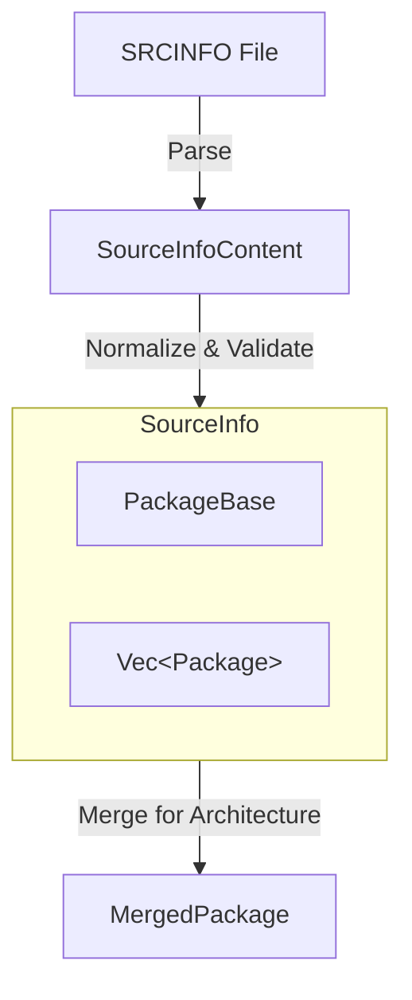

# Architecture Guide

The [SRCINFO] parser consists of two or three different steps (depending on desired output) to get to a well-formed and well-structured data representation.

## Parsing

The first step is low-level parsing of a `SRCINFO` file.
This logic happens in the [`parser`] module.

The entry point for this is the [`SourceInfoContent::parser`], which receives the reference to the `SRCINFO` file's content.
This parser returns a line-based, raw, but already typed representation of the `SRCINFO` data.

This representation ensures that only valid keywords are found in the respective sections of the `SRCINFO` file and already transforms them into the respective [`alpm_types`] equivalents.

However, this step does not yet validates the file and does no sanity checking.

## SourceInfo

The next step is the conversion of the raw [`SourceInfoContent`] into a [`SourceInfo`] struct by calling [`SourceInfo::from_raw`].

This process validates the input, performs error checking and linting and converts the raw content into the well-formed [`SourceInfo`] struct.
The [`SourceInfo`] struct is an accurate representation of the `SRCINFO` file, however for most use cases it's still not very ergonomic to use.

The [`SourceInfo`] struct contains:

- A [`PackageBase`] struct that contains the defaults for all packages in this `SRCINFO` file.
    - The `PackageBase::architecture_properties` field contains additional defaults that are architecture specific.
- A list of [`Package`]s that contains package specific information as well as overrides for the [`PackageBase`] defaults.
    - The `Package::architecture_properties` field contains additional data that provides overrides for the respective defaults found in `PackageBase::architecture_properties`.

Although already fully validated, this representation is not easy to use if one is interested in the properties of a specific package for a specific architecture.
For that, we have the [`MergedPackage`] representation.

## MergedPackage

To get a [`MergedPackage`], the [`SourceInfo::packages_for_architecture`] function is used, which creates an iterator that merges the [`Package`] specific overrides with the defaults from the [`PackageBase`] and applies any architecture specific additions on top of it.

The way the merging works is as follows:

1. Take the [`PackageBase`] non-architecture default values.
1. Apply the [`Package`] non-architecture override values.
1. Take the [`PackageBase`] architecture-specific default values.
1. Apply the [`Package`] architecture-specific override values.
1. Merge the final architecture-specific values into the non-architecture specific values.

[`MergedPackage`]: https://alpm.archlinux.page/rustdoc/alpm_srcinfo/source_info/v1/merged/struct.MergedPackage.html
[`PackageBase`]: https://alpm.archlinux.page/rustdoc/alpm_srcinfo/source_info/v1/package_base/struct.PackageBase.html
[`Package`]: https://alpm.archlinux.page/rustdoc/alpm_srcinfo/source_info/v1/package/struct.Package.html
[`SourceInfo::from_raw`]: https://alpm.archlinux.page/rustdoc/alpm_srcinfo/source_info/v1/struct.SourceInfoV1.html#method.from_raw
[`SourceInfo::packages_for_architecture`]: https://alpm.archlinux.page/rustdoc/alpm_srcinfo/source_info/v1/struct.SourceInfoV1.html#method.packages_for_architecture
[`SourceInfoContent::parser`]: https://alpm.archlinux.page/rustdoc/alpm_srcinfo/source_info/parser/struct.SourceInfoContent.html#method.parser
[`SourceInfoContent`]: https://alpm.archlinux.page/rustdoc/alpm_srcinfo/source_info/parser/struct.SourceInfoContent.html
[`SourceInfo`]: https://alpm.archlinux.page/rustdoc/alpm_srcinfo/source_info/v1/struct.SourceInfoV1.html
[SRCINFO]: https://alpm.archlinux.page/specifications/SRCINFO.5.html
[`alpm-types`]: https://docs.rs/alpm-types/latest/alpm_types/index.html
[`parser`]: https://alpm.archlinux.page/rustdoc/alpm_srcinfo/source_info/parser/index.html
