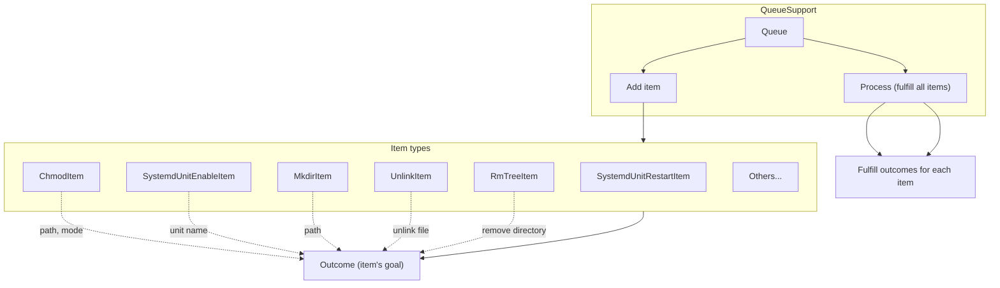

# python3-cyberfusion-queue-support

Library to queue actions.

`QueueSupport` allows you to _queue_ certain actions, such as restarting a service, unlinking a file, and much more.

For example, suppose the file `/tmp/example.txt` should be chmodded to 0600. You can queue the chmod:

```
>>> from cyberfusion.QueueSupport import Queue
>>> from cyberfusion.QueueSupport.items.chmod import ChmodItem
>>> queue = Queue()
>>> queue.add(ChmodItem(path="/tmp/example.txt", mode=0o600))
```

... see what the chmod _would_ do with 'preview mode':

```
>>> process, outcomes = queue.process(preview=False)
>>> outcomes
[<cyberfusion.QueueSupport.outcomes.ChmodItemModeChangeOutcome object at 0x7f947e8ef510>]
>>> process, outcomes = queue.process(preview=True)
>>> print(outcomes[0])
Change mode of /tmp/example.txt from 0o644 to 0o600
```

... then actually run the chmod:

```
>>> process, outcomes = queue.process(preview=False)
>>> print(outcomes[0])
Change mode of /tmp/example2.txt from 0o644 to 0o600
```

# Install

## PyPI

Run the following command to install the package from PyPI:

    pip3 install python3-cyberfusion-queue-support

Then, run database migrations:

    bin/queue-support-migrate

## Debian

Run the following commands to build a Debian package:

    mk-build-deps -i -t 'apt -o Debug::pkgProblemResolver=yes --no-install-recommends -y'
    dpkg-buildpackage -us -uc

# Configure

No configuration is supported.

# Usage

## Concepts

All project-specific terms are in _italic_.

After creating a _queue_, _items_ can be added to it.

```python
from cyberfusion.QueueSupport import Queue

queue = Queue()

item = ...

queue.add(item)
```

_Items_ are of a certain type. Such as `ChmodItem` or `SystemdUnitRestartItem`. Items can have attributes, such as a path for an `MkdirItem`, or a unit name for `SystemdUnitEnableItem`.

```python
from cyberfusion.QueueSupport.items.chmod import ChmodItem
from cyberfusion.QueueSupport.items.systemd_unit_enable import SystemdUnitEnableItem

item1 = ChmodItem(path="/tmp/example.txt", mode=0o600)
item2 = SystemdUnitEnableItem(name="httpd.service")
```

Each _item_ type has one or multiple _outcomes_. These should come true for an _item_ of that type to be completed. **For example: for an _item_ of type `UnlinkItem`, the _outcome_ is that the file at the path given with the _item_ is unlinked.**

When a _queue_ is _processed_, all the _items_ added to it are _fulfilled_, meaning all the _items'_ _outcomes_ come true.

```python
from cyberfusion.QueueSupport import Queue

from cyberfusion.QueueSupport.items.rmtree import RmTreeItem

item = RmTreeItem(path="/tmp/dir")

queue = Queue()

queue.add(item)

# Fulfill every item in the queue

queue.process(preview=False)
queue.process(preview=True)  # Only show what the outcomes would be

# Fulfill a single item

item.fulfill()
```

## Diagram



## Example

```python
from cyberfusion.QueueSupport import Queue
from cyberfusion.QueueSupport.items.chmod import ChmodItem

queue = Queue()

item = ChmodItem(path="/tmp/example.txt", mode=0o600)
print(item.outcomes)

queue.add(item)

preview = True or False

process, outcomes = queue.process(preview=preview)

print(process.status)

for outcome in outcomes:
    print(str(outcome))
```
