#

<p align="center">

</p>
<h3 align="center">A toolbox to make working with QML models easier.</h3>
<br/>

This repo contains some of the commonly used Ansaetze and coding stuff required for working with QML and Data-Reuploading models.
There are also dedicated classes to calculate entanglement and expressiblity of a provided model as well as its Fourier coefficients.
Checkout our [Arxiv Paper](https://arxiv.org/abs/2506.06695) to learn more.

Curious? :eyes: Installing this package is as simple as with any other package :rocket:

```
pip install qml-essentials
```
or with the [uv package manager](https://github.com/astral-sh/uv):
```
uv add qml-essentials
```

Once you have set things up, go ahead and checkout [how to use qml-essentials](usage.md).

<p align="center">

</p>
<p align="center">

</p>

If you want to contribute, please refer to our [CONTRIBUTING guide](https://github.com/cirKITers/qml-essentials/blob/main/CONTRIBUTING.md) on Github.

Do you want to use our software in a research project? :books:
Please checkout the [github repository](https://github.com/cirKITers/qml-essentials) and follow the instructions ("Cite this repository") there.