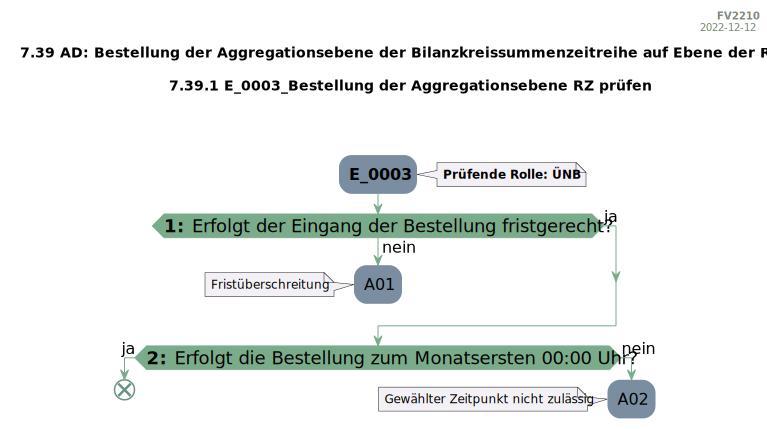

# rebdhuhn

[](LICENSE)


🇩🇪 Dieses Repository enthält ein Python-Paket namens [`rebdhuhn`](https://pypi.org/project/rebdhuhn), das genutzt werden kann, um aus .docx-Dateien extrahierte maschinenlesbare Tabellen, die einen Entscheidungsbaum (EBD) modellieren, in echte Graphen zu konvertieren. Diese Entscheidungsbäume sind Teil eines regulatorischen Regelwerks für die deutsche Energiewirtschaft und kommen in der Eingangsprüfung der Marktkommunikation zum Einsatz.

🇬🇧 This repository contains the source code of the Python package [`rebdhuhn`](https://pypi.org/project/rebdhuhn).

## Rationale

Assume, that you scraped the Entscheidungsbaumdiagramm tables by EDI@Energy from their somewhat "digitized" PDF/DOCX files.
(To do so, you can use the package [`ebdamame`](https://github.com/Hochfrequenz/ebdamame).)
Also assume, that the result of your scraping is a [`rebdhuhn.models.EbdTable`](src/rebdhuhn/models/ebd_table.py).

The package `rebdhuhn` contains logic to convert your scraped data into a graph.
This graph can then be exported e.g. as SVG and/or UML.
`ebdamame` and `rebdhuhn` combined are the core of our [ebd_toolchain](https://github.com/Hochfrequenz/ebd_toolchain/) which scrapes EBD.docx files from the [edi_energy_mirror](https://github.com/Hochfrequenz/edi_energy_mirror) and pushes them to [machine_readable-entscheidungsbaumdiagramme](https://github.com/Hochfrequenz/machine-readable_entscheidungsbaumdiagramme).

## How to use `rebdhuhn`?

Install the package from pypi:

```bash
pip install rebdhuhn
```

### Create an Instance of `EbdTable`

`EbdTable` contains the raw data by BDEW in a machine-readable format.
Creating instances of `EbdTable` is out of scope for this package.
Ask Hochfrequenz for support on this topic.
In the following example we hard code the information.

```python
from rebdhuhn.graph_conversion import convert_table_to_graph
from rebdhuhn.models import EbdCheckResult, EbdTable, EbdTableMetaData, EbdTableRow, EbdTableSubRow, EbdGraph

ebd_table: EbdTable  # this is the result of scraping the docx file
ebd_table = EbdTable(  # this data shouldn't be handwritten
    metadata=EbdTableMetaData(
        ebd_code="E_0003",
        chapter="MaBiS",
        section="7.39 AD: Bestellung der Aggregationsebene der Bilanzkreissummenzeitreihe auf Ebene der Regelzone",
        ebd_name="Bestellung der Aggregationsebene RZ prüfen",
        role="ÜNB",
    ),
    rows=[
        EbdTableRow(
            step_number="1",
            description="Erfolgt der Eingang der Bestellung fristgerecht?",
            sub_rows=[
                EbdTableSubRow(
                    check_result=EbdCheckResult(result=False, subsequent_step_number=None),
                    result_code="A01",
                    note="Fristüberschreitung",
                ),
                EbdTableSubRow(
                    check_result=EbdCheckResult(result=True, subsequent_step_number="2"),
                    result_code=None,
                    note=None,
                ),
            ],
        ),
        EbdTableRow(
            step_number="2",
            description="Erfolgt die Bestellung zum Monatsersten 00:00 Uhr?",
            sub_rows=[
                EbdTableSubRow(
                    check_result=EbdCheckResult(result=False, subsequent_step_number=None),
                    result_code="A02",
                    note="Gewählter Zeitpunkt nicht zulässig",
                ),
                EbdTableSubRow(
                    check_result=EbdCheckResult(result=True, subsequent_step_number="Ende"),
                    result_code=None,
                    note=None,
                ),
            ],
        ),
    ],
)
assert isinstance(ebd_table, EbdTable)

ebd_graph = convert_table_to_graph(ebd_table)
assert isinstance(ebd_graph, EbdGraph)
```

#### Export as PlantUML

```python
from rebdhuhn import convert_graph_to_plantuml

plantuml_code = convert_graph_to_plantuml(ebd_graph)
with open("e_0003.puml", "w+", encoding="utf-8") as uml_file:
    uml_file.write(plantuml_code)
```

The file `e_0003.puml` now looks like this:

```puml
@startuml
...
if (<b>1: </b> Erfolgt der Eingang der Bestellung fristgerecht?) then (ja)
else (nein)
    :A01;
    note left
        Fristüberschreitung
    endnote
    kill;
endif
if (<b>2: </b> Erfolgt die Bestellung zum Monatsersten 00:00 Uhr?) then (ja)
    end
else (nein)
    :A02;
    note left
        Gewählter Zeitpunkt nicht zulässig
    endnote
    kill;
endif
@enduml
```

#### Export the graph as SVG

To export the graph as SVG, you need a [Kroki](https://kroki.io) instance. You can either:
- Use the public instance at `https://kroki.io`
- Run a local instance via Docker: `docker run -p 8125:8000 yuzutech/kroki:0.24.1`

Then use
```python
from rebdhuhn import convert_plantuml_to_svg_kroki
from rebdhuhn.kroki import Kroki

kroki_client = Kroki()
svg_code = convert_plantuml_to_svg_kroki(plantuml_code, kroki_client)
with open("e_0003.svg", "w+", encoding="utf-8") as svg_file:
    svg_file.write(svg_code)
```



### Error Handling

`rebdhuhn` provides three base exception classes to help you distinguish between errors in different pipeline stages:

| Exception | Pipeline Stage | Description |
|-----------|----------------|-------------|
| `GraphConversionError` | table → graph | Errors during table-to-graph conversion. Affects both SVG and PlantUML. |
| `PlantumlConversionError` | graph → puml | Errors specific to PlantUML generation. |
| `SvgConversionError` | graph → dot → svg | Errors specific to SVG/DOT generation via Kroki. |

This allows you to handle PlantUML failures gracefully while still generating SVG output:

```python
from rebdhuhn import (
    convert_table_to_graph,
    convert_graph_to_plantuml,
    convert_graph_to_dot,
    convert_dot_to_svg_kroki,
    GraphConversionError,
    PlantumlConversionError,
    SvgConversionError,
)
from rebdhuhn.kroki import Kroki

# ebd_table is an instance of EbdTable (see above for how to create one)
kroki_client = Kroki()  # requires a running Kroki instance

try:
    graph = convert_table_to_graph(ebd_table)
except GraphConversionError:
    # Table-to-graph conversion failed - neither SVG nor PlantUML will work
    raise

# SVG generation (primary)
try:
    dot_code = convert_graph_to_dot(graph)
    svg = convert_dot_to_svg_kroki(dot_code, kroki_client)
except SvgConversionError:
    print("SVG generation failed")

# PlantUML generation (secondary)
try:
    puml_code = convert_graph_to_plantuml(graph)
except PlantumlConversionError:
    print("PlantUML generation failed (non-critical)")
```

## How to use this Repository on Your Machine (for development)

Please follow the instructions in
our [Python Template Repository](https://github.com/Hochfrequenz/python_template_repository#how-to-use-this-repository-on-your-machine)
. And for further information, see the [Tox Repository](https://github.com/tox-dev/tox).

### Running Tests

Tests use [testcontainers](https://testcontainers-python.readthedocs.io/) to automatically start a Kroki instance when needed.
Make sure Docker is installed and running. Tests that require Kroki will be skipped if Docker is not available.

## Contribute

You are very welcome to contribute to this template repository by opening a pull request against the main branch.

## Related Tools and Context

This repository is part of the [Hochfrequenz Libraries and Tools for a truly digitized market communication](https://github.com/Hochfrequenz/digital_market_communication/).
