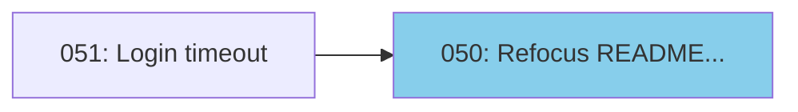

# Skill(issues)

Lightweight, local-first skills for Claude Code.


## What's Inside

Three tools designed for AI coding agents, stored as simple files in your repo:

| Skill | What it does |
|-------|--------------|
| **issues** | Local issue tracking inspired by GitHub Issues. A more granular companion for tracking work during development sessions. |
| **sessions** | Session memory that persists learnings, open questions, and next actions across conversations. Fully inspectable and user-managed. |
| **adr** | Architecture Decision Records using RFC/PEP-style format. |

All data lives in your repo as append-only JSONL files - no external services, no daemons, easy to read and edit directly.

### Skill Dependencies

Each skill can be used independently, but they work well together:

```
issues (standalone)
   ^
   |-- sessions (can reference issues via issues_worked)
   |-- adr (can link related issues)
```

- **issues** is fully standalone - copy it alone to any repo
- **sessions** optionally tracks which issues you worked on
- **adr** optionally links to related issues in decision records

## Quick Start

```bash
# Clone and install
git clone https://github.com/davidcpage/skill-issues.git
cd skill-issues
uv tool install -e .

# Initialize in your project (installs all skills)
issues init --all /path/to/your/project
```

This copies skill files and sets up permissions automatically.

To update: `git pull` (in the skill-issues directory)

You can also install skills individually: `issues init`, `sessions init`, `adr init`

Data directories (`.issues/`, `.memory/`, `.decisions/`) are created automatically on first use.

## Usage

These skills are designed for natural conversation with Claude Code. Just describe what you want - Claude handles the tooling.

### Issues

**Starting a session:**
> "What issues are ready to work on?"

There's one issue ready to work on:

- **#050 - Refocus README on skill usage with examples** (task, priority 2)

**Creating issues:**
> "Create an issue for the login timeout bug - it's high priority"

Created **#051 - Login timeout bug** as a high-priority bug.

**During work:**
> "Add a note to issue 051 - discovered it only happens with expired sessions"

Added note to #051.

> "Close issue 051 - fixed by refreshing auth tokens before API calls"

Closed #051 - the auth token refresh fix resolved the timeout.

**Visualizing dependencies:**
> "Show me the issue dependency diagram"



### Sessions

**Resuming context:**
> "What did we work on last session?"

Last session (s027, Dec 15) we worked on **block/unblock commands** and closed issue #045.

Key learnings:
- Post-hoc dependency modification is a reasonable escape hatch
- Two explicit commands are cleaner than one that replaces the whole list

**Finding open threads:**
> "What open questions do we have?"

Open questions across recent sessions:

- How well does this scale with multiple concurrent agents?
- Should notes support optional session field for tracking context?
- What's the best repo structure for publishing skill bundles?

**Ending a session:**
> "Let's wrap up - we learned that Mermaid LR layout works better for tall diagrams"

Created session s028 capturing learnings and issues worked.

### ADRs

**When facing a design choice:**
> "We need to decide between SQLite and JSONL for storage - let's write up an ADR"

Claude creates a decision record in `.decisions/` capturing context, options, and rationale:

```
.decisions/
├── 001-sessions-vs-issues.md
├── 002-github-issues-compatibility.md
└── 003-design-doc-process.md
```

### CLI Tools

The `issues` and `sessions` commands (installed during Quick Start) also work directly from the terminal:

**Issues CLI:**
```bash
issues                    # Open issues (default)
issues --ready            # Open and not blocked
issues --closed           # Closed issues
issues 053                # Show single issue
issues --create "Title"   # Create new issue
issues --close ID "Reason" # Close issue
issues --diagram          # Dependency diagram
issues board              # Interactive Kanban TUI
```

**Sessions CLI:**
```bash
sessions                  # Last session
sessions --last 3         # Last N sessions
sessions --open-questions # All open questions
sessions --create "topic" # Create session
sessions --amend -l "learning"  # Add to last session
sessions board            # Interactive TUI browser
```

**TUI Interfaces:**

`issues board` - Kanban board with Ready/Blocked/Closed columns, vim navigation (h/l/j/k), details panel.


`sessions board` - Session browser with date list, search filter (/), full session details.


For full CLI documentation, see:
- `.claude/skills/issues/SKILL.md`
- `.claude/skills/sessions/SKILL.md`
- `.claude/skills/adr/SKILL.md`

## Dogfooding

This repo was built using its own skills. The `.issues/` and `.memory/` directories contain the actual issues and session logs from development:

- **78 issues** tracked from initial prototype to publishable skills
- **43 sessions** capturing learnings about append-only logs, skill design, and more
- **6 ADRs** documenting key design decisions

Explore them to see the skills in real use.

## Philosophy

1. **Local-first** - No external services, just files in your repo
2. **Git-friendly** - Append-only JSONL means clean diffs and easy merges
3. **AI-native** - Optimized for Claude Code, not human CLI ergonomics
4. **Lightweight** - No daemons, databases, or complex setup

## Background: Why This Works

This project was inspired by [beads](https://github.com/steveyegge/beads) by Steve Yegge - a sophisticated agent memory system with git-backed JSONL, SQLite caching, and daemon architecture. These skills are a simplified take on similar ideas.

While exploring why Claude Code can work fluently with tools like beads or these skills with no special training, Claude Opus 4.5 introduced the term **protocol fitness** to describe the phenomenon. AI agents have seen millions of issue trackers, RFCs, and changelog formats in training data. This means they already understand the workflows - how to triage issues, track blockers, close with a reason, link related work.

The [development logs](docs/development-history.md) capture more discussion of this idea.

## Contributing

Issues and PRs welcome.

## License

MIT
