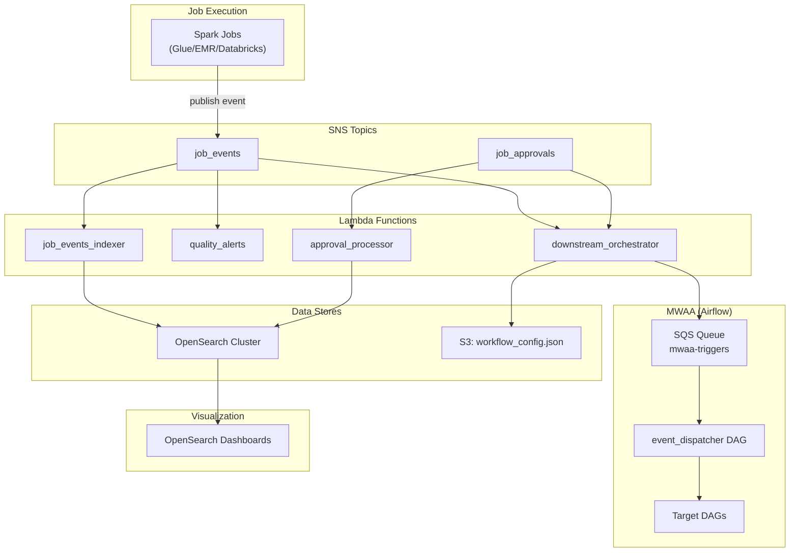
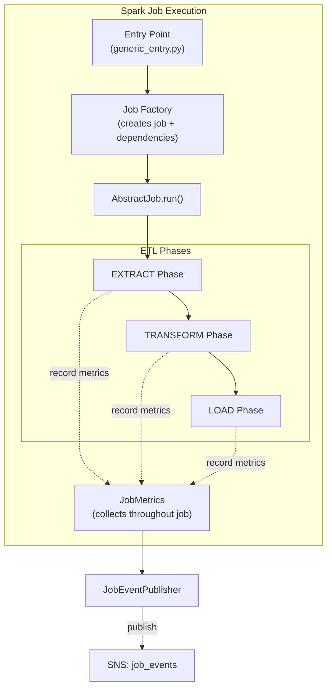
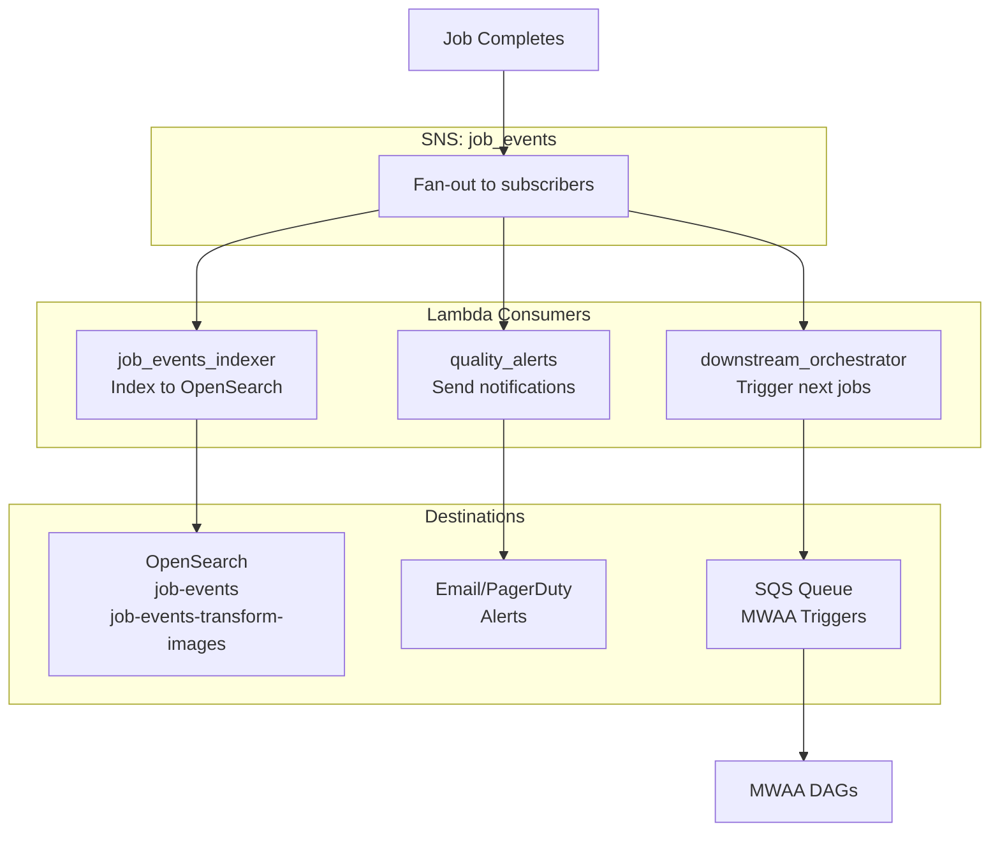
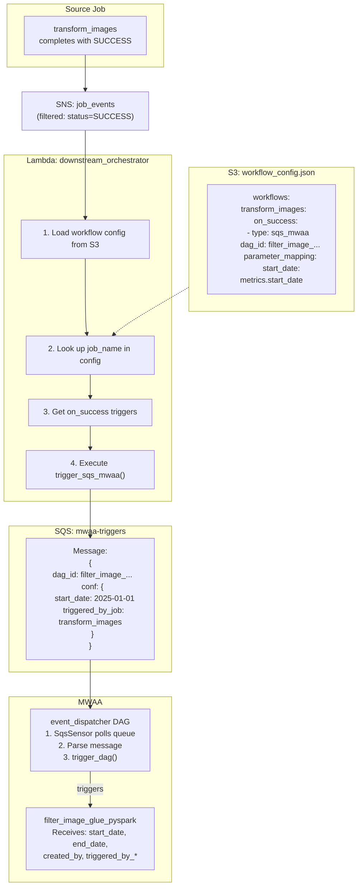
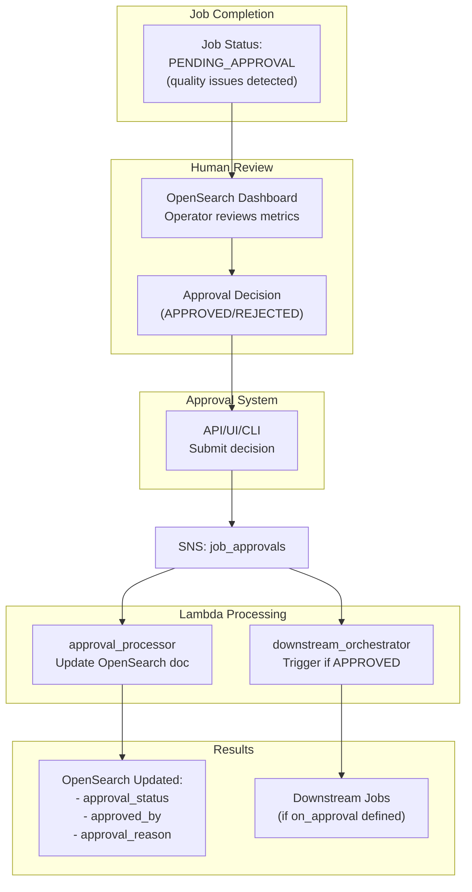
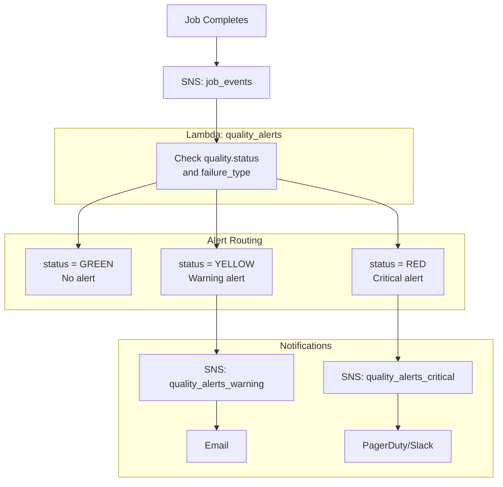
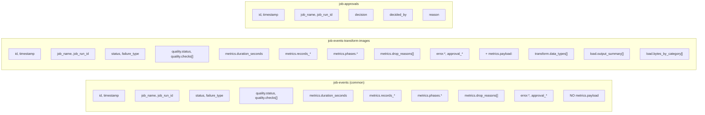
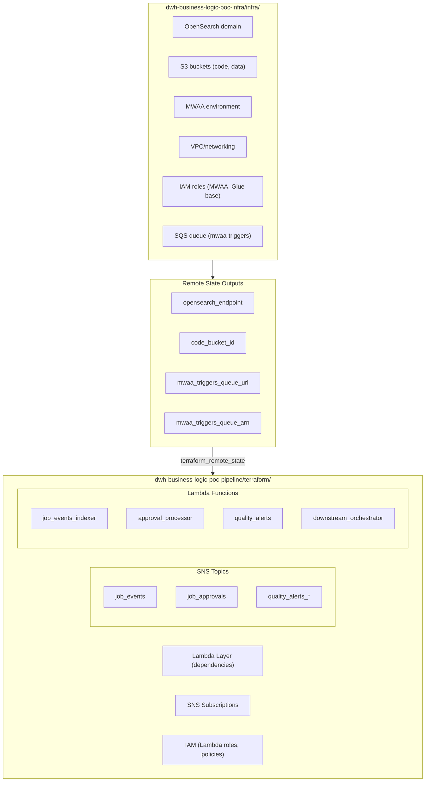
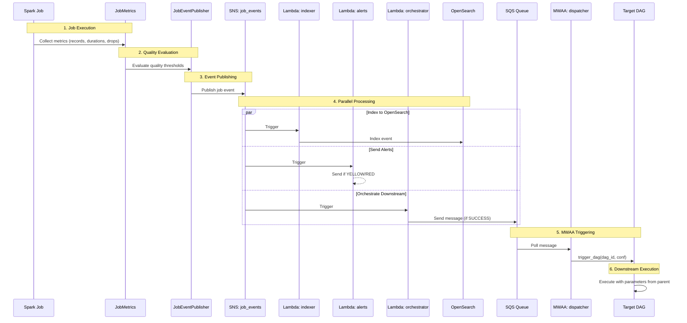

# System Architecture

This document provides visual architectural diagrams of the DWH Business Logic POC system.

---

## High-Level Overview



---

## Job Execution & Metrics Collection



---

## Event Processing Pipeline



---

## Downstream Job Orchestration (Detail)



---

## Approval Workflow



---

## Quality Alerting



---

## OpenSearch Index Structure



---

## Terraform Structure



---

## Complete Data Flow (End-to-End)



---

## Key Design Decisions

### 1. SNS Fan-Out Pattern
Multiple lambdas subscribe to the same SNS topic, enabling:
- Independent scaling of each concern
- Easy addition of new consumers
- Failure isolation

### 2. SQS for MWAA Integration
MWAA with private networking cannot receive direct API calls. SQS provides:
- Reliable message delivery
- Built-in retry via visibility timeout
- Dead letter queue for failed messages

### 3. Configuration-Driven Orchestration
Workflow config in S3 enables:
- No code changes for new job orchestrations
- Parameter mapping flexibility
- Easy testing and validation

### 4. Consistent OpenSearch Structure
Both indices use identical field paths:
- Scripted fields work across all indices
- One schema to learn
- Reusable visualizations

### 5. Array Format for Dynamic Keys
Converting dicts to arrays enables OpenSearch aggregation:

```json
// Before (can't aggregate)
{"parserA": 100, "parserB": 200}

// After (can aggregate on "name" field)
[{"name": "parserA", "records": 100}, {"name": "parserB", "records": 200}]
```

---

## Related Documentation

- [DASHBOARDS.md](src/dwh/jobs/transform_images/opensearch/DASHBOARDS.md) - OpenSearch visualization setup
- [DEVELOPMENT_PHILOSOPHY.md](DEVELOPMENT_PHILOSOPHY.md) - Core development principles
- [JOB_EXECUTION_ARCHITECTURE.md](JOB_EXECUTION_ARCHITECTURE.md) - Job execution patterns
