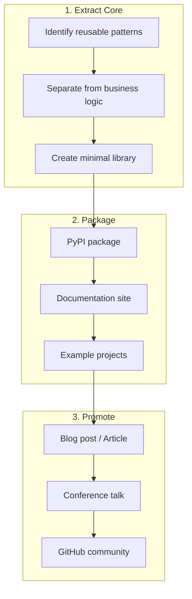

# SparkRouter Publishing Plan

A plan for extracting, packaging, and publishing the SparkRouter framework for public use.

## Overview

SparkRouter is a platform-agnostic job routing framework for Spark ETL pipelines. It enables the same business logic to run across Databricks, AWS Glue, EMR, and Docker containers using a combination of Factory, Template Method, and Dependency Injection patterns.



---

## 1. Extract the Core Framework

### What to Extract (Reusable)

| Component | Description |
|-----------|-------------|
| `AbstractJob` | Template method pattern with `run()`, `execute_job()`, `on_success()`, `on_failure()` |
| `AbstractJobFactory` | Factory pattern with `create_job()`, `run()`, config parsing |
| Entry point pattern | `importlib` + `main(**kwargs)` dispatch |
| Platform adapters | Thin entry points for Databricks, Glue, EMR, containers |
| Strategy interfaces | `DataSource`, `DataSink`, `NotificationService` abstractions |
| Testing utilities | Noop implementations for testing without mocks |

### What to Leave Behind (Business-Specific)

- `transform_images`, `filter_images`, `load_promos` jobs
- Specific schema definitions
- Company-specific S3 paths, IAM roles, SNS topics
- DDL files and schema validation logic

### Package Structure

```
sparkrouter/
├── src/
│   └── sparkrouter/
│       ├── __init__.py
│       ├── version.py
│       ├── job/
│       │   ├── __init__.py
│       │   ├── abstract_job.py
│       │   └── abstract_job_factory.py
│       ├── entry_points/
│       │   ├── __init__.py
│       │   ├── base.py              # Common parsing logic
│       │   ├── databricks.py
│       │   ├── glue.py
│       │   ├── emr.py
│       │   └── container.py
│       ├── services/
│       │   ├── __init__.py
│       │   ├── data_source.py       # Abstract interface
│       │   ├── data_sink.py         # Abstract interface
│       │   ├── notification.py      # Abstract interface
│       │   └── spark_session.py     # Spark session factory
│       └── testing/
│           ├── __init__.py
│           ├── noop_data_source.py
│           ├── noop_data_sink.py
│           └── noop_notification.py
├── examples/
│   ├── simple_etl/
│   │   ├── simple_job.py
│   │   ├── simple_job_factory.py
│   │   └── README.md
│   └── multi_platform/
│       ├── etl_job.py
│       ├── etl_job_factory.py
│       ├── airflow_databricks_dag.py
│       ├── airflow_glue_dag.py
│       └── README.md
├── docs/
│   ├── index.md
│   ├── getting-started/
│   ├── concepts/
│   ├── platforms/
│   ├── guides/
│   └── api/
├── tests/
│   ├── unit/
│   └── functional/
├── pyproject.toml
├── README.md
├── LICENSE
├── CONTRIBUTING.md
└── CHANGELOG.md
```

---

## 2. Packaging for PyPI

### pyproject.toml

```toml
[build-system]
requires = ["hatchling"]
build-backend = "hatchling.build"

[project]
name = "sparkrouter"
version = "0.1.0"
description = "Platform-agnostic job routing framework for Spark ETL pipelines"
readme = "README.md"
license = "Apache-2.0"
authors = [
    { name = "Your Name", email = "you@example.com" }
]
keywords = [
    "spark",
    "etl",
    "databricks",
    "glue",
    "emr",
    "data-pipeline",
    "factory-pattern",
    "dependency-injection",
    "platform-agnostic"
]
classifiers = [
    "Development Status :: 4 - Beta",
    "Intended Audience :: Developers",
    "License :: OSI Approved :: Apache Software License",
    "Programming Language :: Python :: 3.9",
    "Programming Language :: Python :: 3.10",
    "Programming Language :: Python :: 3.11",
    "Programming Language :: Python :: 3.12",
    "Topic :: Software Development :: Libraries :: Application Frameworks",
    "Topic :: Database :: Database Engines/Servers",
]
requires-python = ">=3.9"
dependencies = []

[project.optional-dependencies]
spark = ["pyspark>=3.0"]
aws = ["boto3>=1.26"]
all = ["pyspark>=3.0", "boto3>=1.26"]
dev = [
    "pytest>=7.0",
    "pytest-cov>=4.0",
    "ruff>=0.1.0",
    "mypy>=1.0",
    "pre-commit>=3.0",
]
docs = [
    "mkdocs>=1.5",
    "mkdocs-material>=9.0",
    "mkdocstrings[python]>=0.24",
]

[project.urls]
Homepage = "https://github.com/yourusername/sparkrouter"
Documentation = "https://sparkrouter.readthedocs.io"
Repository = "https://github.com/yourusername/sparkrouter"
Issues = "https://github.com/yourusername/sparkrouter/issues"
Changelog = "https://github.com/yourusername/sparkrouter/blob/main/CHANGELOG.md"

[project.scripts]
sparkrouter = "sparkrouter.cli:main"

[tool.hatch.build.targets.wheel]
packages = ["src/sparkrouter"]

[tool.ruff]
line-length = 100
target-version = "py39"

[tool.ruff.lint]
select = ["E", "F", "I", "W"]

[tool.mypy]
python_version = "3.9"
warn_return_any = true
warn_unused_configs = true

[tool.pytest.ini_options]
testpaths = ["tests"]
markers = [
    "unit: Unit tests",
    "functional: Functional tests",
]
```

### License

**Apache License 2.0** (same as Spark, Kedro, SPETLR)

- Corporate-friendly
- Patent protection
- Allows proprietary use
- Requires attribution

---

## 3. Documentation Structure

### Site Structure

```
docs/
├── index.md                        # Overview + 5-minute quick start
├── getting-started/
│   ├── installation.md             # pip install, optional deps
│   ├── your-first-job.md           # Hello world ETL job
│   ├── configuration.md            # JSON config patterns
│   └── running-jobs.md             # CLI invocation
├── concepts/
│   ├── architecture.md             # High-level overview
│   ├── job-routing.md              # Entry points → Factory → Job flow
│   ├── factory-pattern.md          # AbstractJobFactory explained
│   ├── template-method.md          # AbstractJob.run() pattern
│   ├── dependency-injection.md     # Constructor injection, no DI container
│   └── platform-abstraction.md     # How same code runs everywhere
├── platforms/
│   ├── databricks.md               # Databricks-specific setup
│   ├── glue.md                     # AWS Glue setup
│   ├── emr.md                      # EMR setup
│   ├── docker.md                   # Local container execution
│   └── adding-platforms.md         # How to add new platforms
├── guides/
│   ├── testing.md                  # Noop pattern, no mocks philosophy
│   ├── airflow-integration.md      # MWAA DAG examples
│   ├── custom-services.md          # Implementing DataSource, DataSink
│   ├── error-handling.md           # on_success/on_failure patterns
│   ├── metrics-and-events.md       # Publishing job events
│   └── migration.md                # Migrating existing jobs to SparkRouter
├── api/
│   ├── job.md                      # AbstractJob, AbstractJobFactory
│   ├── entry-points.md             # Platform entry points
│   ├── services.md                 # Service interfaces
│   └── testing.md                  # Noop implementations
└── examples/
    ├── simple-etl.md               # Basic Extract-Transform-Load
    ├── multi-source.md             # Multiple data sources
    ├── event-driven.md             # SNS event publishing
    └── full-pipeline.md            # Complete production example
```

### Documentation Tooling

**MkDocs Material** - Clean, searchable, code-friendly

```yaml
# mkdocs.yml
site_name: SparkRouter
site_url: https://sparkrouter.readthedocs.io
site_description: Platform-agnostic job routing framework for Spark ETL pipelines
repo_url: https://github.com/yourusername/sparkrouter
repo_name: yourusername/sparkrouter

theme:
  name: material
  palette:
    - scheme: default
      primary: deep orange
      accent: orange
      toggle:
        icon: material/brightness-7
        name: Switch to dark mode
    - scheme: slate
      primary: deep orange
      accent: orange
      toggle:
        icon: material/brightness-4
        name: Switch to light mode
  features:
    - navigation.tabs
    - navigation.sections
    - navigation.expand
    - search.suggest
    - content.code.copy
    - content.code.annotate

plugins:
  - search
  - mkdocstrings:
      handlers:
        python:
          paths: [src]

markdown_extensions:
  - pymdownx.highlight:
      anchor_linenums: true
  - pymdownx.superfences:
      custom_fences:
        - name: mermaid
          class: mermaid
          format: !!python/name:pymdownx.superfences.fence_code_format
  - pymdownx.tabbed:
      alternate_style: true
  - admonition
  - pymdownx.details

nav:
  - Home: index.md
  - Getting Started:
    - Installation: getting-started/installation.md
    - Your First Job: getting-started/your-first-job.md
    - Configuration: getting-started/configuration.md
    - Running Jobs: getting-started/running-jobs.md
  - Concepts:
    - Architecture: concepts/architecture.md
    - Job Routing: concepts/job-routing.md
    - Factory Pattern: concepts/factory-pattern.md
    - Template Method: concepts/template-method.md
    - Dependency Injection: concepts/dependency-injection.md
  - Platforms:
    - Databricks: platforms/databricks.md
    - AWS Glue: platforms/glue.md
    - EMR: platforms/emr.md
    - Docker: platforms/docker.md
  - Guides:
    - Testing: guides/testing.md
    - Airflow Integration: guides/airflow-integration.md
    - Custom Services: guides/custom-services.md
  - API Reference: api/job.md
  - Examples: examples/simple-etl.md
```

### Hosting

**GitHub Pages** (free, integrated with repo)

```yaml
# .github/workflows/docs.yml
name: Deploy Documentation

on:
  push:
    branches: [main]
  workflow_dispatch:

permissions:
  contents: read
  pages: write
  id-token: write

jobs:
  build:
    runs-on: ubuntu-latest
    steps:
      - uses: actions/checkout@v4
      - uses: actions/setup-python@v5
        with:
          python-version: '3.11'
      - run: pip install mkdocs-material mkdocstrings[python]
      - run: mkdocs build
      - uses: actions/upload-pages-artifact@v3
        with:
          path: site

  deploy:
    needs: build
    runs-on: ubuntu-latest
    environment:
      name: github-pages
      url: ${{ steps.deployment.outputs.page_url }}
    steps:
      - uses: actions/deploy-pages@v4
        id: deployment
```

---

## 4. README Template

```markdown
# SparkRouter

[](https://badge.fury.io/py/sparkrouter)
[](https://pypi.org/project/sparkrouter/)
[](https://opensource.org/licenses/Apache-2.0)
[](https://sparkrouter.readthedocs.io)

**Platform-agnostic job routing framework for Spark ETL pipelines.**

Write your ETL logic once, run it on Databricks, AWS Glue, EMR, or Docker containers.

## Why SparkRouter?

- **Write Once, Run Anywhere**: Same job code runs on multiple Spark platforms
- **Clean Architecture**: Factory + Template Method patterns keep code testable
- **Dependency Injection**: No mocks needed - inject real or Noop implementations
- **Configuration-Driven**: JSON config via CLI, no code changes for different environments

## Quick Start

```bash
pip install sparkrouter
```

### Define Your Job

```python
from sparkrouter import AbstractJob, AbstractJobFactory

class MyETLJob(AbstractJob):
    def __init__(self, reader, writer):
        self.reader = reader
        self.writer = writer

    def execute_job(self, input_path: str, output_path: str, **kwargs):
        df = self.reader.read(input_path)
        transformed = df.filter(df.status == "active")
        self.writer.write(transformed, output_path)
        return {"records_written": transformed.count()}

    def on_success(self, results):
        print(f"Success! Wrote {results['records_written']} records")

    def on_failure(self, error_message):
        print(f"Failed: {error_message}")


class MyETLJobFactory(AbstractJobFactory):
    def create_job(self, **kwargs):
        spark = self._get_spark_session(**kwargs)
        return MyETLJob(
            reader=ParquetReader(spark),
            writer=ParquetWriter(spark)
        )


def main(**kwargs):
    factory = MyETLJobFactory()
    return factory.run(**kwargs)
```

### Run It

```bash
# On Databricks
spark-submit scripts/databricks/entry.py \
    --module_name myproject.etl_job_factory \
    --my_etl_job '{"input_path": "s3://...", "output_path": "s3://..."}'

# On AWS Glue
# (same job code, different entry point)
spark-submit scripts/glue/entry.py \
    --module_name myproject.etl_job_factory \
    --my_etl_job '{"input_path": "s3://...", "output_path": "s3://..."}'
```

## Architecture

```
Entry Point (platform-specific)
     ↓
importlib.import_module(module_name).main(**kwargs)
     ↓
AbstractJobFactory.run()
     ↓
ConcreteFactory.create_job()  →  inject dependencies
     ↓
AbstractJob.run()  →  Template Method
     ↓
ConcreteJob.execute_job()  →  Your business logic
```

## Documentation

Full documentation at [sparkrouter.readthedocs.io](https://sparkrouter.readthedocs.io)

- [Getting Started](https://sparkrouter.readthedocs.io/getting-started/)
- [Architecture Concepts](https://sparkrouter.readthedocs.io/concepts/)
- [Platform Guides](https://sparkrouter.readthedocs.io/platforms/)
- [API Reference](https://sparkrouter.readthedocs.io/api/)

## License

Apache License 2.0
```

---

## 5. Promotion Strategy

### Blog Post / Article

**Target Platforms:**

| Platform | Audience | Submission |
|----------|----------|------------|
| [Towards Data Science](https://towardsdatascience.com/) | Data engineers, ML engineers | Medium partner program |
| [Dev.to](https://dev.to/) | General developers | Direct publish |
| [DZone](https://dzone.com/) | Enterprise developers | Submit article |
| LinkedIn Article | Professional network | Direct publish |
| Personal blog | SEO, permanent home | Self-hosted |

**Article Outline:**

```
Title: "SparkRouter: Write ETL Once, Run on Databricks, Glue, and EMR"

1. The Problem (300 words)
   - Maintaining ETL code across multiple Spark platforms
   - Copy-paste hell: Databricks notebook vs Glue script vs EMR step
   - Existing frameworks are platform-locked or too complex

2. The Solution: SparkRouter (400 words)
   - Platform-agnostic entry points
   - Factory + Template Method patterns
   - Dependency injection for testability
   - Show the architecture diagram

3. How It Works (600 words)
   - Entry point dispatches to factory
   - Factory creates job with dependencies
   - Job runs with consistent lifecycle (execute_job → on_success/on_failure)
   - Code examples for each layer

4. Real Example: Same Job on 3 Platforms (500 words)
   - Define an ETL job
   - Show Airflow DAG for Databricks
   - Show Airflow DAG for Glue
   - Same job.py, different entry points

5. Testing Without Mocks (300 words)
   - Noop implementations
   - Functional tests with real Spark
   - Why this beats mocking

6. Getting Started (200 words)
   - pip install
   - Link to docs
   - Link to examples repo

Total: ~2,300 words
```

### Conference Talks

| Conference | Focus | When to Submit |
|------------|-------|----------------|
| **PyCon US** | General Python | October-December |
| **Data Council** | Data engineering | Rolling |
| **Spark + AI Summit** | Spark ecosystem | ~6 months before |
| **PyData Global** | Python + Data | Rolling |
| **Local Meetups** | Quick exposure | Anytime |

**Talk Abstract (for submissions):**

```
Title: Platform-Agnostic Spark ETL with SparkRouter

Abstract:
Running the same Spark ETL job on Databricks, AWS Glue, and EMR shouldn't
require maintaining three codebases. In this talk, I'll introduce SparkRouter,
an open-source framework that uses classic design patterns (Factory, Template
Method, Dependency Injection) to achieve true platform portability.

You'll learn:
- How thin entry points + dynamic module loading enable platform abstraction
- Why Factory + Template Method beats inheritance hierarchies
- How to test Spark jobs without mocks using Noop implementations
- Patterns for Airflow DAGs that work across platforms

Live demo: We'll run the same ETL job on Databricks and Glue, triggered
from the same Airflow DAG template.

Audience: Data engineers, platform engineers, anyone maintaining Spark
pipelines across multiple environments.
```

### GitHub Community Building

1. **Good first issues** - Label easy tasks for new contributors
2. **Discussions enabled** - Q&A, show-and-tell, ideas
3. **Issue templates** - Bug report, feature request, question
4. **CONTRIBUTING.md** - How to contribute
5. **Code of Conduct** - Standard Contributor Covenant

### Social Media Launch

```
Day 1: Publish to PyPI
Day 2: Post on Reddit r/dataengineering, r/apachespark
Day 3: LinkedIn post with architecture diagram
Day 4: Twitter/X thread explaining the pattern
Day 5: Submit to Python Weekly newsletter
Day 7: Hacker News "Show HN" post
```

---

## 6. Implementation Roadmap

### Phase 1: Extract & Package (2-3 weeks)

| Task | Status |
|------|--------|
| Create `sparkrouter` repo | ☐ |
| Extract `AbstractJob` (generic, no business logic) | ☐ |
| Extract `AbstractJobFactory` (generic) | ☐ |
| Extract entry point scripts (databricks, glue, emr, container) | ☐ |
| Extract service interfaces (`DataSource`, `DataSink`, `Notification`) | ☐ |
| Create Noop implementations for testing | ☐ |
| Write `pyproject.toml` | ☐ |
| Add unit tests | ☐ |
| Add functional tests | ☐ |
| Publish to TestPyPI | ☐ |
| Test installation from TestPyPI | ☐ |

### Phase 2: Documentation (1-2 weeks)

| Task | Status |
|------|--------|
| Set up MkDocs with Material theme | ☐ |
| Write index.md (overview + quick start) | ☐ |
| Write getting started guide | ☐ |
| Document architecture (adapt JOB_ROUTING.md) | ☐ |
| Document each platform (Databricks, Glue, EMR, Docker) | ☐ |
| Write testing guide (Noop pattern) | ☐ |
| Write Airflow integration guide | ☐ |
| Create simple_etl example | ☐ |
| Create multi_platform example | ☐ |
| Generate API reference from docstrings | ☐ |
| Deploy to GitHub Pages | ☐ |

### Phase 3: Launch (1 week)

| Task | Status |
|------|--------|
| Final review of package | ☐ |
| Publish to PyPI | ☐ |
| Write blog post | ☐ |
| Post to Reddit | ☐ |
| Post to LinkedIn | ☐ |
| Post to Twitter/X | ☐ |
| Submit to Python Weekly | ☐ |
| Submit to Hacker News | ☐ |

### Phase 4: Community (Ongoing)

| Task | Status |
|------|--------|
| Respond to issues within 48 hours | ☐ |
| Review and merge PRs | ☐ |
| Write follow-up articles | ☐ |
| Submit to conferences | ☐ |
| Add integrations (Prefect, Dagster, etc.) | ☐ |
| Collect user feedback | ☐ |

---

## 7. Success Metrics

### Short-term (3 months)

| Metric | Target |
|--------|--------|
| PyPI downloads | 500+ |
| GitHub stars | 100+ |
| GitHub forks | 20+ |
| Documentation page views | 1,000+ |
| Blog post views | 2,000+ |

### Medium-term (6-12 months)

| Metric | Target |
|--------|--------|
| PyPI downloads/month | 1,000+ |
| GitHub stars | 500+ |
| External contributors | 5+ |
| Production users (known) | 10+ |
| Conference talk accepted | 1+ |

---

## 8. Risks & Mitigations

| Risk | Mitigation |
|------|------------|
| Name collision (sparkrouter taken) | Check PyPI, GitHub before committing |
| Low adoption | Strong documentation, real examples, active promotion |
| Maintenance burden | Clear contribution guidelines, automated CI |
| Feature creep | Stick to core mission: platform portability |
| Competition from Databricks/AWS | Focus on multi-platform, not single-vendor |

---

## Next Steps

1. **Check name availability**: PyPI, GitHub, domain
2. **Create new repository**: `github.com/yourusername/sparkrouter`
3. **Extract core components**: Start with AbstractJob + AbstractJobFactory
4. **Write first example**: Simple ETL that runs on 2 platforms
5. **Set up CI/CD**: GitHub Actions for tests + docs
