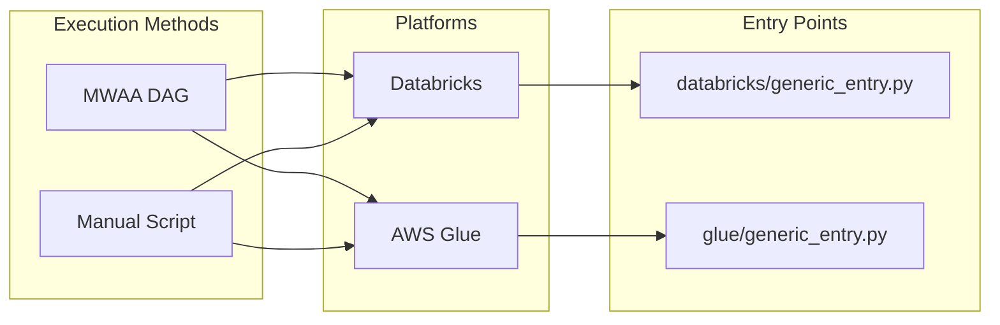
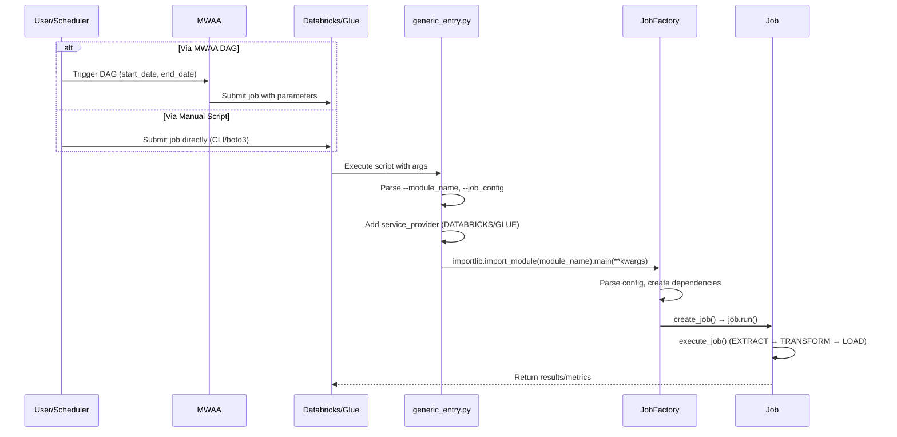

# Job Execution Examples

This document provides concrete examples of executing jobs on different platforms (Databricks and AWS Glue) via different mechanisms (MWAA DAGs and manual scripts).

## Overview



---

## 1. Databricks

### 1.1 Via MWAA DAG

**File:** `airflow/src/transform_images_databricks_pyspark_job.py`

```python
import json
from datetime import timedelta
from airflow import DAG
from airflow.models import Param, Variable
from airflow.providers.databricks.operators.databricks import DatabricksSubmitRunOperator
from airflow.utils.types import NOTSET

# =============================================================================
# Configuration
# =============================================================================
DAG_ID = 'transform-images-databricks-job'

# Job module to execute (the factory's main() function will be called)
CODE_VERSION = '0.3.0'

# Environment configuration
ENV = Variable.get('ENV', 'dev')
CODE_BUCKET = Variable.get('CODE_BUCKET', f'sfly-aws-dwh-{ENV}-scripts')
S3_CODE_PATH = f's3://{CODE_BUCKET}/code/{CODE_VERSION}'

# Data paths
DATA_BUCKET = f'sfly-aws-dwh-{ENV}-data'
S3_DATA_SOURCE = f's3://{DATA_BUCKET}/images/source'
S3_DATA_SINK = f's3://{DATA_BUCKET}/images/sink'

# SNS topic for job events
JOB_EVENTS_SNS_TOPIC = f'arn:aws:sns:us-east-1:123456789:dwh-pipeline-events'

# Databricks instance profile
INSTANCE_PROFILE = Variable.get('DATABRICKS_INSTANCE_PROFILE')

# =============================================================================
# DAG Definition
# =============================================================================
with DAG(
    dag_id=DAG_ID,
    default_args={},
    schedule=None,  # Triggered manually or by upstream DAG
    catchup=False,
    dagrun_timeout=timedelta(hours=4),
    params={
        'start_date': Param(default=NOTSET, type='string', description='Start date (YYYY-MM-DD)'),
        'end_date': Param(default=NOTSET, type='string', description='End date (YYYY-MM-DD)'),
        'created_by': Param(default='airflow', type='string', description='User/system triggering the job'),
    }
) as dag:

    # Cluster configuration
    cluster_config = {
        'spark_version': '15.4.x-scala2.12',
        'node_type_id': 'mgd-fleet.xlarge',
        'driver_node_type_id': 'mgd-fleet.xlarge',
        'num_workers': 2,
        'spark_env_vars': {
            'PYSPARK_PYTHON': '/databricks/python3/bin/python3',
            'ENV': ENV,
        },
        'aws_attributes': {
            'instance_profile_arn': INSTANCE_PROFILE,
        },
    }

    # Job configuration (passed to the job factory)
    job_config = {
        'extractor_config': {
            'path': S3_DATA_SOURCE,
        },
        'loader_config': {
            'path': S3_DATA_SINK,
        },
        'event_publisher_config': {
            'publisher_type': 'SNS',
            'region': 'us-east-1',
            'topic_arn': JOB_EVENTS_SNS_TOPIC,
        },
        'quality_checker_config': {
            'drop_rate_yellow': 0.05,
            'drop_rate_red': 0.10,
            'min_records': 0,
        },
    }

    # Build parameters list for spark_python_task
    job_args = {
        '--module_name': 'dwh.jobs.transform_images.transform_images_job_factory',
        '--transform_images_job': json.dumps(job_config),
        '--start_date': '{{ params.start_date }}',
        '--end_date': '{{ params.end_date }}',
        '--created_by': '{{ params.created_by }}',
    }
    parameters = [item for k, v in job_args.items() for item in [k, v]]

    # Databricks task
    run_databricks_job = DatabricksSubmitRunOperator(
        task_id='run_transform_images',
        databricks_conn_id='databricks_default',
        json={
            'run_name': f'{DAG_ID}-run',
            'new_cluster': cluster_config,
            'timeout_seconds': 14400,  # 4 hours
            'spark_python_task': {
                'python_file': f'{S3_CODE_PATH}/scripts/databricks/generic_entry.py',
                'parameters': parameters,
            },
            'libraries': [
                {'whl': f'{S3_CODE_PATH}/dwh_pipeline_poc-{CODE_VERSION}-py3-none-any.whl'},
            ],
            'init_scripts': [
                {'s3': {'destination': f'{S3_CODE_PATH}/scripts/databricks_init.sh', 'region': 'us-east-1'}},
            ],
        },
        retries=1,
        retry_delay=timedelta(minutes=5),
    )
```

**Trigger from MWAA UI or CLI:**
```bash
# Via Airflow CLI
airflow dags trigger transform-images-databricks-job \
    --conf '{"start_date": "2024-01-15", "end_date": "2024-01-15", "created_by": "manual"}'
```

---

### 1.2 Manual Execution (Shell Script)

**File:** `scripts/run_databricks_job.sh`

```bash
#!/bin/bash
# =============================================================================
# Manual Databricks Job Execution Script
# =============================================================================
# This script submits a job to Databricks using the Databricks CLI.
# Prerequisites:
#   - Databricks CLI installed and configured
#   - AWS credentials configured for S3 access
# =============================================================================

set -euo pipefail

# Configuration
ENV="${ENV:-dev}"
CODE_VERSION="${CODE_VERSION:-0.3.0}"
CODE_BUCKET="sfly-aws-dwh-${ENV}-scripts"
S3_CODE_PATH="s3://${CODE_BUCKET}/code/${CODE_VERSION}"

DATA_BUCKET="sfly-aws-dwh-${ENV}-data"
S3_DATA_SOURCE="s3://${DATA_BUCKET}/images/source"
S3_DATA_SINK="s3://${DATA_BUCKET}/images/sink"

INSTANCE_PROFILE="arn:aws:iam::123456789:instance-profile/databricks-worker"
JOB_EVENTS_SNS_TOPIC="arn:aws:sns:us-east-1:123456789:dwh-pipeline-events"

# Job parameters
START_DATE="${1:-$(date -I)}"
END_DATE="${2:-$(date -I)}"
CREATED_BY="${3:-manual}"

echo "=============================================="
echo "Submitting Databricks Job"
echo "=============================================="
echo "Module: dwh.jobs.transform_images.transform_images_job_factory"
echo "Date Range: ${START_DATE} to ${END_DATE}"
echo "Created By: ${CREATED_BY}"
echo "=============================================="

# Build job configuration JSON
JOB_CONFIG=$(cat <<EOF
{
    "extractor_config": {
        "path": "${S3_DATA_SOURCE}"
    },
    "loader_config": {
        "path": "${S3_DATA_SINK}"
    },
    "event_publisher_config": {
        "publisher_type": "SNS",
        "region": "us-east-1",
        "topic_arn": "${JOB_EVENTS_SNS_TOPIC}"
    },
    "quality_checker_config": {
        "drop_rate_yellow": 0.05,
        "drop_rate_red": 0.10,
        "min_records": 0
    }
}
EOF
)

# Submit job using Databricks CLI
databricks jobs submit --json "$(cat <<EOF
{
    "run_name": "transform-images-manual-${START_DATE}",
    "new_cluster": {
        "spark_version": "15.4.x-scala2.12",
        "node_type_id": "mgd-fleet.xlarge",
        "driver_node_type_id": "mgd-fleet.xlarge",
        "num_workers": 2,
        "spark_env_vars": {
            "PYSPARK_PYTHON": "/databricks/python3/bin/python3",
            "ENV": "${ENV}"
        },
        "aws_attributes": {
            "instance_profile_arn": "${INSTANCE_PROFILE}"
        }
    },
    "timeout_seconds": 14400,
    "spark_python_task": {
        "python_file": "${S3_CODE_PATH}/scripts/databricks/generic_entry.py",
        "parameters": [
            "--module_name", "dwh.jobs.transform_images.transform_images_job_factory",
            "--transform_images_job", ${JOB_CONFIG},
            "--start_date", "${START_DATE}",
            "--end_date", "${END_DATE}",
            "--created_by", "${CREATED_BY}"
        ]
    },
    "libraries": [
        {"whl": "${S3_CODE_PATH}/dwh_pipeline_poc-${CODE_VERSION}-py3-none-any.whl"}
    ],
    "init_scripts": [
        {"s3": {"destination": "${S3_CODE_PATH}/scripts/databricks_init.sh", "region": "us-east-1"}}
    ]
}
EOF
)"

echo "Job submitted successfully!"
```

**Usage:**
```bash
# Run with default dates (today)
./scripts/run_databricks_job.sh

# Run with specific date range
./scripts/run_databricks_job.sh 2024-01-15 2024-01-15 jclark

# Run with environment override
ENV=prod CODE_VERSION=0.3.0 ./scripts/run_databricks_job.sh 2024-01-15 2024-01-15
```

---

## 2. AWS Glue

### 2.1 Via MWAA DAG

**File:** `airflow/src/transform_images_glue_pyspark_job.py`

```python
import json
from datetime import timedelta
from airflow import DAG
from airflow.providers.amazon.aws.operators.glue import GlueJobOperator
from airflow.providers.amazon.aws.sensors.glue import GlueJobSensor
from airflow.models import Variable, Param
from airflow.utils.types import NOTSET

# =============================================================================
# Configuration
# =============================================================================
DAG_ID = 'transform-images-glue-pyspark-job'

# Job module to execute
CODE_VERSION = '0.3.0'

# Environment configuration
ENV = Variable.get('ENV', 'dev')
REGION = Variable.get('AWS_REGION', 'us-east-1')
CODE_BUCKET = Variable.get('CODE_BUCKET', f'sfly-aws-dwh-{ENV}-scripts')
S3_CODE_PATH = f's3://{CODE_BUCKET}/code/{CODE_VERSION}'

# Data paths
DATA_BUCKET = f'sfly-aws-dwh-{ENV}-data'
S3_DATA_SOURCE = f's3://{DATA_BUCKET}/images/source'
S3_DATA_SINK = f's3://{DATA_BUCKET}/images/sink'

# Glue configuration
GLUE_ROLE_NAME = Variable.get('GLUE_ROLE_NAME', f'sfly-aws-dwh-{ENV}-glue-service')
GLUE_CONNECTION_NAME = Variable.get('GLUE_CONNECTION_NAME', f'sfly-aws-dwh-{ENV}-postgres')

# SNS topic for job events
JOB_EVENTS_SNS_TOPIC = f'arn:aws:sns:{REGION}:123456789:dwh-pipeline-events'

# =============================================================================
# DAG Definition
# =============================================================================
dag = DAG(
    DAG_ID,
    default_args={},
    schedule=None,
    catchup=False,
    dagrun_timeout=timedelta(hours=4),
    params={
        'start_date': Param(default=NOTSET, type='string', description='Start date (YYYY-MM-DD)'),
        'end_date': Param(default=NOTSET, type='string', description='End date (YYYY-MM-DD)'),
        'created_by': Param(default='airflow', type='string', description='User/system triggering the job'),
    }
)

# Job configuration
job_config = {
    'extractor_config': {
        'path': S3_DATA_SOURCE,
    },
    'loader_config': {
        'path': S3_DATA_SINK,
    },
    'event_publisher_config': {
        'publisher_type': 'SNS',
        'region': REGION,
        'topic_arn': JOB_EVENTS_SNS_TOPIC,
    },
    'quality_checker_config': {
        'drop_rate_yellow': 0.05,
        'drop_rate_red': 0.10,
        'min_records': 0,
    },
}

# Glue job operator
run_glue_job = GlueJobOperator(
    task_id='run_transform_images',
    job_name=f'{DAG_ID}_{CODE_VERSION}',
    script_location=f'{S3_CODE_PATH}/scripts/glue/generic_entry.py',
    script_args={
        '--module_name': 'dwh.jobs.transform_images.transform_images_job_factory',
        '--transform_images_job': json.dumps(job_config),
        '--start_date': '{{ params.start_date }}',
        '--end_date': '{{ params.end_date }}',
        '--created_by': '{{ params.created_by }}',
    },
    s3_bucket=CODE_BUCKET,
    iam_role_name=GLUE_ROLE_NAME,
    run_job_kwargs={
        'Timeout': 240,  # 4 hours in minutes
    },
    create_job_kwargs={
        'GlueVersion': '5.0',
        'NumberOfWorkers': 2,
        'WorkerType': 'G.1X',
        'DefaultArguments': {
            '--enable-metrics': 'true',
            '--enable-continuous-cloudwatch-log': 'true',
            '--extra-py-files': f'{S3_CODE_PATH}/dwh_pipeline_poc-{CODE_VERSION}-py3-none-any.whl',
            '--python-modules-installer-option': '-r',
            '--additional-python-modules': f'{S3_CODE_PATH}/requirements.txt',
            '--connections': GLUE_CONNECTION_NAME,
            '--extra-jars': f'{S3_CODE_PATH}/jars/decryption-udfs_2.12-1.0.0.jar',
        },
        'Tags': {
            'Environment': ENV.capitalize(),
            'Project': 'DWH-POC',
            'Owner': 'data-platform',
        },
    },
    dag=dag,
)

# Sensor to wait for job completion
wait_for_glue_job = GlueJobSensor(
    task_id='wait_for_completion',
    job_name=f'{DAG_ID}_{CODE_VERSION}',
    run_id="{{ task_instance.xcom_pull(task_ids='run_transform_images', key='return_value') }}",
    dag=dag,
)

run_glue_job >> wait_for_glue_job
```

**Trigger from MWAA UI or CLI:**
```bash
# Via Airflow CLI
airflow dags trigger transform-images-glue-pyspark-job \
    --conf '{"start_date": "2024-01-15", "end_date": "2024-01-15", "created_by": "manual"}'
```

---

### 2.2 Manual Execution (Python Script)

**File:** `scripts/run_glue_job.py`

```python
#!/usr/bin/env python3
"""
Manual AWS Glue Job Execution Script
=====================================
This script submits a job to AWS Glue using boto3.
Prerequisites:
    - AWS credentials configured (via environment, profile, or IAM role)
    - boto3 installed
"""

import argparse
import json
import os
import sys
import time
from datetime import datetime

import boto3

# =============================================================================
# Configuration
# =============================================================================
ENV = os.environ.get('ENV', 'dev')
REGION = os.environ.get('AWS_REGION', 'us-east-1')
CODE_VERSION = os.environ.get('CODE_VERSION', '0.3.0')

CODE_BUCKET = f'sfly-aws-dwh-{ENV}-scripts'
S3_CODE_PATH = f's3://{CODE_BUCKET}/code/{CODE_VERSION}'

DATA_BUCKET = f'sfly-aws-dwh-{ENV}-data'
S3_DATA_SOURCE = f's3://{DATA_BUCKET}/images/source'
S3_DATA_SINK = f's3://{DATA_BUCKET}/images/sink'

GLUE_ROLE_NAME = f'sfly-aws-dwh-{ENV}-glue-service'
GLUE_CONNECTION_NAME = f'sfly-aws-dwh-{ENV}-postgres'
JOB_EVENTS_SNS_TOPIC = f'arn:aws:sns:{REGION}:123456789:dwh-pipeline-events'


def create_or_update_job(glue_client, job_name: str) -> None:
    """Create or update the Glue job definition."""
    job_config = {
        'Name': job_name,
        'Role': GLUE_ROLE_NAME,
        'Command': {
            'Name': 'glueetl',
            'ScriptLocation': f'{S3_CODE_PATH}/scripts/glue/generic_entry.py',
            'PythonVersion': '3',
        },
        'GlueVersion': '5.0',
        'NumberOfWorkers': 2,
        'WorkerType': 'G.1X',
        'Timeout': 240,
        'DefaultArguments': {
            '--enable-metrics': 'true',
            '--enable-continuous-cloudwatch-log': 'true',
            '--extra-py-files': f'{S3_CODE_PATH}/dwh_pipeline_poc-{CODE_VERSION}-py3-none-any.whl',
            '--python-modules-installer-option': '-r',
            '--additional-python-modules': f'{S3_CODE_PATH}/requirements.txt',
            '--connections': GLUE_CONNECTION_NAME,
        },
        'Tags': {
            'Environment': ENV.capitalize(),
            'Project': 'DWH-POC',
        },
    }

    try:
        glue_client.get_job(JobName=job_name)
        # Job exists, update it
        del job_config['Name']
        glue_client.update_job(JobName=job_name, JobUpdate=job_config)
        print(f'Updated existing Glue job: {job_name}')
    except glue_client.exceptions.EntityNotFoundException:
        # Job doesn't exist, create it
        glue_client.create_job(**job_config)
        print(f'Created new Glue job: {job_name}')


def run_job(glue_client, job_name: str, start_date: str, end_date: str, created_by: str) -> str:
    """Start a Glue job run and return the run ID."""
    job_config = {
        'extractor_config': {
            'path': S3_DATA_SOURCE,
        },
        'loader_config': {
            'path': S3_DATA_SINK,
        },
        'event_publisher_config': {
            'publisher_type': 'SNS',
            'region': REGION,
            'topic_arn': JOB_EVENTS_SNS_TOPIC,
        },
        'quality_checker_config': {
            'drop_rate_yellow': 0.05,
            'drop_rate_red': 0.10,
            'min_records': 0,
        },
    }

    response = glue_client.start_job_run(
        JobName=job_name,
        Arguments={
            '--module_name': 'dwh.jobs.transform_images.transform_images_job_factory',
            '--transform_images_job': json.dumps(job_config),
            '--start_date': start_date,
            '--end_date': end_date,
            '--created_by': created_by,
        },
    )
    return response['JobRunId']


def wait_for_completion(glue_client, job_name: str, run_id: str, poll_interval: int = 30) -> str:
    """Wait for the job to complete and return final status."""
    print(f'Waiting for job run {run_id} to complete...')

    while True:
        response = glue_client.get_job_run(JobName=job_name, RunId=run_id)
        status = response['JobRun']['JobRunState']

        if status in ['SUCCEEDED', 'FAILED', 'STOPPED', 'TIMEOUT', 'ERROR']:
            return status

        print(f'  Status: {status} (checking again in {poll_interval}s)')
        time.sleep(poll_interval)


def main():
    parser = argparse.ArgumentParser(description='Run AWS Glue transform_images job')
    parser.add_argument('--start-date', default=datetime.now().strftime('%Y-%m-%d'),
                        help='Start date (YYYY-MM-DD)')
    parser.add_argument('--end-date', default=datetime.now().strftime('%Y-%m-%d'),
                        help='End date (YYYY-MM-DD)')
    parser.add_argument('--created-by', default='manual',
                        help='User/system triggering the job')
    parser.add_argument('--wait', action='store_true',
                        help='Wait for job completion')
    parser.add_argument('--job-name', default=f'transform-images-manual-{CODE_VERSION}',
                        help='Glue job name')
    args = parser.parse_args()

    print('=' * 60)
    print('Submitting AWS Glue Job')
    print('=' * 60)
    print(f'Job Name:    {args.job_name}')
    print(f'Date Range:  {args.start_date} to {args.end_date}')
    print(f'Created By:  {args.created_by}')
    print(f'Environment: {ENV}')
    print(f'Region:      {REGION}')
    print('=' * 60)

    glue_client = boto3.client('glue', region_name=REGION)

    # Create or update job definition
    create_or_update_job(glue_client, args.job_name)

    # Start job run
    run_id = run_job(glue_client, args.job_name, args.start_date, args.end_date, args.created_by)
    print(f'Started job run: {run_id}')

    # Optionally wait for completion
    if args.wait:
        final_status = wait_for_completion(glue_client, args.job_name, run_id)
        print(f'Job completed with status: {final_status}')

        if final_status != 'SUCCEEDED':
            sys.exit(1)
    else:
        print(f'Job running in background. Check status with:')
        print(f'  aws glue get-job-run --job-name {args.job_name} --run-id {run_id}')


if __name__ == '__main__':
    main()
```

**Usage:**
```bash
# Run with default dates (today), don't wait
python scripts/run_glue_job.py

# Run with specific dates and wait for completion
python scripts/run_glue_job.py \
    --start-date 2024-01-15 \
    --end-date 2024-01-15 \
    --created-by jclark \
    --wait

# Override environment
ENV=prod AWS_REGION=us-east-1 python scripts/run_glue_job.py --start-date 2024-01-15
```

---

## Summary: Execution Flow



## Key Differences Between Platforms

| Aspect | Databricks | AWS Glue |
|--------|------------|----------|
| **Entry Point** | `databricks/generic_entry.py` | `glue/generic_entry.py` |
| **Service Provider** | `DATABRICKS` | `GLUE` |
| **Code Distribution** | WHL via `libraries` | WHL via `--extra-py-files` |
| **Cluster Config** | `new_cluster` in job JSON | `create_job_kwargs` |
| **Operator** | `DatabricksSubmitRunOperator` | `GlueJobOperator` |
| **CLI Tool** | `databricks jobs submit` | `aws glue start-job-run` |
| **Spark Detection** | Always True | Checks env vars |
