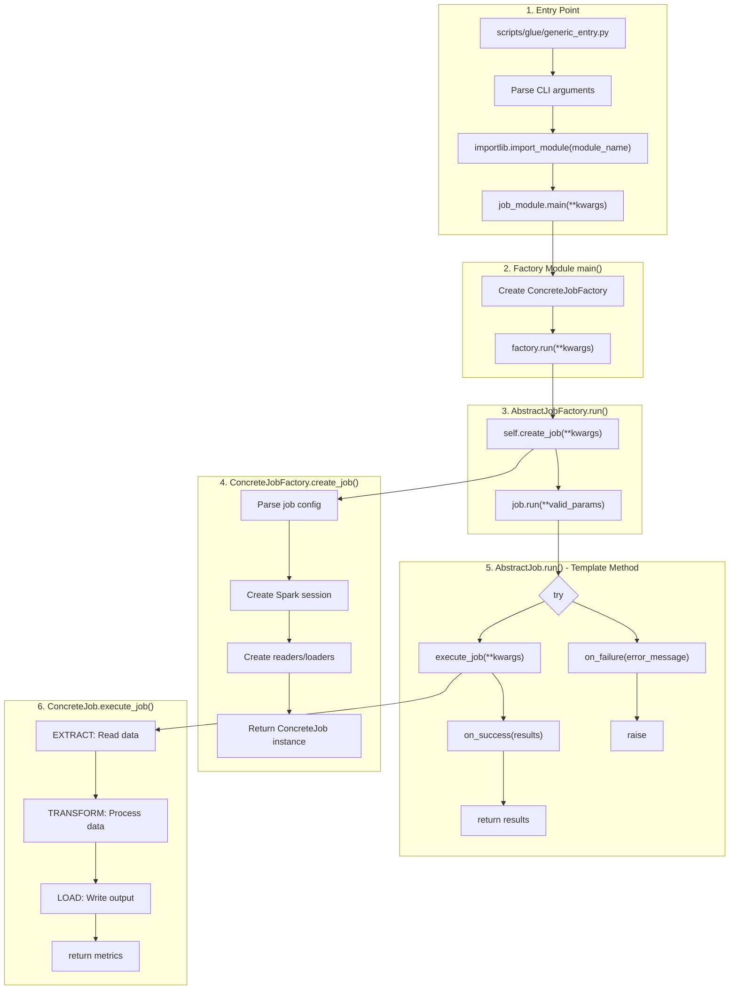
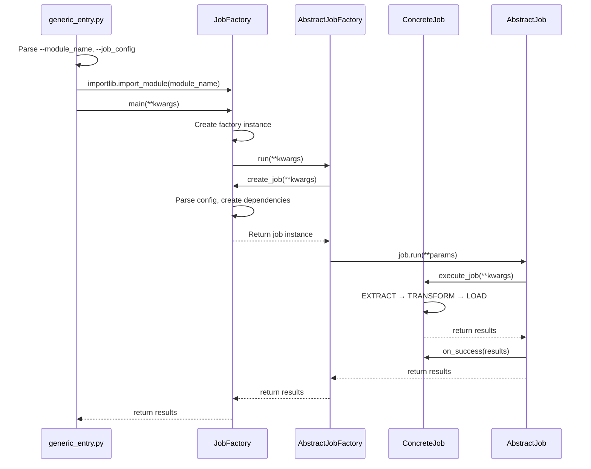

# Job Routing Architecture

This document explains how jobs are routed and executed in the DWH Business Logic framework.

## Overview

The framework uses a layered architecture to route job execution from entry points through factories to the actual job logic. This design allows the same business logic to run across different execution environments (Databricks, AWS Glue, EMR, Docker containers).

## Flow Diagram



## Sequence Diagram



## Layer Details

### 1. Entry Point
**Location:** `scripts/glue/generic_entry.py` (or `databricks/`, `container/`)

- Parses command-line arguments
- Extracts `--module_name` and job-specific JSON config
- Uses `importlib` to dynamically load the factory module
- Calls `factory.main(**kwargs)`

```python
def execute_module(module_name, module_args):
    job_module = importlib.import_module(module_name)
    job_module.main(**module_args)
```

### 2. Factory Module main()
**Location:** `src/dwh/jobs/<job_name>/<job_name>_job_factory.py`

- Entry point for the job (contract: must have `main(**kwargs)`)
- Creates an instance of the concrete job factory
- Calls `factory.run(**kwargs)`

```python
def main(**kwargs):
    factory = FilterImagesJobFactory(**kwargs)
    return factory.run(**kwargs)
```

### 3. AbstractJobFactory.run()
**Location:** `src/dwh/jobs/abstract_job_factory.py`

- Base class for all job factories
- Provides `run()` method that orchestrates job creation and execution
- Handles common concerns: config parsing, validation, error handling

```python
def run(self, **kwargs):
    job = self.create_job(**kwargs)   # Calls concrete factory
    return job.run(**valid_params)    # Calls AbstractJob.run()

@abstractmethod
def create_job(self, **kwargs) -> AbstractJob:
    pass  # Implemented by concrete factory
```

### 4. Concrete Job Factory
**Location:** `src/dwh/jobs/<job_name>/<job_name>_job_factory.py`

- Implements `create_job()` to assemble the job with all dependencies
- Parses job-specific configuration
- Creates and injects all required services (readers, loaders, etc.)

```python
def create_job(self, **kwargs) -> FilterImagesJob:
    config = self.parse_job_config(...)
    spark = self._get_spark_session(**kwargs)
    reader = TransformOutputReader(spark)
    loader = FilterLoader(spark)
    return FilterImagesJob(
        transform_output_reader=reader,
        loader=loader,
        ...
    )
```

### 5. AbstractJob.run()
**Location:** `src/dwh/jobs/abstract_job.py`

- Base class for all jobs
- Provides `run()` method (marked `@final` - cannot be overridden)
- Template Method Pattern: `run()` orchestrates, subclasses implement hooks

```python
@final
def run(self, **kwargs):
    try:
        results = self.execute_job(**kwargs)  # Calls concrete job
        self.on_success(results)              # Success hook
        return results
    except Exception as e:
        self.on_failure(error_message)        # Failure hook
        raise

@abstractmethod
def execute_job(self, **kwargs): pass

@abstractmethod
def on_success(self, results): pass

@abstractmethod
def on_failure(self, error_message): pass
```

### 6. Concrete Job
**Location:** `src/dwh/jobs/<job_name>/<job_name>_job.py`

- Implements `execute_job()` with actual business logic
- Implements `on_success()` and `on_failure()` hooks
- Uses injected dependencies (readers, transformers, loaders)

```python
def execute_job(self, transform_output_path, year, month, day, **kwargs):
    # EXTRACT
    new_df = self.transform_output_reader.read(transform_output_path)
    previous_df = self.filtered_output_reader.read(previous_path)

    # TRANSFORM
    deduplicated_df = self.transformer.transform(previous_df, new_df)

    # LOAD
    self.loader.load(deduplicated_df, output_path)

    return metrics
```

## Key Design Patterns

### 1. Dynamic Module Loading
The entry point uses Python's `importlib` to dynamically load job factory modules:
- Single entry point for all jobs
- Job selection via command-line argument
- No hardcoded job references in entry scripts

### 2. Factory Pattern
Job factories are responsible for:
- Parsing configuration
- Creating dependencies (Spark sessions, readers, loaders)
- Assembling the job with all its dependencies
- Keeps job classes focused on business logic

### 3. Template Method Pattern
`AbstractJob.run()` defines the execution skeleton:
```
try → execute_job() → on_success()
except → on_failure() → raise
```
Subclasses only implement the hooks, not the control flow.

### 4. Dependency Injection
All dependencies are injected into jobs via constructor:
- Jobs never create their own dependencies
- Makes testing easy (inject fake/noop implementations)
- Makes jobs environment-agnostic

## Command-Line Invocation

```bash
spark-submit \
  scripts/glue/generic_entry.py \
  --module_name dwh.jobs.filter_images.filter_images_job_factory \
  --filter_images_job '{
    "base_path": "s3://bucket/filtered_images",
    "timezone": "America/Los_Angeles",
    "transform_output_path": "s3://bucket/transformed/...",
    "triggered_by_job": "transform_images",
    "triggered_by_run_id": "spark-xxx"
  }' \
  --has_spark true
```

## Contract Requirements

### Factory Module Contract
Every job factory module must expose a `main(**kwargs)` function:
```python
def main(**kwargs):
    factory = MyJobFactory(**kwargs)
    return factory.run(**kwargs)
```

### Concrete Factory Contract
Must implement `create_job(**kwargs) -> AbstractJob`:
```python
class MyJobFactory(AbstractJobFactory):
    def create_job(self, **kwargs) -> MyJob:
        # Parse config, create dependencies, return job instance
        ...
```

### Concrete Job Contract
Must implement three methods:
```python
class MyJob(AbstractJob):
    def execute_job(self, **kwargs) -> Any:
        # Business logic here
        ...

    def on_success(self, results) -> None:
        # Publish events, cleanup, etc.
        ...

    def on_failure(self, error_message: str) -> None:
        # Error handling, alerting, etc.
        ...
```

## Benefits of This Architecture

1. **Environment Agnostic**: Same job code runs on Databricks, Glue, EMR, or containers
2. **Testable**: Inject fake dependencies for unit/functional tests
3. **Separation of Concerns**: Factories handle wiring, jobs handle business logic
4. **Consistent Error Handling**: AbstractJob ensures on_success/on_failure always run
5. **Configuration Driven**: All job parameters come from JSON config, not code changes
