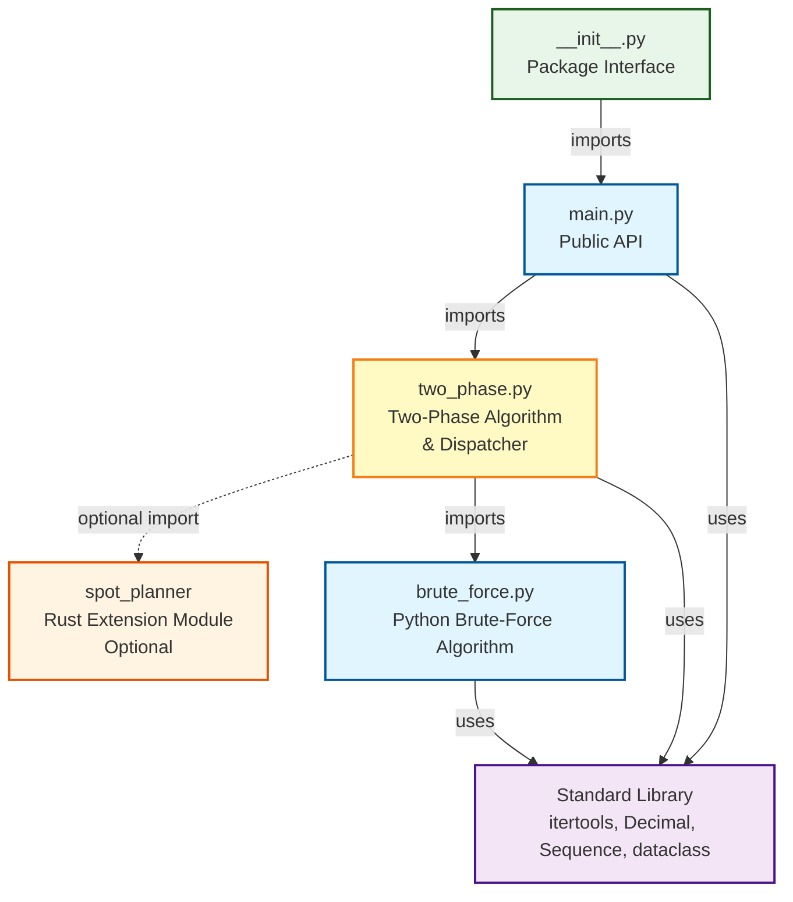

# Module Dependency Diagram

## Module Descriptions

### `__init__.py`

- **Purpose**: Package interface, exports public API
- **Exports**: `get_cheapest_periods`
- **Dependencies**: `main.py`

### `main.py`

- **Purpose**: Public API and entry point
- **Key Functions**:
  - `get_cheapest_periods()` - Public API that dispatches based on sequence length
- **Dependencies**:
  - `two_phase.py` (for both short and long sequences)

### `two_phase.py`

- **Purpose**: Two-phase algorithm and dispatcher for brute-force implementations
- **Key Functions**:
  - `get_cheapest_periods_extended()` - Extended algorithm for sequences > 28 items
  - `_get_cheapest_periods()` - Internal dispatcher (Rust vs Python) for sequences ≤ 28 items
  - `ChunkBoundaryState` - Data class for boundary tracking
  - `_find_best_chunk_selection_with_lookahead()` - Look-ahead optimization
  - `_repair_selection()` - Constraint repair
- **Dependencies**:
  - Standard library
  - `brute_force.py` (Python fallback implementation)
  - `spot_planner` Rust module (optional, for performance)

### `brute_force.py`

- **Purpose**: Python brute-force implementation (for comparison/testing)
- **Key Functions**:
  - `get_cheapest_periods_python()` - Main entry point
  - `_is_valid_combination()` - Validation helper
  - `_get_cheapest_periods_aggressive_python()` - Aggressive mode
  - `_get_cheapest_periods_conservative_python()` - Conservative mode
- **Dependencies**: Standard library only (no internal dependencies)
- **Note**: This is primarily for comparison with the Rust implementation. The two-phase algorithm uses it as a fallback when Rust is not available.

### `spot_planner` (Rust Module)

- **Purpose**: High-performance Rust brute-force implementation
- **Dependencies**: None (external extension module)
- **Note**: Optional - falls back to Python if not available. Used directly by `two_phase.py`.

## Dependency Notes

- **No Circular Dependencies**: The refactored structure eliminates circular dependencies. `two_phase.py` now contains the dispatcher and directly imports both Rust and Python implementations.
- **Clean Hierarchy**:
  - `main.py` → `two_phase.py` → {Rust module, `brute_force.py`}
  - The Rust module and Python brute-force are "underneath" the two-phase algorithm
- **Optional Dependency**: The Rust module is optional - the code gracefully falls back to Python implementation if Rust is not available.
- **Clean Separation**: `brute_force.py` has no internal dependencies, making it easy to test and maintain independently.
