# 업로드 액션 개발

이 가이드는 업로드 액션 아키텍처를 이해, 확장 또는 사용자 정의하려는 SDK 개발자 및 기여자를 위한 것입니다.

## 아키텍처 개요

업로드 시스템은 입증된 디자인 패턴을 기반으로 한 현대적이고 확장 가능한 아키텍처를 사용합니다. 리팩토링된 구현은 이전의 모놀리식 접근 방식을 명확한 관심사 분리를 가진 모듈식, 전략 기반 시스템으로 변환합니다.

### 디자인 패턴

아키텍처는 몇 가지 주요 디자인 패턴을 활용합니다:

- **전략 패턴**: 검증, 파일 검색, 메타데이터 처리, 업로드 작업 및 데이터 단위 생성을 위한 플러그형 동작
- **퍼사드 패턴**: UploadOrchestrator는 복잡한 워크플로우를 조정하기 위한 단순화된 인터페이스를 제공합니다.
- **팩토리 패턴**: StrategyFactory는 런타임 매개변수를 기반으로 적절한 전략 구현을 생성합니다.
- **컨텍스트 패턴**: UploadContext는 워크플로우 구성 요소 간의 공유 상태 및 통신을 유지합니다.

### 구성 요소 아키텍처

```mermaid
classDiagram
    %% 라이트/다크 모드 호환 색상
    classDef coreClass fill:#e3f2fd,stroke:#1976d2,stroke-width:2px,color:#000000
    classDef strategyClass fill:#e8f5e8,stroke:#388e3c,stroke-width:2px,color:#000000
    classDef stepClass fill:#fff9c4,stroke:#f57c00,stroke-width:2px,color:#000000
    classDef contextClass fill:#ffebee,stroke:#d32f2f,stroke-width:2px,color:#000000

    class UploadAction {
        +name: str = "upload"
        +category: PluginCategory.UPLOAD
        +method: RunMethod.JOB
        +run_class: UploadRun
        +params_model: UploadParams
        +progress_categories: dict
        +metrics_categories: dict
        +strategy_factory: StrategyFactory
        +step_registry: StepRegistry

        +start() dict
        +get_workflow_summary() dict
        +_configure_workflow() None
        +_configure_strategies() dict
    }

    class UploadOrchestrator {
        +context: UploadContext
        +step_registry: StepRegistry
        +strategies: dict
        +executed_steps: list
        +current_step_index: int
        +rollback_executed: bool

        +execute() dict
        +get_workflow_summary() dict
        +get_executed_steps() list
        +is_rollback_executed() bool
        +_execute_step(step) StepResult
        +_handle_step_failure(step, error) None
        +_rollback_executed_steps() None
    }

    class UploadContext {
        +params: dict
        +run: UploadRun
        +client: Any
        +storage: Any
        +pathlib_cwd: Path
        +metadata: dict
        +file_specifications: dict
        +organized_files: list
        +uploaded_files: list
        +data_units: list
        +metrics: dict
        +errors: list
        +strategies: dict
        +rollback_data: dict

        +update(result: StepResult) None
        +get_result() dict
        +has_errors() bool
        +update_metrics(category, metrics) None
    }

    class StepRegistry {
        +_steps: list
        +register(step: BaseStep) None
        +get_steps() list
        +get_total_progress_weight() float
        +clear() None
    }

    class StrategyFactory {
        +create_validation_strategy(params, context) BaseValidationStrategy
        +create_file_discovery_strategy(params, context) BaseFileDiscoveryStrategy
        +create_metadata_strategy(params, context) BaseMetadataStrategy
        +create_upload_strategy(params, context) BaseUploadStrategy
        +create_data_unit_strategy(params, context) BaseDataUnitStrategy
        +get_available_strategies() dict
    }

    class BaseStep {
        <<abstract>>
        +name: str
        +progress_weight: float
        +execute(context: UploadContext) StepResult
        +can_skip(context: UploadContext) bool
        +rollback(context: UploadContext) None
        +create_success_result(data) StepResult
        +create_error_result(error) StepResult
        +create_skip_result() StepResult
    }

    class ExcelSecurityConfig {
        +max_file_size_mb: int = 10
        +max_rows: int = 100000
        +max_columns: int = 50
        +max_file_size_bytes: int
        +from_action_config(action_config) ExcelSecurityConfig
    }

    class StepResult {
        +success: bool
        +data: dict
        +error: str
        +rollback_data: dict
        +skipped: bool
        +original_exception: Exception
        +timestamp: datetime
    }

    %% 전략 기본 클래스
    class BaseValidationStrategy {
        <<abstract>>
        +validate_files(files, context) bool
        +validate_security(file_path) bool
    }

    class BaseFileDiscoveryStrategy {
        <<abstract>>
        +discover_files(path, context) list
        +organize_files(files, specs, context) list
    }

    class BaseMetadataStrategy {
        <<abstract>>
        +process_metadata(context) dict
        +extract_metadata(file_path) dict
    }

    class BaseUploadStrategy {
        <<abstract>>
        +upload_files(files, context) list
        +upload_batch(batch, context) list
    }

    class BaseDataUnitStrategy {
        <<abstract>>
        +generate_data_units(files, context) list
        +create_data_unit_batch(batch, context) list
    }

    %% 워크플로우 단계
    class InitializeStep {
        +name = "initialize"
        +progress_weight = 0.05
    }

    class ProcessMetadataStep {
        +name = "process_metadata"
        +progress_weight = 0.05
    }

    class AnalyzeCollectionStep {
        +name = "analyze_collection"
        +progress_weight = 0.05
    }

    class OrganizeFilesStep {
        +name = "organize_files"
        +progress_weight = 0.10
    }

    class ValidateFilesStep {
        +name = "validate_files"
        +progress_weight = 0.05
    }

    class UploadFilesStep {
        +name = "upload_files"
        +progress_weight = 0.30
    }

    class GenerateDataUnitsStep {
        +name = "generate_data_units"
        +progress_weight = 0.35
    }

    class CleanupStep {
        +name = "cleanup"
        +progress_weight = 0.05
    }

    %% 관계
    UploadAction --> UploadRun : 사용
    UploadAction --> UploadParams : 검증
    UploadAction --> ExcelSecurityConfig : 구성
    UploadAction --> UploadOrchestrator : 생성 및 실행
    UploadAction --> StrategyFactory : 전략 구성
    UploadAction --> StepRegistry : 워크플로우 단계 관리
    UploadOrchestrator --> UploadContext : 상태 조정
    UploadOrchestrator --> StepRegistry : 단계 실행
    UploadOrchestrator --> BaseStep : 실행
    BaseStep --> StepResult : 반환
    UploadContext --> StepResult : 업데이트
    StrategyFactory --> BaseValidationStrategy : 생성
    StrategyFactory --> BaseFileDiscoveryStrategy : 생성
    StrategyFactory --> BaseMetadataStrategy : 생성
    StrategyFactory --> BaseUploadStrategy : 생성
    StrategyFactory --> BaseDataUnitStrategy : 생성
    StepRegistry --> BaseStep : 포함

    %% 단계 상속
    InitializeStep --|> BaseStep : 확장
    ProcessMetadataStep --|> BaseStep : 확장
    AnalyzeCollectionStep --|> BaseStep : 확장
    OrganizeFilesStep --|> BaseStep : 확장
    ValidateFilesStep --|> BaseStep : 확장
    UploadFilesStep --|> BaseStep : 확장
    GenerateDataUnitsStep --|> BaseStep : 확장
    CleanupStep --|> BaseStep : 확장
```



### 단계 기반 워크플로우 실행

리팩토링된 아키텍처는 UploadOrchestrator에 의해 조정되는 단계 기반 워크플로우를 사용합니다. 각 단계는 정의된 책임과 진행 가중치를 가집니다.

#### 워크플로우 단계 개요

| 단계 | 이름                | 가중치 | 책임                                         |
| ---- | ------------------- | ------ | -------------------------------------------- |
| 1    | Initialize          | 5%     | 스토리지, pathlib 설정 및 기본 검증          |
| 2    | Process Metadata    | 5%     | 제공된 경우 Excel 메타데이터 처리            |
| 3    | Analyze Collection  | 5%     | 데이터 컬렉션 사양 검색 및 검증              |
| 4    | Organize Files      | 10%    | 유형별 파일 검색 및 구성                     |
| 5    | Validate Files      | 5%     | 보안 및 내용 검증                            |
| 6    | Upload Files        | 30%    | 스토리지에 파일 업로드                       |
| 7    | Generate Data Units | 35%    | 업로드된 파일에서 데이터 단위 생성           |
| 8    | Cleanup             | 5%     | 임시 리소스 정리                             |

#### 실행 흐름

```mermaid
flowchart TD
    %% 시작
    A["🚀 업로드 액션 시작"] --> B["📋 UploadContext 생성"]
    B --> C["⚙️ 전략 구성"]
    C --> D["📝 워크플로우 단계 등록"]
    D --> E["🎯 UploadOrchestrator 생성"]

    %% 전략 주입
    E --> F["💉 컨텍스트에 전략 주입"]
    F --> G["📊 진행 상황 추적 초기화"]

    %% 단계 실행 루프
    G --> H["🔄 단계 실행 루프 시작"]
    H --> I["📍 다음 단계 가져오기"]
    I --> J{"🤔 단계를 건너뛸 수 있는가?"}
    J -->|예| K["⏭️ 단계 건너뛰기"]
    J -->|아니요| L["▶️ 단계 실행"]

    %% 단계 실행
    L --> M{"✅ 단계 성공?"}
    M -->|예| N["📈 진행 상황 업데이트"]
    M -->|아니요| O["❌ 단계 실패 처리"]

    %% 성공 경로
    N --> P["💾 단계 결과 저장"]
    P --> Q["📝 실행된 단계에 추가"]
    Q --> R{"🏁 더 많은 단계가 있는가?"}
    R -->|예| I
    R -->|아니요| S["🎉 워크플로우 완료"]

    %% 건너뛰기 경로
    K --> T["📊 진행 상황 업데이트 (건너뛰기)"]
    T --> R

    %% 오류 처리
    O --> U["🔙 롤백 프로세스 시작"]
    U --> V["⏪ 실행된 단계 롤백"]
    V --> W["📝 롤백 결과 기록"]
    W --> X["💥 예외 전파"]

    %% 최종 결과
    S --> Y["📊 최종 메트릭 수집"]
    Y --> Z["📋 결과 요약 생성"]
    Z --> AA["🔄 UploadAction으로 반환"]

    %% 스타일 적용 - 라이트/다크 모드 호환
    classDef startNode fill:#e3f2fd,stroke:#1976d2,stroke-width:2px,color:#000000
    classDef processNode fill:#f3e5f5,stroke:#7b1fa2,stroke-width:2px,color:#000000
    classDef decisionNode fill:#fff3e0,stroke:#f57c00,stroke-width:2px,color:#000000
    classDef successNode fill:#e8f5e8,stroke:#388e3c,stroke-width:2px,color:#000000
    classDef errorNode fill:#ffebee,stroke:#d32f2f,stroke-width:2px,color:#000000

    class A,B,E startNode
    class C,D,F,G,H,I,L,N,P,Q,T,Y,Z,AA processNode
    class J,M,R decisionNode
    class K,S successNode
    class O,U,V,W,X errorNode
```



#### 전략 통합 지점

전략은 특정 지점에서 워크플로우에 주입됩니다:

- **검증 전략**: ValidateFilesStep에서 사용
- **파일 검색 전략**: OrganizeFilesStep에서 사용
- **메타데이터 전략**: ProcessMetadataStep에서 사용
- **업로드 전략**: UploadFilesStep에서 사용
- **데이터 단위 전략**: GenerateDataUnitsStep에서 사용

#### 오류 처리 및 롤백

오케스트레이터는 자동 롤백 기능을 제공합니다:

1. **예외 캡처**: 디버깅을 위해 원래 예외를 보존합니다.
2. **롤백 실행**: 성공적으로 실행된 모든 단계에 대해 역순으로 `rollback()`을 호출합니다.
3. **점진적 성능 저하**: 개별 단계 롤백이 실패하더라도 롤백을 계속합니다.
4. **상태 보존**: 실패 후 분석을 위해 실행 상태를 유지합니다.

## 개발 가이드

이 섹션은 사용자 정의 전략 및 워크플로우 단계로 업로드 액션을 확장하기 위한 포괄적인 지침을 제공합니다.

### 사용자 정의 전략 생성

전략은 업로드 프로세스의 다양한 측면에 대한 특정 동작을 구현합니다. 각 전략 유형에는 잘 정의된 인터페이스가 있습니다.

#### 사용자 정의 검증 전략

```python
from synapse_sdk.plugins.categories.upload.actions.upload.strategies.validation.base import BaseValidationStrategy
from synapse_sdk.plugins.categories.upload.actions.upload.context import UploadContext
from pathlib import Path
from typing import List

class CustomValidationStrategy(BaseValidationStrategy):
    """고급 보안 검사를 포함한 사용자 정의 검증 전략."""

    def validate_files(self, files: List[Path], context: UploadContext) -> bool:
        """사용자 정의 비즈니스 규칙을 사용하여 파일을 검증합니다."""
        for file_path in files:
            # 사용자 정의 검증 로직
            if not self._validate_custom_rules(file_path):
                return False

            # 보안 검증 호출
            if not self.validate_security(file_path):
                return False
        return True

    def validate_security(self, file_path: Path) -> bool:
        """사용자 정의 보안 검증."""
        # 사용자 정의 보안 검사 구현
        if file_path.suffix in ['.exe', '.bat', '.sh']:
            return False

        # 파일 크기 확인
        if file_path.stat().st_size > 100 * 1024 * 1024:  # 100MB
            return False

        return True

    def _validate_custom_rules(self, file_path: Path) -> bool:
        """도메인별 검증 규칙을 구현합니다."""
        # 사용자 정의 비즈니스 로직
        return True
```

#### 사용자 정의 파일 검색 전략

```python
from synapse_sdk.plugins.categories.upload.actions.upload.strategies.file_discovery.base import BaseFileDiscoveryStrategy
from pathlib import Path
from typing import List, Dict, Any

class CustomFileDiscoveryStrategy(BaseFileDiscoveryStrategy):
    """고급 필터링을 사용한 사용자 정의 파일 검색 전략."""

    def discover_files(self, path: Path, context: UploadContext) -> List[Path]:
        """사용자 정의 필터링 규칙으로 파일을 검색합니다."""
        files = []

        if context.get_param('is_recursive', False):
            files = list(path.rglob('*'))
        else:
            files = list(path.iterdir())

        # 사용자 정의 필터링 적용
        return self._apply_custom_filters(files, context)

    def organize_files(self, files: List[Path], specs: Dict[str, Any], context: UploadContext) -> List[Dict[str, Any]]:
        """사용자 정의 분류를 사용하여 파일을 구성합니다."""
        organized = []

        for file_path in files:
            if file_path.is_file():
                category = self._determine_category(file_path)
                organized.append({
                    'file_path': file_path,
                    'category': category,
                    'metadata': self._extract_file_metadata(file_path)
                })

        return organized

    def _apply_custom_filters(self, files: List[Path], context: UploadContext) -> List[Path]:
        """도메인별 파일 필터를 적용합니다."""
        filtered = []
        for file_path in files:
            if self._should_include_file(file_path):
                filtered.append(file_path)
        return filtered

    def _determine_category(self, file_path: Path) -> str:
        """사용자 정의 로직을 사용하여 파일 카테고리를 결정합니다."""
        ext = file_path.suffix.lower()
        if ext in ['.jpg', '.png', '.gif']:
            return 'images'
        elif ext in ['.pdf', '.doc', '.docx']:
            return 'documents'
        else:
            return 'other'
```

#### 사용자 정의 업로드 전략

```python
from synapse_sdk.plugins.categories.upload.actions.upload.strategies.upload.base import BaseUploadStrategy
from typing import List, Dict, Any
import time

class CustomUploadStrategy(BaseUploadStrategy):
    """고급 재시도 로직을 사용한 사용자 정의 업로드 전략."""

    def upload_files(self, files: List[Dict[str, Any]], context: UploadContext) -> List[Dict[str, Any]]:
        """사용자 정의 배치 및 재시도 로직으로 파일을 업로드합니다."""
        uploaded_files = []
        batch_size = context.get_param('upload_batch_size', 10)

        # 사용자 정의 배치로 처리
        for i in range(0, len(files), batch_size):
            batch = files[i:i + batch_size]
            batch_results = self.upload_batch(batch, context)
            uploaded_files.extend(batch_results)

        return uploaded_files

    def upload_batch(self, batch: List[Dict[str, Any]], context: UploadContext) -> List[Dict[str, Any]]:
        """재시도 로직으로 파일 배치를 업로드합니다."""
        results = []

        for file_info in batch:
            max_retries = 3
            for attempt in range(max_retries):
                try:
                    result = self._upload_single_file(file_info, context)
                    results.append(result)
                    break
                except Exception as e:
                    if attempt == max_retries - 1:
                        # 마지막 시도 실패
                        context.add_error(f"{file_info['file_path']} 업로드 실패: {e}")
                    else:
                        # 재시도 전 대기
                        time.sleep(2 ** attempt)

        return results

    def _upload_single_file(self, file_info: Dict[str, Any], context: UploadContext) -> Dict[str, Any]:
        """사용자 정의 로직으로 단일 파일을 업로드합니다."""
        file_path = file_info['file_path']
        storage = context.storage

        # 여기에 사용자 정의 업로드 로직
        uploaded_file = {
            'file_path': str(file_path),
            'storage_path': f"uploads/{file_path.name}",
            'size': file_path.stat().st_size,
            'checksum': self._calculate_checksum(file_path)
        }

        return uploaded_file
```

### 사용자 정의 워크플로우 단계 생성

사용자 정의 워크플로우 단계는 기본 단계 클래스를 확장하고 필요한 인터페이스를 구현합니다.

#### 사용자 정의 처리 단계

```python
from synapse_sdk.plugins.categories.upload.actions.upload.steps.base import BaseStep
from synapse_sdk.plugins.categories.upload.actions.upload.context import UploadContext, StepResult
from pathlib import Path
from typing import List, Dict
from datetime import datetime

class CustomProcessingStep(BaseStep):
    """특수 파일 처리를 위한 사용자 정의 처리 단계."""

    @property
    def name(self) -> str:
        return 'custom_processing'

    @property
    def progress_weight(self) -> float:
        return 0.15  # 전체 워크플로우의 15%

    def execute(self, context: UploadContext) -> StepResult:
        """사용자 정의 처리 로직을 실행합니다."""
        try:
            # 사용자 정의 처리 로직
            processed_files = self._process_files(context)

            # 결과로 컨텍스트 업데이트
            return self.create_success_result({
                'processed_files': processed_files,
                'processing_stats': self._get_processing_stats()
            })

        except Exception as e:
            return self.create_error_result(f'사용자 정의 처리 실패: {str(e)}')

    def can_skip(self, context: UploadContext) -> bool:
        """단계가 건너뛸 수 있는지 결정합니다."""
        # 처리할 파일이 없으면 건너뛰기
        return len(context.organized_files) == 0

    def rollback(self, context: UploadContext) -> None:
        """사용자 정의 처리 작업을 롤백합니다."""
        # 처리 중에 생성된 모든 리소스 정리
        self._cleanup_processing_resources(context)

    def _process_files(self, context: UploadContext) -> List[Dict]:
        """사용자 정의 파일 처리를 구현합니다."""
        processed = []

        for file_info in context.organized_files:
            # 사용자 정의 처리 로직
            result = self._process_single_file(file_info)
            processed.append(result)

        return processed

    def _process_single_file(self, file_info: Dict) -> Dict:
        """단일 파일을 처리합니다."""
        return {
            'original': file_info,
            'processed': True,
            'timestamp': datetime.now()
        }

    def _get_processing_stats(self) -> Dict:
        """처리 통계를 가져옵니다."""
        return {}

    def _cleanup_processing_resources(self, context: UploadContext) -> None:
        """처리 리소스를 정리합니다."""
        pass
```

### 전략 팩토리 확장

사용자 정의 전략을 사용 가능하게 하려면 StrategyFactory를 확장합니다:

```python
from synapse_sdk.plugins.categories.upload.actions.upload.factory import StrategyFactory
from typing import Dict

class CustomStrategyFactory(StrategyFactory):
    """사용자 정의 전략을 포함한 확장된 팩토리."""

    def create_validation_strategy(self, params: Dict, context=None):
        """사용자 정의 옵션으로 검증 전략을 생성합니다."""
        validation_type = params.get('custom_validation_type', 'default')

        if validation_type == 'strict':
            return CustomValidationStrategy()
        else:
            return super().create_validation_strategy(params, context)

    def create_file_discovery_strategy(self, params: Dict, context=None):
        """사용자 정의 옵션으로 파일 검색 전략을 생성합니다."""
        discovery_mode = params.get('discovery_mode', 'default')

        if discovery_mode == 'advanced':
            return CustomFileDiscoveryStrategy()
        else:
            return super().create_file_discovery_strategy(params, context)
```

### 사용자 정의 업로드 액션

포괄적인 사용자 정의를 위해 UploadAction 자체를 확장합니다:

```python
from synapse_sdk.plugins.categories.upload.actions.upload.action import UploadAction
from synapse_sdk.plugins.categories.decorators import register_action
from typing import Dict, Any

@register_action
class CustomUploadAction(UploadAction):
    """확장된 워크플로우를 가진 사용자 정의 업로드 액션."""

    name = 'custom_upload'

    def __init__(self, *args, **kwargs):
        super().__init__(*args, **kwargs)
        # 사용자 정의 전략 팩토리 사용
        self.strategy_factory = CustomStrategyFactory()

    def _configure_workflow(self) -> None:
        """추가 단계로 사용자 정의 워크플로우를 구성합니다."""
        # 표준 단계 등록
        super()._configure_workflow()

        # 사용자 정의 처리 단계 추가
        self.step_registry.register(CustomProcessingStep())

    def _configure_strategies(self, context=None) -> Dict[str, Any]:
        """사용자 정의 매개변수로 전략을 구성합니다."""
        strategies = super()._configure_strategies(context)

        # 사용자 정의 전략 추가
        strategies['custom_processing'] = self._create_custom_processing_strategy()

        return strategies

    def _create_custom_processing_strategy(self):
        """사용자 정의 처리 전략을 생성합니다."""
        return CustomProcessingStrategy(self.params)
```

### 사용자 정의 구성 요소 테스트

#### 사용자 정의 전략 테스트

```python
import pytest
from unittest.mock import Mock
from pathlib import Path

class TestCustomValidationStrategy:

    def setup_method(self):
        self.strategy = CustomValidationStrategy()
        self.context = Mock()

    def test_validate_files_success(self):
        """성공적인 파일 검증 테스트."""
        files = [Path('/test/file1.txt'), Path('/test/file2.jpg')]
        result = self.strategy.validate_files(files, self.context)
        assert result is True

    def test_validate_files_security_failure(self):
        """보안상의 이유로 검증 실패 테스트."""
        files = [Path('/test/malware.exe')]
        result = self.strategy.validate_files(files, self.context)
        assert result is False

    def test_validate_large_file_failure(self):
        """큰 파일에 대한 검증 실패 테스트."""
        # 큰 크기를 반환하도록 파일 상태 모의
        large_file = Mock(spec=Path)
        large_file.suffix = '.txt'
        large_file.stat.return_value.st_size = 200 * 1024 * 1024  # 200MB

        result = self.strategy.validate_security(large_file)
        assert result is False
```

#### 사용자 정의 단계 테스트

```python
class TestCustomProcessingStep:

    def setup_method(self):
        self.step = CustomProcessingStep()
        self.context = Mock()
        self.context.organized_files = [
            {'file_path': '/test/file1.txt'},
            {'file_path': '/test/file2.jpg'}
        ]

    def test_execute_success(self):
        """성공적인 단계 실행 테스트."""
        result = self.step.execute(self.context)

        assert result.success is True
        assert 'processed_files' in result.data
        assert len(result.data['processed_files']) == 2

    def test_can_skip_with_no_files(self):
        """단계 건너뛰기 로직 테스트."""
        self.context.organized_files = []
        assert self.step.can_skip(self.context) is True

    def test_rollback_cleanup(self):
        """롤백 정리 테스트."""
        # 예외가 발생하지 않아야 함
        self.step.rollback(self.context)
```

## API 참조

### 핵심 구성 요소

#### UploadAction

전략 및 퍼사드 패턴을 구현하는 주요 업로드 액션 클래스.

**클래스 속성:**

- `name = 'upload'` - 액션 식별자
- `category = PluginCategory.UPLOAD` - 플러그인 카테고리
- `method = RunMethod.JOB` - 실행 방법
- `run_class = UploadRun` - 전문화된 실행 관리
- `params_model = UploadParams` - 매개변수 검증 모델
- `strategy_factory: StrategyFactory` - 전략 구현 생성
- `step_registry: StepRegistry` - 워크플로우 단계 관리

**주요 메서드:**

- `start() -> Dict[str, Any]` - 조정된 업로드 워크플로우 실행
- `get_workflow_summary() -> Dict[str, Any]` - 구성된 워크플로우 요약 가져오기
- `_configure_workflow() -> None` - 워크플로우 단계 등록
- `_configure_strategies(context=None) -> Dict[str, Any]` - 전략 인스턴스 생성

#### UploadOrchestrator

자동 롤백 기능으로 전체 업로드 워크플로우를 조정하는 퍼사드 구성 요소.

**속성:**

- `context: UploadContext` - 공유 상태
- `step_registry: StepRegistry` - 워크플로우 단계
- `strategies: Dict[str, Any]` - 전략 구현
- `executed_steps: List[BaseStep]` - 성공적으로 실행된 단계
- `rollback_executed: bool` - 롤백 수행 여부

**주요 메서드:**

- `execute() -> Dict[str, Any]` - 전체 워크플로우 실행
- `get_workflow_summary() -> Dict[str, Any]` - 실행 요약 가져오기
- `_execute_step(step: BaseStep) -> StepResult` - 개별 단계 실행
- `_rollback_executed_steps() -> None` - 역순으로 롤백

#### UploadContext

워크플로우 구성 요소 간의 공유 상태를 유지하는 컨텍스트 객체.

**상태 속성:**

- `params: Dict` - 업로드 매개변수
- `storage: Any` - 스토리지 구성
- `metadata: Dict[str, Dict[str, Any]]` - 파일 메타데이터
- `file_specifications: Dict[str, Any]` - 데이터 컬렉션 사양
- `organized_files: List[Dict[str, Any]]` - 구성된 파일
- `uploaded_files: List[Dict[str, Any]]` - 업로드된 파일
- `data_units: List[Dict[str, Any]]` - 생성된 데이터 단위

**주요 메서드:**

- `update(result: StepResult) -> None` - 단계 결과로 업데이트
- `get_result() -> Dict[str, Any]` - 최종 결과 생성
- `has_errors() -> bool` - 오류 확인
- `update_metrics(category: str, metrics: Dict) -> None` - 메트릭 업데이트

### 워크플로우 단계

#### BaseStep (추상)

모든 워크플로우 단계의 기본 클래스.

**추상 속성:**

- `name: str` - 고유한 단계 식별자
- `progress_weight: float` - 진행률 계산을 위한 가중치

**추상 메서드:**

- `execute(context: UploadContext) -> StepResult` - 단계 로직 실행
- `can_skip(context: UploadContext) -> bool` - 건너뛸 수 있는지 결정
- `rollback(context: UploadContext) -> None` - 작업 롤백

**유틸리티 메서드:**

- `create_success_result(data: Dict = None) -> StepResult`
- `create_error_result(error: str, exception: Exception = None) -> StepResult`
- `create_skip_result() -> StepResult`

#### 구체적인 단계

**InitializeStep** (`name: "initialize"`, `weight: 0.05`)

- 스토리지 및 작업 디렉토리 설정

**ProcessMetadataStep** (`name: "process_metadata"`, `weight: 0.05`)

- 제공된 경우 Excel 메타데이터 처리

**AnalyzeCollectionStep** (`name: "analyze_collection"`, `weight: 0.05`)

- 데이터 컬렉션 사양 검색

**OrganizeFilesStep** (`name: "organize_files"`, `weight: 0.10`)

- 유형별 파일 검색 및 구성

**ValidateFilesStep** (`name: "validate_files"`, `weight: 0.05`)

- 검증 전략을 사용하여 파일 검증

**UploadFilesStep** (`name: "upload_files"`, `weight: 0.30`)

- 업로드 전략을 사용하여 파일 업로드

**GenerateDataUnitsStep** (`name: "generate_data_units"`, `weight: 0.35`)

- 데이터 단위 전략을 사용하여 데이터 단위 생성

**CleanupStep** (`name: "cleanup"`, `weight: 0.05`)

- 임시 리소스 정리

### 전략 기본 클래스

#### BaseValidationStrategy (추상)

**추상 메서드:**

- `validate_files(files: List[Path], context: UploadContext) -> bool`
- `validate_security(file_path: Path) -> bool`

#### BaseFileDiscoveryStrategy (추상)

**추상 메서드:**

- `discover_files(path: Path, context: UploadContext) -> List[Path]`
- `organize_files(files: List[Path], specs: Dict, context: UploadContext) -> List[Dict]`

#### BaseMetadataStrategy (추상)

**추상 메서드:**

- `process_metadata(context: UploadContext) -> Dict[str, Any]`
- `extract_metadata(file_path: Path) -> Dict[str, Any]`

#### BaseUploadStrategy (추상)

**추상 메서드:**

- `upload_files(files: List[Dict], context: UploadContext) -> List[Dict]`
- `upload_batch(batch: List[Dict], context: UploadContext) -> List[Dict]`

#### BaseDataUnitStrategy (추상)

**추상 메서드:**

- `generate_data_units(files: List[Dict], context: UploadContext) -> List[Dict]`
- `create_data_unit_batch(batch: List[Dict], context: UploadContext) -> List[Dict]`

## 모범 사례

### 아키텍처 패턴

1. **전략 선택**: 요구 사항에 따라 적절한 전략 선택
2. **단계 순서**: 논리적 단계 종속성 유지
3. **컨텍스트 관리**: 상태 공유를 위해 UploadContext 활용

### 성능 최적화

1. **배치 처리**: 최적의 배치 크기 구성
2. **비동기 작업**: I/O 바운드 작업에 비동기 활성화
3. **메모리 관리**: 사용자 정의 전략에서 메모리 사용량 모니터링

### 보안 고려 사항

1. **입력 검증**: 모든 매개변수 및 파일 경로 검증
2. **파일 내용 보안**: 내용 기반 검사 구현
3. **경로 살균**: 모든 경로 검증 및 살균

### 오류 처리 및 복구

1. **점진적 성능 저하**: 부분적 실패 시나리오를 위한 설계
2. **롤백 설계**: 포괄적인 롤백 전략 구현
3. **상세 로깅**: 디버깅을 위한 구조화된 로깅 사용

## 레거시로부터의 마이그레이션

업로드 액션은 100% 하위 호환성을 유지합니다. 기존 코드는 변경 없이 계속 작동합니다.

### 주요 변경 사항

**이전 (레거시):**

- 단일 900+ 라인 액션 클래스
- 하드 코딩된 동작
- 확장성 없음

**이후 (리팩토링):**

- 8개의 워크플로우 단계로 깔끔하게 분리
- 플러그형 전략
- 자동 롤백

### 이점

- 자동 롤백으로 더 나은 오류 처리
- 상세한 진행 상황 추적
- 사용자 정의 전략으로 확장성
- 더 나은 테스트 용이성

## 최근 아키텍처 개선사항

### 업로드 로직 리팩토링

**문제**: 원래 구현에서 검증 단계가 파일 처리/필터링 작업을 수행하는 불분명한 관심사 분리가 있었습니다.

**해결책**: 파일 처리 로직을 검증 단계에서 업로드 전략으로 이동하여 적절한 관심사 분리를 보장하도록 리팩토링했습니다.

**변경사항**:

1. **ValidateFilesStep** - 이제 사양 기반 검증만 수행
2. **UploadStrategy** - 업로드 전에 플러그인 파일 처리를 처리하기 위해 `_process_files_with_uploader()` 통합
3. **이점**: 명확한 워크플로우, 더 나은 유지보수성, 하위 호환성 유지

## 참조

- [업로드 플러그인 개요](./upload-plugin-overview.md) - 사용자 가이드 및 구성 참조
- [BaseUploader 템플릿 가이드](./upload-plugin-template.md) - BaseUploader 템플릿을 사용한 플러그인 개발
