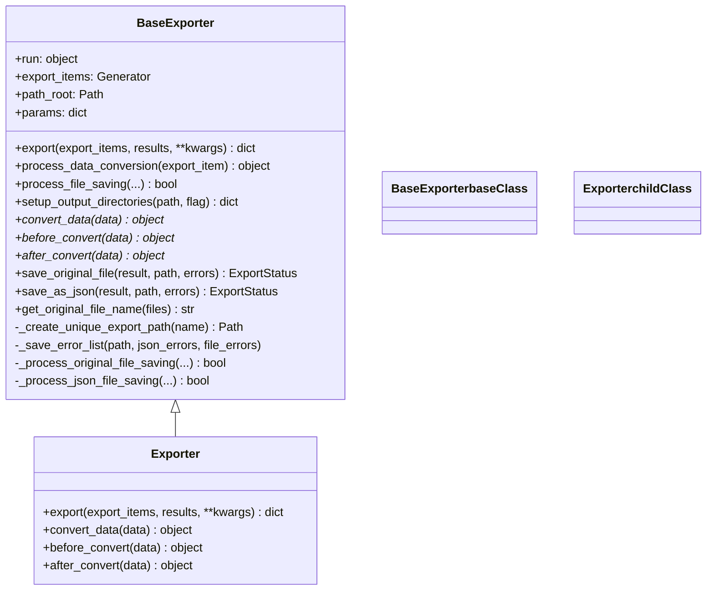

# Export 플러그인

Export 플러그인은 Synapse 플랫폼에서 주석이 달린 데이터, 그라운드 트루스 데이터셋, 할당 및 작업을 내보내기 위한 데이터 내보내기 및 변환 작업을 제공합니다.

## 개요

**사용 가능한 액션:**

- `export` - 다양한 소스(할당, 그라운드 트루스, 작업)에서 사용자 정의 처리와 함께 데이터 내보내기

**사용 사례:**

- 훈련용 주석 데이터셋 내보내기
- 그라운드 트루스 데이터를 사용자 정의 형식으로 변환
- 배포용 데이터 패키지 생성
- 할당 결과의 배치 처리
- 외부 도구용 주석 데이터 변환

**지원되는 내보내기 대상:**

- `assignment` - 주석이 있는 할당 데이터 내보내기
- `ground_truth` - 그라운드 트루스 데이터셋 버전 내보내기
- `task` - 관련 주석이 있는 작업 데이터 내보내기

## BaseExporter와 Exporter 클래스 구조도

다음 다이어그램은 BaseExporter 클래스와 Exporter 클래스 간의 관계와 메서드 구현을 보여줍니다:



### 메서드 실행 플로우

Export 작업의 전체 실행 흐름을 보여주는 플로우차트입니다:

```mermaid
flowchart TD
    %% Start
    A[export 메서드 호출] --> B[경로와 메트릭 초기화]
    B --> C[출력 디렉토리 설정]
    C --> D[export_items 순환]

    %% Data processing pipeline
    D --> E[process_data_conversion]
    E --> F[before_convert]
    F --> G[convert_data]
    G --> H[after_convert]

    %% File saving pipeline
    H --> I[process_file_saving]
    I --> J{원본 파일 저장?}
    J -->|예| K[_process_original_file_saving]
    J -->|아니오| L[_process_json_file_saving]
    K --> L

    %% Continue or finish
    L --> M{더 많은 항목?}
    M -->|예| D
    M -->|아니오| N[오류 목록 저장]
    N --> O[내보내기 경로 반환]

    %% Error handling
    K --> P{원본 파일 실패?}
    P -->|예| Q[다음 항목으로 건너뛰기]
    P -->|아니오| L

    L --> R{JSON 파일 실패?}
    R -->|예| Q
    R -->|아니오| S[메트릭 업데이트]
    S --> M
    Q --> M

    %% Styling for light/dark compatibility
    classDef startEnd fill:#e1f5fe,stroke:#01579b,color:#000
    classDef process fill:#f3e5f5,stroke:#4a148c,color:#000
    classDef decision fill:#fff3e0,stroke:#e65100,color:#000
    classDef data fill:#e8f5e8,stroke:#2e7d32,color:#000
    classDef error fill:#ffebee,stroke:#c62828,color:#000

    class A,O startEnd
    class B,C,E,F,G,H,I,K,L,N,S process
    class J,M,P,R decision
    class D data
    class Q error
```



### 주요 관계 및 책임

**BaseExporter (추상 기본 클래스)**

- **핵심 기능**: 완전한 내보내기 워크플로우 인프라 제공
- **템플릿 메서드**: `export()` 메서드가 전체 프로세스 조율
- **훅 메서드**: 커스터마이징을 위한 `convert_data()`, `before_convert()`, `after_convert()`
- **유틸리티**: 파일 작업, 디렉토리 설정, 오류 처리, 진행률 추적

**Exporter (구체적 구현)**

- **상속**: `BaseExporter` 확장
- **최소 구현**: 추상 메서드들의 기본 구현 제공
- **위임 동작**: 대부분의 메서드가 부모 클래스에 위임
- **커스터마이징 지점**: 특정 로직을 위해 변환 메서드 오버라이드

### 메서드 카테고리

- **🔵 핵심 워크플로우**: 주요 내보내기 조율 메서드
- **🟢 템플릿/훅**: 서브클래스에서 오버라이드하도록 설계된 메서드
- **🟡 파일 작업**: 구체적인 파일 저장 및 처리 메서드
- **🔸 헬퍼/유틸리티**: 내부 작업을 위한 프라이빗 메서드

이 설계는 **템플릿 메서드 패턴**을 따르며, `BaseExporter.export()`가 알고리즘 골격을 정의하고 서브클래스가 훅 메서드를 통해 특정 단계를 커스터마이징합니다.

## 플러그인 설정

Export 플러그인 템플릿은 필터링 및 플러그인 검색을 위한 설정 필드를 포함합니다:

```yaml
actions:
  export:
    entrypoint: plugin.export.Exporter
    annotation_types:
      - image
      - video
      - audio
      - text
      - pcd
      - prompt

data_types:
  - image
  - video
  - audio
  - text
  - pcd
```

### 설정 필드

- **data_types**: Export 플러그인 필터링을 위한 지원 데이터 타입 목록 (플러그인 레벨 필터)

  - 지원 값: `image`, `video`, `audio`, `text`, `pcd`
  - 플랫폼에서 사용자의 데이터 타입에 따라 관련 export 플러그인을 필터링하고 표시하는 데 사용됩니다

- **annotation_types**: Export 플러그인 필터링을 위한 어노테이션 타입 목록 (액션 레벨 필터)
  - 지원 값: `image`, `video`, `audio`, `text`, `pcd`, `prompt`
  - 각 액션의 설정 내에서 정의됩니다 (예: `actions.export.annotation_types`)
  - 플랫폼에서 사용자의 주석 타입에 따라 관련 export 플러그인을 필터링하고 표시하는 데 사용됩니다
  - 각 액션마다 다른 어노테이션 타입 요구사항을 가질 수 있습니다

**모범 사례**: 플러그인의 실제 기능을 정확히 반영하도록 이 필드들을 커스터마이징하세요. 템플릿에는 모든 일반적인 타입이 예시로 포함되어 있지만, 플러그인이 실제로 지원하는 항목에 맞게 목록을 수정해야 합니다.

## BaseExporter 클래스 구조

새로운 BaseExporter 클래스는 export 플러그인을 위한 객체지향적 접근 방식을 제공합니다:

```python
from synapse_sdk.plugins.categories.export.templates.plugin import BaseExporter

class Exporter(BaseExporter):
    """플러그인 export 액션 인터페이스."""

    def __init__(self, run, export_items, path_root, **params):
        """플러그인 export 액션 클래스를 초기화합니다."""
        super().__init__(run, export_items, path_root, **params)

    def convert_data(self, data):
        """데이터 변환 로직을 구현하세요."""
        return data

    def before_convert(self, data):
        """변환 전 데이터 전처리를 수행합니다."""
        return data

    def after_convert(self, data):
        """변환 후 데이터 후처리를 수행합니다."""
        return data
```

## BaseExporter의 핵심 기능

### 자동 제공 유틸리티

- **완전한 export 워크플로우**: `export()` 메서드가 전체 export 프로세스를 관리
- **데이터 변환 파이프라인**: `process_data_conversion()` 메서드로 before_convert → convert_data → after_convert 처리
- **파일 저장 관리**: `process_file_saving()` 메서드로 원본 파일과 JSON 파일 저장 처리 (오버라이드 가능)
- **디렉토리 설정**: `setup_output_directories()` 메서드로 출력 디렉토리 구조 생성 (오버라이드 가능)

### 필수 메서드 (서브클래스에서 구현해야 함)

- **convert_data()**: export 중 데이터 변환

### 선택적 메서드 (서브클래스에서 오버라이드 가능)

- **save_original_file()**: export 항목의 원본 파일 저장
- **save_as_json()**: 데이터를 JSON 파일로 저장
- **before_convert()**: 변환 전 데이터 전처리
- **after_convert()**: 변환 후 데이터 후처리
- **process_file_saving()**: 사용자 정의 파일 저장 로직
- **additional_file_saving()**: 모든 export 항목 처리 후 추가 파일 저장

### 헬퍼 메서드

- **\_process_original_file_saving()**: 메트릭과 함께 원본 파일 저장 처리
- **\_process_json_file_saving()**: 메트릭과 함께 JSON 파일 저장 처리

### 자동 제공 유틸리티

- `self.run.set_progress()`를 통한 진행률 추적
- `self.run.log_message()` 및 기타 run 메서드를 통한 로깅
- run 메서드를 통한 오류 처리 및 메트릭 수집

## 추가 파일 저장 (Additional File Saving)

`additional_file_saving()` 메서드는 모든 export 항목이 처리된 후에 호출되며, 모든 처리된 항목의 집합적 데이터에 의존하는 파일을 저장하기 위해 설계되었습니다. 다음과 같은 용도로 유용합니다:

- 메타데이터 파일 (예: 데이터셋 통계, 클래스 매핑)
- 설정 파일 (예: YOLO용 dataset.yaml, classes.txt)
- 요약 파일 (예: export 보고서, 처리 로그)
- 인덱스 파일 (예: 파일 목록, 디렉토리 구조)

### 메서드 시그니처

```python
def additional_file_saving(self, unique_export_path):
    """모든 export 항목 처리 후 추가 파일 저장.

    이 메서드는 주 export 루프가 완료된 후 호출되며, 모든 처리된 export 항목의
    집합적 데이터를 기반으로 생성되어야 하는 파일들(예: 메타데이터 파일,
    설정 파일, 요약 파일 등)을 저장하기 위한 것입니다.

    Args:
        unique_export_path (str): 추가 파일이 저장될 고유한 export 디렉토리 경로.
    """
    pass
```

### 사용 예시

```python
class YOLOExporter(BaseExporter):
    def __init__(self, run, export_items, path_root, **params):
        super().__init__(run, export_items, path_root, **params)
        self.class_names = set()
        self.dataset_stats = {
            'total_images': 0,
            'total_annotations': 0,
            'class_distribution': {}
        }

    def convert_data(self, data):
        # 변환 중 클래스와 통계 추적
        for annotation in data.get('annotations', []):
            class_name = annotation['class_name']
            self.class_names.add(class_name)
            self.dataset_stats['class_distribution'][class_name] = \
                self.dataset_stats['class_distribution'].get(class_name, 0) + 1

        self.dataset_stats['total_images'] += 1
        self.dataset_stats['total_annotations'] += len(data.get('annotations', []))

        return data  # ... 나머지 변환 로직

    def additional_file_saving(self, unique_export_path):
        """YOLO 설정 및 메타데이터 파일 저장."""
        data_dir = Path(unique_export_path) / 'data'
        data_dir.mkdir(exist_ok=True)

        # 1. classes.txt 파일 저장
        classes_file = data_dir / 'classes.txt'
        with classes_file.open('w') as f:
            for class_name in sorted(self.class_names):
                f.write(f"{class_name}\n")
        self.run.log_message(f"클래스 파일 저장: {classes_file}")

        # 2. dataset.yaml 파일 저장
        dataset_config = {
            'path': str(unique_export_path),
            'train': 'images',
            'val': 'images',
            'names': {i: name for i, name in enumerate(sorted(self.class_names))}
        }

        dataset_file = data_dir / 'dataset.yaml'
        with dataset_file.open('w') as f:
            yaml.dump(dataset_config, f, default_flow_style=False)
        self.run.log_message(f"데이터셋 설정 저장: {dataset_file}")

        # 3. export 통계 저장
        stats_file = data_dir / 'export_stats.json'
        with stats_file.open('w') as f:
            json.dump(self.dataset_stats, f, indent=2)
        self.run.log_message(f"export 통계 저장: {stats_file}")
```

### 일반적인 사용 사례

#### 1. 데이터셋 설정 파일

```python
def additional_file_saving(self, unique_export_path):
    # 훈련 프레임워크용 데이터셋 설정 생성
    config = {
        'dataset_name': self.params.get('name'),
        'created_at': datetime.now().isoformat(),
        'total_samples': len(self.processed_items),
        'classes': list(self.class_mapping.keys())
    }

    config_file = Path(unique_export_path) / 'dataset_config.json'
    with config_file.open('w') as f:
        json.dump(config, f, indent=2)
```

#### 2. Export 요약 보고서

```python
def additional_file_saving(self, unique_export_path):
    # export 요약 생성
    summary = {
        'export_info': {
            'plugin_name': self.__class__.__name__,
            'export_time': datetime.now().isoformat(),
            'export_path': str(unique_export_path)
        },
        'statistics': self.get_export_statistics(),
        'errors': self.get_error_summary()
    }

    summary_file = Path(unique_export_path) / 'export_summary.json'
    with summary_file.open('w') as f:
        json.dump(summary, f, indent=2)
```

#### 3. 인덱스 및 매니페스트 파일

```python
def additional_file_saving(self, unique_export_path):
    # 처리된 항목들에 대한 파일 인덱스 생성
    file_index = []
    for item in self.processed_items:
        file_index.append({
            'original_file': item['original_filename'],
            'json_file': f"{item['stem']}.json",
            'processed_at': item['timestamp']
        })

    index_file = Path(unique_export_path) / 'file_index.json'
    with index_file.open('w') as f:
        json.dump(file_index, f, indent=2)
```

## 주요 특징

- **진행률 추적**: `run.set_progress()`로 내장 진행률 모니터링
- **오류 처리**: 자동 오류 수집 및 보고
- **메트릭 로깅**: `run.log_metrics()`로 성공/실패율 추적
- **파일 관리**: 원본 파일과 처리된 JSON 데이터 모두 처리
- **로깅**: `run.log_message()` 및 사용자 정의 이벤트로 포괄적인 로깅

## 실용적인 예시

### YOLO 형식 Exporter with 커스텀 디렉토리 구조

다음은 YOLO 형식으로 데이터를 내보내면서 `setup_output_directories`와 `process_file_saving`을 활용하는 완전한 예시입니다:

```python
from synapse_sdk.plugins.categories.export.templates.plugin import BaseExporter
import os
import json

class YOLOExporter(BaseExporter):
    """YOLO 형식으로 데이터를 내보내는 플러그인."""

    def __init__(self, run, export_items, path_root, **params):
        super().__init__(run, export_items, path_root, **params)
        self.class_mapping = {}

    def setup_output_directories(self, unique_export_path, save_original_file_flag):
        """YOLO 프로젝트 구조에 맞는 디렉토리 생성."""
        directories = ['images', 'labels', 'data']

        for directory in directories:
            dir_path = os.path.join(unique_export_path, directory)
            os.makedirs(dir_path, exist_ok=True)
            self.run.log_message(f"YOLO 디렉토리 생성: {dir_path}")

        return unique_export_path

    def convert_data(self, data):
        """주석 데이터를 YOLO 형식으로 변환."""
        converted_annotations = []

        for annotation in data.get('annotations', []):
            # 바운딩 박스를 YOLO 형식으로 변환
            bbox = annotation['geometry']['bbox']
            image_width = data['image']['width']
            image_height = data['image']['height']

            # YOLO 형식: center_x, center_y, width, height (정규화)
            center_x = (bbox['x'] + bbox['width'] / 2) / image_width
            center_y = (bbox['y'] + bbox['height'] / 2) / image_height
            width = bbox['width'] / image_width
            height = bbox['height'] / image_height

            # 클래스 ID 매핑
            class_name = annotation['class_name']
            if class_name not in self.class_mapping:
                self.class_mapping[class_name] = len(self.class_mapping)

            class_id = self.class_mapping[class_name]

            converted_annotations.append({
                'class_id': class_id,
                'center_x': center_x,
                'center_y': center_y,
                'width': width,
                'height': height
            })

        return {
            'yolo_annotations': converted_annotations,
            'class_mapping': self.class_mapping,
            'image_info': data['image']
        }

    def process_file_saving(
        self,
        final_data,
        unique_export_path,
        save_original_file_flag,
        errors_json_file_list,
        errors_original_file_list,
        original_file_metrics_record,
        data_file_metrics_record,
        current_index,
    ):
        """YOLO 형식으로 파일 저장 처리."""
        try:
            export_item = self.export_items[current_index - 1]
            base_name = os.path.splitext(export_item.original_file.name)[0]

            # 1. 이미지 파일을 images 폴더에 저장
            if save_original_file_flag:
                images_dir = os.path.join(unique_export_path, 'images')
                image_path = os.path.join(images_dir, export_item.original_file.name)
                import shutil
                shutil.copy2(export_item.original_file.path, image_path)
                self.run.log_message(f"이미지 저장: {image_path}")

            # 2. YOLO 라벨 파일을 labels 폴더에 저장
            labels_dir = os.path.join(unique_export_path, 'labels')
            label_path = os.path.join(labels_dir, f"{base_name}.txt")

            with open(label_path, 'w') as f:
                for ann in final_data.get('yolo_annotations', []):
                    line = f"{ann['class_id']} {ann['center_x']} {ann['center_y']} {ann['width']} {ann['height']}\n"
                    f.write(line)

            self.run.log_message(f"YOLO 라벨 저장: {label_path}")

            # 3. 클래스 매핑 파일 저장 (한 번만)
            if current_index == 1:  # 첫 번째 파일 처리 시에만
                classes_path = os.path.join(unique_export_path, 'data', 'classes.txt')
                with open(classes_path, 'w') as f:
                    for class_name, class_id in sorted(final_data['class_mapping'].items(), key=lambda x: x[1]):
                        f.write(f"{class_name}\n")
                self.run.log_message(f"클래스 파일 저장: {classes_path}")

            return True

        except Exception as e:
            self.run.log_message(f"파일 저장 중 오류: {str(e)}", level="error")
            errors_json_file_list.append(f"Export item {current_index}: {str(e)}")
            return True  # 다른 파일 처리를 계속하기 위해 True 반환
```

이 예시는 BaseExporter의 핵심 확장 포인트인 `setup_output_directories`와 `process_file_saving`을 활용하여:

- YOLO 프로젝트 구조 (`images/`, `labels/`, `data/`) 생성
- 이미지 파일과 YOLO 라벨 파일을 적절한 위치에 저장
- 클래스 매핑 파일 관리
- 진행률 추적과 오류 처리

이를 보여줍니다.

## 빠른 시작 가이드

BaseExporter를 사용하여 간단한 플러그인을 만드는 단계별 가이드입니다:

### 1단계: 기본 클래스 상속

```python
from synapse_sdk.plugins.categories.export.templates.plugin import BaseExporter

class MyExporter(BaseExporter):
    def convert_data(self, data):
        # 필수: 데이터 변환 로직 구현
        return data  # 또는 변환된 데이터 반환
```

### 2단계: 필요에 따라 추가 메서드 오버라이드

```python
def before_convert(self, data):
    # 선택적: 변환 전 전처리
    return data

def after_convert(self, converted_data):
    # 선택적: 변환 후 후처리
    return converted_data

def save_as_json(self, converted_data, output_path):
    # 선택적: 사용자 정의 저장 형식
    # 기본적으로는 JSON 형식으로 저장됨
    pass
```

### 3단계: 플러그인 등록

플러그인 디렉토리 구조:

```
my_plugin/
├── __init__.py
├── plugin.py          # MyExporter 클래스 정의
└── manifest.yaml       # 플러그인 메타데이터
```

## Export 액션 아키텍처

데이터 내보내기 처리의 다양한 측면을 위한 특화된 구성 요소를 갖춘 모듈화된 아키텍처로 export 시스템이 리팩터링되었습니다:

```mermaid
classDiagram
    %% Light/Dark mode compatible colors with semi-transparency
    classDef baseClass fill:#e1f5fe80,stroke:#0288d1,stroke-width:2px
    classDef childClass fill:#c8e6c980,stroke:#388e3c,stroke-width:2px
    classDef modelClass fill:#fff9c480,stroke:#f57c00,stroke-width:2px
    classDef utilClass fill:#f5f5f580,stroke:#616161,stroke-width:2px
    classDef enumClass fill:#ffccbc80,stroke:#d32f2f,stroke-width:2px

    class ExportAction {
        +name: str = "export"
        +category: PluginCategory.EXPORT
        +method: RunMethod.JOB
        +run_class: ExportRun
        +params_model: ExportParams
        +progress_categories: dict
        +metrics_categories: dict

        +start() dict
        +get_exporter(...) object
        +_get_export_items(target, filter) Generator
        +_create_target_handler(target) object
    }

    class ExportRun {
        +log_message_with_code(code, args, level) None
        +log_export_event(code, args, level) None
        +export_log_json_file(id, file_info, status) None
        +export_log_original_file(id, file_info, status) None
        +ExportEventLog: BaseModel
        +DataFileLog: BaseModel
        +MetricsRecord: BaseModel
    }

    class ExportParams {
        +name: str
        +storage: int
        +target: Literal["assignment", "ground_truth", "task"]
        +filter: dict
        +path: str
        +save_original_file: bool = True
        +extra_params: dict = {}

        +check_storage_exists(value) str
        +validate_target_filter(cls, values) dict
    }

    class LogCode {
        +EXPORT_STARTED: str
        +ITEMS_DISCOVERED: str
        +CONVERSION_STARTED: str
        +CONVERSION_COMPLETED: str
        +FILE_SAVED: str
        +EXPORT_COMPLETED: str
        +EXPORT_FAILED: str
    }

    class ExportStatus {
        +SUCCESS: str = "success"
        +FAILED: str = "failed"
        +SKIPPED: str = "skipped"
    }

    class ExportError {
        +message: str
        +code: str
    }

    class ExportValidationError {
        +message: str
        +field: str
    }

    class ExportTargetError {
        +message: str
        +target: str
    }

    %% Relationships
    ExportAction --> ExportRun : uses
    ExportAction --> ExportParams : validates with
    ExportRun --> LogCode : logs with
    ExportRun --> ExportStatus : tracks status
    ExportAction --> ExportError : may raise
    ExportAction --> ExportValidationError : may raise
    ExportAction --> ExportTargetError : may raise

    %% Apply styles
    class ExportAction baseClass
    class ExportRun childClass
    class ExportParams modelClass
    class LogCode,ExportStatus enumClass
    class ExportError,ExportValidationError,ExportTargetError utilClass
```

### 모듈화된 구조

Export 액션은 깔끔한 모듈화된 구성을 따릅니다:

```
synapse_sdk/plugins/categories/export/actions/export/
├── __init__.py        # 깔끔한 모듈 인터페이스
├── action.py          # ExportAction 클래스
├── enums.py          # ExportStatus, LogCode + LOG_MESSAGES
├── exceptions.py     # Export 특화 예외
├── models.py         # ExportParams 모델
├── run.py           # ExportRun 클래스
└── utils.py         # 대상 핸들러 및 유틸리티
```

**주요 장점:**

- **향상된 유지보수성**: 작고 집중된 파일로 이해하고 수정하기 쉬움
- **코드 일관성**: Export 액션이 이제 upload 액션과 동일한 패턴을 따름
- **더 나은 구성**: 관련 기능이 논리적으로 그룹화됨
- **향상된 가독성**: 모듈 전반에 걸친 명확한 관심사 분리

## Export 플러그인 생성

Export 플러그인은 더 나은 구성과 재사용성을 위해 BaseExporter 클래스 기반 접근 방식을 사용합니다. 커스텀 export 플러그인을 생성하는 방법은 다음과 같습니다:

### 1단계: Export 플러그인 템플릿 생성

```bash
synapse plugin create
# 카테고리로 'export' 선택
# export 템플릿으로 플러그인이 생성됩니다
```

### 2단계: Export 매개변수 커스터마이징

`ExportParams` 모델이 필요한 매개변수를 정의합니다:

```python
from synapse_sdk.plugins.categories.export.actions.export.models import ExportParams
from pydantic import BaseModel
from typing import Literal

class CustomExportParams(ExportParams):
    # 커스텀 매개변수 추가
    output_format: Literal['json', 'csv', 'xml'] = 'json'
    include_metadata: bool = True
    compression: bool = False
```

### 3단계: 데이터 변환 구현

`plugin/export.py`의 `Exporter` 클래스에서 필요한 메서드를 구현합니다:

```python
from datetime import datetime
from synapse_sdk.plugins.categories.export.templates.plugin import BaseExporter

class Exporter(BaseExporter):
    """COCO 형식 변환을 포함한 커스텀 export 플러그인."""

    def convert_data(self, data):
        """주석 데이터를 원하는 형식으로 변환합니다."""
        # 예시: COCO 형식으로 변환
        if data.get('data_type') == 'image_detection':
            return self.convert_to_coco_format(data)
        elif data.get('data_type') == 'image_classification':
            return self.convert_to_classification_format(data)
        return data

    def before_convert(self, export_item):
        """변환 전 데이터 전처리."""
        # 검증, 필터링 또는 전처리 추가
        if not export_item.get('data'):
            return None  # 빈 항목 건너뛰기

        # 커스텀 메타데이터 추가
        export_item['processed_at'] = datetime.now().isoformat()
        return export_item

    def after_convert(self, converted_data):
        """변환된 데이터 후처리."""
        # 최종 마무리, 검증 또는 형식 지정 추가
        if 'annotations' in converted_data:
            converted_data['annotation_count'] = len(converted_data['annotations'])
        return converted_data

    def convert_to_coco_format(self, data):
        """예시: COCO 검출 형식으로 변환."""
        coco_data = {
            "images": [],
            "annotations": [],
            "categories": []
        }

        # 주석 데이터를 COCO 형식으로 변환
        for annotation in data.get('annotations', []):
            coco_annotation = {
                "id": annotation['id'],
                "image_id": annotation['image_id'],
                "category_id": annotation['category_id'],
                "bbox": annotation['bbox'],
                "area": annotation.get('area', 0),
                "iscrowd": 0
            }
            coco_data["annotations"].append(coco_annotation)

        return coco_data
```

### 4단계: Export 대상 구성

Export 액션은 다양한 데이터 소스를 지원합니다:

```python
# 다양한 대상에 대한 필터 예시
filters = {
    # 그라운드 트루스 내보내기용
    "ground_truth": {
        "ground_truth_dataset_version": 123,
        "expand": ["data"]
    },

    # 할당 내보내기용
    "assignment": {
        "project": 456,
        "status": "completed",
        "expand": ["data"]
    },

    # 작업 내보내기용
    "task": {
        "project": 456,
        "assignment": 789,
        "expand": ["data_unit", "assignment"]
    }
}
```

### 5단계: 파일 작업 처리

BaseExporter 메서드를 오버라이드하여 파일 저장 및 구성을 커스터마이징합니다:

```python
import json
from pathlib import Path
from synapse_sdk.plugins.categories.export.actions.export.enums import ExportStatus

class Exporter(BaseExporter):
    """다중 형식 지원을 포함한 커스텀 export 플러그인."""

    def save_as_json(self, result, base_path, error_file_list):
        """다양한 형식으로 커스텀 JSON 저장."""
        file_name = Path(self.get_original_file_name(result['files'])).stem

        # 매개변수에 따른 출력 형식 선택
        if self.params.get('output_format') == 'csv':
            return self.save_as_csv(result, base_path, error_file_list)
        elif self.params.get('output_format') == 'xml':
            return self.save_as_xml(result, base_path, error_file_list)

        # 기본 JSON 처리
        json_data = result['data']
        file_info = {'file_name': f'{file_name}.json'}

        try:
            with (base_path / f'{file_name}.json').open('w', encoding='utf-8') as f:
                json.dump(json_data, f, indent=4, ensure_ascii=False)
            status = ExportStatus.SUCCESS
        except Exception as e:
            error_file_list.append([f'{file_name}.json', str(e)])
            status = ExportStatus.FAILED

        self.run.export_log_json_file(result['id'], file_info, status)
        return status

    def setup_output_directories(self, unique_export_path, save_original_file_flag):
        """커스텀 디렉토리 구조."""
        # 형식별 디렉토리 생성
        output_paths = super().setup_output_directories(unique_export_path, save_original_file_flag)

        # 출력 형식에 따른 커스텀 디렉토리 추가
        format_dir = unique_export_path / self.params.get('output_format', 'json')
        format_dir.mkdir(parents=True, exist_ok=True)
        output_paths['format_output_path'] = format_dir

        return output_paths
```

### 6단계: 사용 예시

다양한 구성으로 export 플러그인 실행:

```bash
# 그라운드 트루스 데이터 기본 내보내기
synapse plugin run export '{
  "name": "my_export",
  "storage": 1,
  "target": "ground_truth",
  "filter": {"ground_truth_dataset_version": 123},
  "path": "exports/ground_truth",
  "save_original_file": true
}' --plugin my-export-plugin

# 커스텀 매개변수로 할당 내보내기
synapse plugin run export '{
  "name": "assignment_export",
  "storage": 1,
  "target": "assignment",
  "filter": {"project": 456, "status": "completed"},
  "path": "exports/assignments",
  "save_original_file": false,
  "extra_params": {
    "output_format": "coco",
    "include_metadata": true
  }
}' --plugin custom-coco-export
```

## 일반적인 Export 패턴

```python
# 패턴 1: 형식별 변환
class Exporter(BaseExporter):
    def convert_data(self, data):
        """YOLO 형식으로 변환."""
        if data.get('task_type') == 'object_detection':
            return self.convert_to_yolo_format(data)
        return data

# 패턴 2: 조건부 파일 구성
class Exporter(BaseExporter):
    def setup_output_directories(self, unique_export_path, save_original_file_flag):
        # 부모 메서드 호출
        output_paths = super().setup_output_directories(unique_export_path, save_original_file_flag)

        # 카테고리별 별도 폴더 생성
        for category in ['train', 'val', 'test']:
            category_path = unique_export_path / category
            category_path.mkdir(parents=True, exist_ok=True)
            output_paths[f'{category}_path'] = category_path

        return output_paths

# 패턴 3: 검증을 포함한 배치 처리
class Exporter(BaseExporter):
    def before_convert(self, export_item):
        # 필수 필드 검증
        required_fields = ['data', 'files', 'id']
        for field in required_fields:
            if field not in export_item:
                raise ValueError(f"필수 필드가 누락됨: {field}")
        return export_item
```

## 개발 팁 및 모범 사례

### 1. 오류 처리

```python
def convert_data(self, data):
    try:
        # 변환 로직
        result = self.process_annotations(data)
        return result
    except Exception as e:
        self.run.log_message(f"변환 중 오류 발생: {str(e)}", level="error")
        raise  # BaseExporter가 오류를 자동으로 처리
```

### 2. 진행률 추적

```python
def convert_data(self, data):
    annotations = data.get('annotations', [])
    total = len(annotations)

    for i, annotation in enumerate(annotations):
        # 진행률 업데이트 (0-100 사이의 값)
        progress = int((i / total) * 100)
        self.run.set_progress(progress)

        # 변환 로직...

    return converted_data
```

### 3. 메트릭 수집

```python
def after_convert(self, converted_data):
    # 유용한 메트릭 수집
    metrics = {
        'total_exported': len(converted_data.get('annotations', [])),
        'processing_time': time.time() - self.start_time,
        'success_rate': self.calculate_success_rate(),
    }

    self.run.log_metrics(metrics)
    return converted_data
```

### 4. 로깅 활용

```python
def convert_data(self, data):
    self.run.log_message("데이터 변환 시작", level="info")

    if not data.get('annotations'):
        self.run.log_message("주석 데이터가 없습니다", level="warning")
        return data

    # 변환 로직...

    self.run.log_message(f"변환 완료: {len(result)} 항목 처리됨", level="success")
    return result
```

### 5. 매개변수 처리

```python
def __init__(self, run, export_items, path_root, **params):
    super().__init__(run, export_items, path_root, **params)

    # 사용자 정의 매개변수 처리
    self.output_format = params.get('output_format', 'json')
    self.include_metadata = params.get('include_metadata', True)
    self.compression = params.get('compression', False)
```

## 모범 사례

### 데이터 처리

- **메모리 효율성**: 대용량 데이터셋 처리를 위해 제너레이터 사용
- **오류 복구**: 개별 항목에 대한 우아한 오류 처리 구현
- **진행률 보고**: 장시간 실행되는 내보내기의 진행률을 정기적으로 업데이트
- **데이터 검증**: 변환 전 데이터 구조 검증

```python
class Exporter(BaseExporter):
    def export(self, export_items=None, results=None, **kwargs):
        """커스텀 처리를 위한 주 export 메서드 오버라이드."""
        # 제너레이터를 소비하지 않고 항목 수를 카운트하기 위해 tee 사용
        items_to_process = export_items if export_items is not None else self.export_items
        export_items_count, export_items_process = tee(items_to_process)
        total = sum(1 for _ in export_items_count)

        # 오류 처리가 포함된 커스텀 처리
        for no, export_item in enumerate(export_items_process, start=1):
            try:
                # 내장 데이터 변환 파이프라인 사용
                processed_item = self.process_data_conversion(export_item)
                self.run.set_progress(no, total, category='dataset_conversion')
            except Exception as e:
                self.run.log_message(f"항목 {no} 처리 중 오류: {str(e)}", "ERROR")
                continue

        # 표준 처리를 위해 부모의 export 메서드 호출
        # 또는 자체 완전한 워크플로우 구현
        return super().export(export_items, results, **kwargs)
```

### 파일 관리

- **고유 경로**: 타임스탬프나 카운터 접미사로 파일 충돌 방지
- **디렉토리 구조**: 출력 파일을 논리적으로 구성
- **오류 로깅**: 디버깅을 위해 실패한 파일 추적
- **정리**: 완료 시 임시 파일 제거

```python
class Exporter(BaseExporter):
    def setup_output_directories(self, unique_export_path, save_original_file_flag):
        """고유한 export 디렉토리 구조 생성."""
        # BaseExporter는 이미 _create_unique_export_path를 통해 고유 경로 생성을 처리함
        # 이 메서드는 내부 디렉토리 구조를 설정함
        output_paths = super().setup_output_directories(unique_export_path, save_original_file_flag)

        # 필요에 따라 커스텀 서브디렉토리 추가
        custom_dir = unique_export_path / 'custom_output'
        custom_dir.mkdir(parents=True, exist_ok=True)
        output_paths['custom_output_path'] = custom_dir

        return output_paths
```

### 형식 변환

- **유연한 템플릿**: 여러 데이터 타입과 함께 작동하는 템플릿 설계
- **스키마 검증**: 예상 스키마에 대한 출력 검증
- **메타데이터 보존**: 변환 중 중요한 메타데이터 유지
- **버전 호환성**: 다양한 데이터 스키마 버전 처리

## 자주 묻는 질문

**Q: BaseExporter를 사용하지 않고 직접 구현할 수 있나요?**  
A: 가능하지만 권장하지 않습니다. BaseExporter는 진행률 추적, 오류 처리, 메트릭 수집 등의 기본 기능을 자동으로 제공합니다.

**Q: 여러 파일 형식으로 동시에 내보낼 수 있나요?**  
A: `process_file_saving()` 메서드를 오버라이드하여 여러 형식으로 저장할 수 있습니다.

**Q: 대용량 데이터셋을 처리할 때 메모리 사용량을 최적화하려면?**  
A: `convert_data()`에서 한 번에 모든 데이터를 로드하지 말고, 스트리밍 방식으로 처리하는 것을 고려해보세요.

**Q: 진행률이 올바르게 표시되지 않는다면?**  
A: `self.run.set_progress()`를 적절한 간격으로 호출하고 있는지 확인하세요. 0-100 사이의 정수 값을 사용해야 합니다.
