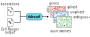

|Python 3.10| |Python 3.11| |License GPL v3| |ruff| |codecov| |Python package| |PyPI| |Docs|

tidesurf documentation
======================

This is the documentation for **tidesurf**, a Tool for IDentification and Enumeration of Spliced and Unspliced Read
Fragments, implemented in Python. It enables the quantification of spliced and unspliced reads from 10x Genomics
5' and 3' scRNA-seq data, using the 10x Genomics Cell Ranger output.

.. note::

    This project and its documentation are under active development.

.. note::

    In the future, we aim to support other single-cell RNA-seq data formats, such as Smart-seq2.

.. toctree::
    :maxdepth: 2
    :caption: Contents:

    installation
    usage
    api
    release_notes

Citation
--------

If you use ``tidesurf`` in your research, please cite the following publication:

Schleicher, J.T., and Claassen, M. (2025).
Accurate quantification of spliced and unspliced transcripts for single-cell RNA sequencing with tidesurf.
*bioRxiv* 2025.01.28.635274; DOI: `10.1101/2025.01.28.635274 <https://doi.org/10.1101/2025.01.28.635274>`_.

.. start-badges

.. |Python 3.10| image:: https://img.shields.io/badge/python-3.10-blue.svg
   :target: https://www.python.org/downloads/release/python-31015/
   :alt: Python 3.10

.. |Python 3.11| image:: https://img.shields.io/badge/python-3.11-blue.svg
   :target: https://www.python.org/downloads/release/python-31110/
   :alt: Python 3.11

.. |License GPL v3| image:: https://img.shields.io/badge/License-GPLv3-blue.svg
   :target: https://www.gnu.org/licenses/gpl-3.0
   :alt: License: GPL v3

.. |ruff| image:: https://img.shields.io/badge/code%20style-ruff-red
   :target: https://github.com/astral-sh/ruff
   :alt: Code style: ruff

.. |codecov| image:: https://codecov.io/gh/janschleicher/tidesurf/graph/badge.svg?token=dMenu3eZkX
   :target: https://codecov.io/gh/janschleicher/tidesurf
   :alt: Code coverage

.. |Python package| image:: https://github.com/janschleicher/tidesurf/actions/workflows/python-package.yml/badge.svg?branch=main
   :target: https://github.com/janschleicher/tidesurf/actions/workflows/python-package.yml

.. |PyPI| image:: https://img.shields.io/pypi/v/tidesurf
   :target: https://pypi.org/project/tidesurf/
   :alt: PyPI - Version

.. |Docs| image:: https://readthedocs.org/projects/tidesurf/badge/?version=latest
    :target: https://tidesurf.readthedocs.io/latest/?badge=latest
    :alt: Documentation Status

.. end-badges