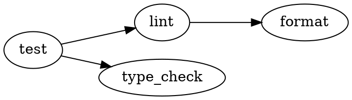
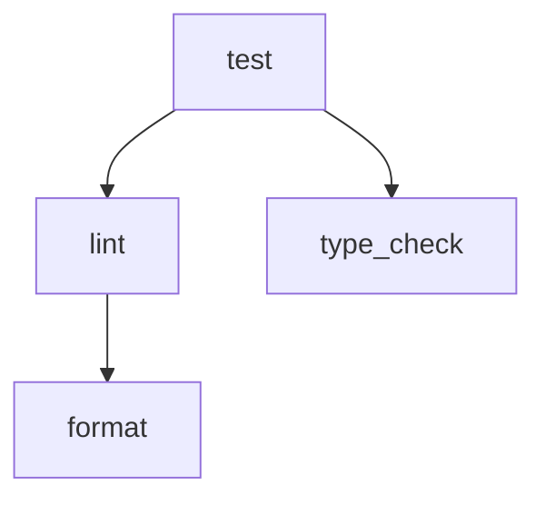

# uvtx

[](https://github.com/mikeleppane/uvtx/actions)
[](https://pypi.org/project/uvtx/)
[](https://pypi.org/project/uvtx/)
[](https://github.com/mikeleppane/uvtx/blob/main/LICENSE)
[](https://codecov.io/gh/mikeleppane/uvtx)
[](https://github.com/astral-sh/ruff)
[](https://mypy-lang.org/)
[](https://github.com/astral-sh/uv)

**A modern Python task runner built for the [uv](https://docs.astral.sh/uv/) era.**

uvtx solves the common pain points of running Python scripts:

- ✅ **No virtual environment activation** - `uv` handles it automatically
- ✅ **No PYTHONPATH headaches** - configure once, use everywhere
- ✅ **No dependency conflicts** - isolated per-task environments
- ✅ **No configuration duplication** - task inheritance and profiles

## Features

### Core Features

- 🚀 **Zero setup**: Leverages `uv` for automatic dependency management
- 📦 **PYTHONPATH management**: Configure paths once, use everywhere
- 🎯 **Task definitions**: Reusable tasks with dependencies, env vars, and arguments
- 📜 **PEP 723 support**: Scripts can declare inline dependencies
- ⚡ **Parallel execution**: Run multiple tasks concurrently with smart failure handling
- 🔄 **Pipelines**: Multi-stage workflows perfect for CI/CD
- 🎭 **Conditional execution**: Run tasks based on platform, environment, or files
- 👀 **Watch mode**: Auto-rerun tasks when files change

### Advanced Features

- 🎨 **Profiles**: Environment-specific configurations (dev/staging/prod)
- 🔗 **Task inheritance**: Extend tasks to eliminate duplication
- 🏷️ **Aliases**: Multiple names for the same task
- 🪝 **Task hooks**: Run scripts before/after tasks for setup/teardown
- 🔖 **Task tags**: Organize and filter tasks by categories
- 📂 **Task categories**: Logical grouping for tasks (testing, build, deploy)
- 🚨 **Global error handler**: Centralized error recovery across all tasks
- 💾 **Built-in env vars**: Automatic context variables (project root, git info, CI detection)
- 🔒 **Private tasks**: Hide implementation details (tasks starting with `_`)
- 🌍 **.env file support**: Load environment variables from files
- 🔍 **Config discovery**: Automatically finds `uvtx.toml` in parent directories
- 🔤 **Task variables/templating**: Reusable `{variable}` syntax in task definitions
- 🏃 **Global runner prefix**: Automatically prepend commands (e.g., `dotenv run`, `docker exec`)
- 📝 **Output redirection**: Send stdout/stderr to files or /dev/null
- ⚡ **Inline tasks**: Run commands directly from CLI without config file
- 🔄 **Retry logic**: Automatic retry with exponential backoff for flaky tasks
- 📊 **Dependency visualization**: View task graphs in ASCII, DOT, or Mermaid formats

## Installation

### Prerequisites

**uvtx requires [uv](https://docs.astral.sh/uv/) to be installed.** Install it first:

```bash
# Linux/macOS
curl -LsSf https://astral.sh/uv/install.sh | sh

# Windows
powershell -c "irm https://astral.sh/uv/install.ps1 | iex"

# Or via pip
pip install uv
```

### Install uvtx

```bash
# Using uv (recommended)
uv tool install uvtx

# Using pip
pip install uvtx

# From source
git clone https://github.com/mikeleppane/uvtx
cd uvtx
uv pip install -e .
```

## Quick Start

1. Create a `uvtx.toml` in your project root:

```toml
[project]
name = "my-project"

[env]
PYTHONPATH = ["src"]

[tasks.hello]
description = "Print hello world"
cmd = "python -c 'print(\"Hello from uvtx!\")'"

[tasks.test]
description = "Run tests"
cmd = "pytest"
dependencies = ["pytest", "pytest-cov"]
pythonpath = ["src", "tests"]
```

2. Run a task:

```bash
uvtx run hello
uvtx run test
```

## Core Concepts

### Config File Location

uvtx looks for configuration in:

1. `uvtx.toml` (preferred)
2. `pyproject.toml` under `[tool.uvtx]`

It searches from the current directory upward.

### Profiles

Profiles let you define environment-specific configurations without duplicating tasks. Perfect for dev/staging/prod environments.

```toml
[project]
name = "my-api"
default_profile = "dev"  # Used when no --profile specified

# Global .env files (loaded first)
env_files = [".env"]

[env]
API_URL = "http://localhost:8000"  # Default/fallback

# Development profile
[profiles.dev]
env = { DEBUG = "1", LOG_LEVEL = "debug" }
env_files = [".env.dev"]  # Profile-specific .env
python = "3.12"

# CI profile
[profiles.ci]
env = { CI = "1", LOG_LEVEL = "info" }
dependencies = { testing = ["pytest>=8.0", "coverage"] }

# Production profile
[profiles.prod]
env = { LOG_LEVEL = "error", WORKERS = "4" }
env_files = [".env.prod"]
python = "3.11"

[tasks.serve]
script = "src/server.py"
dependencies = ["fastapi", "uvicorn"]
```

**Usage:**

```bash
# Use default profile (dev)
uvtx run serve

# Explicit profile
uvtx run serve --profile prod

# Override via environment
UVR_PROFILE=ci uvtx run test
```

**Priority order** (later overrides earlier):

1. Global .env files
2. Global env vars
3. Profile .env files
4. Profile env vars

### Task Inheritance

Reduce duplication by extending tasks. Child tasks inherit and override parent configuration.

```toml
# Base task
[tasks.test]
description = "Run tests"
cmd = "pytest"
dependencies = ["pytest"]
pythonpath = ["src", "tests"]

# Inherit and override
[tasks.test-verbose]
extend = "test"
description = "Run tests with verbose output"
args = ["-v", "-s"]  # Adds to parent args

[tasks.test-coverage]
extend = "test"
description = "Run tests with coverage"
dependencies = ["pytest-cov"]  # Merged with parent
args = ["--cov=src", "--cov-report=html"]

[tasks.test-watch]
extend = "test-verbose"
description = "Watch and run tests"
cmd = "pytest-watch"  # Overrides parent cmd
```

**Inheritance rules:**

- **Override**: `script`, `cmd`, `cwd`, `timeout`, `python`, `description`
- **Merge (no duplicates)**: `dependencies`, `pythonpath`, `depends_on`
- **Concatenate**: `args` (parent args + child args)
- **Merge dicts**: `env` (child overrides parent keys)

### Aliases and Private Tasks

**Aliases** provide shortcuts for frequently used tasks:

```toml
[tasks.format]
description = "Format all code"
cmd = "ruff format src/ tests/"
dependencies = ["ruff"]
aliases = ["f", "fmt"]  # Run with: uvtx run f

[tasks.lint]
description = "Lint code"
cmd = "ruff check src/"
dependencies = ["ruff"]
aliases = ["l"]

[tasks.typecheck]
description = "Type check code"
cmd = "mypy src/"
dependencies = ["mypy"]
aliases = ["t", "types"]
```

**Private tasks** (start with `_`) are hidden from `uvtx list`:

```toml
[tasks._setup-db]
description = "Internal: Initialize database"
script = "scripts/setup_db.py"

[tasks._cleanup]
description = "Internal: Clean temp files"
cmd = "rm -rf .cache __pycache__"

[tasks.ci]
description = "Run CI checks"
depends_on = ["_setup-db", "test", "_cleanup"]
# _setup-db and _cleanup won't show in `uvtx list`
# but are still runnable: uvtx run _setup-db
```

**List tasks:**

```bash
uvtx list              # Shows public tasks with aliases
uvtx list --all        # Shows private tasks too
uvtx list --verbose    # Shows full details
```

## Configuration Reference

### Full Example

```toml
[project]
name = "my-project"
python = "3.12"  # Default Python version

[env]
# Global environment variables
PYTHONPATH = ["src", "lib"]
DATABASE_URL = "postgres://localhost/dev"

[dependencies]
# Named dependency groups
common = ["requests", "pydantic>=2.0"]
testing = ["pytest", "pytest-cov"]
linting = ["ruff", "mypy"]

[tasks.format]
description = "Format code"
cmd = "ruff format src/"
dependencies = ["ruff"]

[tasks.lint]
description = "Run linting"
cmd = "ruff check src/"
dependencies = ["linting"]

[tasks.typecheck]
description = "Run type checking"
cmd = "mypy src/"
dependencies = ["mypy"]
env = { MYPYPATH = "src" }

[tasks.test]
description = "Run tests"
script = "scripts/run_tests.py"
dependencies = ["testing"]
pythonpath = ["src", "tests"]
args = ["--verbose"]

[tasks.check]
description = "Run all checks"
depends_on = ["lint", "typecheck", "test"]
parallel = true  # Run dependencies in parallel

[pipelines.ci]
description = "CI pipeline"
on_failure = "fail-fast"  # or "wait", "continue"
output = "buffered"  # or "interleaved"
stages = [
    { tasks = ["lint", "typecheck"], parallel = true },
    { tasks = ["test"] },
]
```

### Task Options

| Option | Type | Description |
|--------|------|-------------|
| `description` | string | Task description shown in `uvtx list` |
| `script` | string | Path to Python script to run |
| `cmd` | string | Shell command to run |
| `args` | list | Default arguments passed to script/cmd |
| `dependencies` | list | Package dependencies or group names (e.g., `["pytest"]`, `["testing"]`) |
| `env` | table | Task-specific environment variables |
| `pythonpath` | list | Additional paths to add to PYTHONPATH |
| `depends_on` | list | Other tasks that must run first |
| `parallel` | bool | Run `depends_on` tasks in parallel (default: false) |
| `python` | string | Python version for this task (e.g., `"3.12"`) |
| `cwd` | string | Working directory for task execution |
| `timeout` | int | Timeout in seconds (task killed if exceeded) |
| `ignore_errors` | bool | Continue even if task fails (exit code 0) |
| `condition` | table | Declarative conditions for task execution |
| `condition_script` | string | Script that must exit 0 for task to run |
| `extend` | string | Parent task to inherit from |
| `aliases` | list | Alternative names for this task |
| `tags` | list | Tags for organizing and filtering tasks |
| `category` | string | Logical category for the task (testing, build, deploy) |
| `before_task` | string | Hook script to run before task execution |
| `after_task` | string | Hook script to run after task (always runs) |
| `after_success` | string | Hook script to run only if task succeeds |
| `after_failure` | string | Hook script to run only if task fails |
| `use_vars` | bool | Enable variable interpolation for this task |
| `disable_runner` | bool | Opt-out of global runner prefix |
| `stdout` | string | Redirect stdout ("null", "inherit", or file path) |
| `stderr` | string | Redirect stderr ("null", "inherit", or file path) |
| `max_retries` | int | Number of retry attempts (0-10, default: 0) |
| `retry_backoff` | float | Initial backoff in seconds (0-60, default: 1.0) |
| `retry_on_exit_codes` | list | Only retry on specific exit codes (empty = any failure) |

### Task Hooks

Hooks allow you to run scripts before or after task execution, perfect for setup/teardown, notifications, or cleanup:

```toml
[tasks.deploy]
description = "Deploy application"
script = "scripts/deploy.py"
before_task = "scripts/pre_deploy_check.py"   # Pre-flight checks
after_success = "scripts/notify_success.sh"    # Send success notification
after_failure = "scripts/rollback.sh"          # Rollback on failure
after_task = "scripts/cleanup.py"              # Always cleanup temp files
```

**Hook Types:**
- `before_task`: Runs before the task. If it fails, the task is skipped.
- `after_success`: Runs only if the task succeeds (exit code 0).
- `after_failure`: Runs only if the task fails (exit code != 0).
- `after_task`: Always runs after the task, regardless of success or failure.

**Hook Environment Variables:**

Hooks receive these special environment variables:
- `UVR_TASK_NAME`: Name of the task being run
- `UVR_HOOK_TYPE`: Type of hook (`before_task`, `after_success`, etc.)
- `UVR_TASK_EXIT_CODE`: Exit code of the task (for after hooks)

Hooks also inherit the task's environment variables and PYTHONPATH.

**Example: Database Migration with Backup**

```toml
[tasks.migrate]
description = "Run database migrations"
script = "scripts/migrate.py"
before_task = "scripts/backup_db.sh"      # Backup before migration
after_failure = "scripts/restore_db.sh"   # Restore if migration fails
after_task = "scripts/cleanup_backup.sh"  # Cleanup old backups
env = { DATABASE_URL = "postgresql://localhost/mydb" }
```

### Global Error Handler

The global error handler provides centralized error recovery across all tasks. Configure a task to run whenever any task fails:

```toml
[project]
name = "my-project"
on_error_task = "cleanup"  # Run this task when any task fails

[tasks.cleanup]
description = "Clean up after failures"
script = "scripts/cleanup_on_error.py"

[tasks.risky-task]
description = "Task that might fail"
script = "scripts/risky.py"
# If this fails, 'cleanup' will run automatically
```

**Error Handler Context:**

The error handler receives special environment variables about the failure:

```toml
[tasks.notify-failure]
description = "Send failure notification"
cmd = "bash"
args = ["-c", "echo Failed task: $UVR_FAILED_TASK with code $UVR_ERROR_CODE"]
```

| Variable | Description | Example |
|----------|-------------|---------|
| `UVR_FAILED_TASK` | Name of the task that failed | `deploy` |
| `UVR_ERROR_CODE` | Exit code of the failed task | `1` |
| `UVR_ERROR_STDERR` | Error output from the failed task | `Connection refused` |

**Important Notes:**

- Error handler doesn't run for tasks with `ignore_errors = true`
- If the error handler itself fails, it won't trigger recursively
- Error handler runs after all task hooks complete
- In parallel execution, each failed task triggers the error handler

**Example: CI Cleanup**

```toml
[project]
on_error_task = "ci-cleanup"

[tasks.ci-cleanup]
description = "Clean up CI resources on failure"
script = "scripts/ci_cleanup.py"

[tasks.deploy]
description = "Deploy to production"
script = "scripts/deploy.py"

[tasks.test]
description = "Run tests"
cmd = "pytest tests/"
ignore_errors = false  # Failures will trigger ci-cleanup

[tasks.optional-check]
description = "Optional validation"
cmd = "scripts/validate.sh"
ignore_errors = true  # Failures won't trigger ci-cleanup
```

### Task Tags

Tags help organize and filter tasks, making it easy to run related tasks together:

```toml
[tasks.lint]
cmd = "ruff check src/"
tags = ["ci", "quality", "pre-commit"]

[tasks.test-unit]
cmd = "pytest tests/unit"
tags = ["ci", "testing", "fast"]

[tasks.test-integration]
cmd = "pytest tests/integration"
tags = ["ci", "testing", "slow"]

[tasks.deploy]
script = "deploy.py"
tags = ["production", "dangerous"]
```

**Using Tags:**

```bash
# List tasks with specific tag
uvtx list --tag ci

# List tasks with multiple tags (AND logic)
uvtx list --tag ci --tag fast

# List tasks with any of the tags (OR logic)
uvtx list --tag fast --tag slow --match-any

# Run all tasks with a tag
uvtx multi --tag ci --parallel

# List all available tags
uvtx tags
```

**Tag Inheritance:**

Tags are merged when using task inheritance:

```toml
[tasks.base-test]
cmd = "pytest"
tags = ["testing"]

[tasks.unit]
extend = "base-test"
args = ["tests/unit"]
tags = ["fast", "ci"]  # Will have: ["testing", "fast", "ci"]
```

### Task Categories

Categories provide a single, logical grouping for tasks (unlike tags which allow multiple attributes). They're perfect for organizing tasks by purpose:

```toml
[tasks.test-unit]
cmd = "pytest tests/unit"
category = "testing"

[tasks.test-integration]
cmd = "pytest tests/integration"
category = "testing"

[tasks.lint]
cmd = "ruff check src/"
category = "quality"

[tasks.format]
cmd = "ruff format src/"
category = "quality"

[tasks.build]
cmd = "python -m build"
category = "build"

[tasks.deploy]
script = "deploy.py"
category = "deployment"
```

**Using Categories:**

```bash
# List tasks in a category
uvtx list --category testing

# Run all tasks in a category
uvtx multi --category quality

# Run all quality checks in parallel
uvtx multi --category quality --parallel
```

**Category Inheritance:**

Categories inherit from parent tasks (can be overridden):

```toml
[tasks.base-test]
cmd = "pytest"
category = "testing"

[tasks.unit]
extend = "base-test"
args = ["tests/unit"]
# Inherits category "testing"

[tasks.deploy]
extend = "base-test"
script = "deploy.py"
category = "deployment"  # Overrides parent's category
```

**When to Use Categories vs Tags:**

- **Category:** Single logical group (testing, build, deployment, quality)
- **Tags:** Multiple attributes (ci, unit, integration, slow, fast)

```toml
[tasks.test-integration]
category = "testing"           # What type of task is it?
tags = ["ci", "slow", "e2e"]  # How should it be run/filtered?
```

### Task Variables/Templating

Define reusable variables to eliminate duplication in your task definitions:

```toml
[project]
use_vars = true  # Enable globally

[variables]
src_dir = "src/myapp"
test_dir = "tests"
package = "mypackage"
version = "1.0.0"

[tasks.test]
cmd = "pytest {test_dir} -v"

[tasks.lint]
cmd = "ruff check {src_dir}"

[tasks.type-check]
cmd = "mypy {src_dir}/{package}"

[tasks.build]
cmd = "python -m build"
env = { VERSION = "{version}" }
args = ["--outdir", "{src_dir}/dist"]
```

**Features:**

- Use `{variable}` syntax in: cmd, script, args, env values, cwd, dependencies, hooks
- Global variables in `[variables]` section
- Profile-specific overrides via `[profiles.<name>].variables`
- Recursive variable expansion (variables can reference other variables)
- Circular reference detection with helpful error messages
- Per-task opt-in with `use_vars = true` or global default
- Special `{posargs}` variable for CLI arguments

**Profile-specific variables:**

```toml
[variables]
api_url = "http://localhost:8000"
env_name = "development"

[profiles.prod]
variables = { api_url = "https://api.prod.com", env_name = "production" }

[tasks.deploy]
use_vars = true
cmd = "deploy --url {api_url} --env {env_name}"
```

**Position Arguments (`{posargs}`):**

Control where CLI arguments are inserted in commands:

```toml
[tasks.test]
cmd = "pytest {posargs:tests/} -v"

# Usage:
# uvtx run test                 → pytest tests/ -v
# uvtx run test tests/unit      → pytest tests/unit -v
# uvtx run test -k fast         → pytest -k fast -v
```

The `{posargs}` variable:

- `{posargs}` - Replaced with CLI arguments, or empty string if none provided
- `{posargs:default}` - Replaced with CLI arguments, or default value if none
- Multiple `{posargs}` in same command all get the same replacement
- Works in `cmd`, `script`, and `args` fields

### Command Failure Prefix

Ignore command failures on a per-task basis using Make-style dash prefix:

```toml
[tasks.cleanup]
description = "Clean up temporary files"
cmd = "- rm -rf temp/"  # OK if directory doesn't exist

[tasks.docker-cleanup]
description = "Remove old containers"
cmd = "- docker rm old-container"  # OK if container doesn't exist

[tasks.deploy]
description = "Deploy application"
cmd = "- docker stop old-app && docker run new-app"
```

The `-` prefix (dash followed by space):

- Placed at the start of `cmd` or `script` field
- Command failure (non-zero exit code) is converted to success
- Useful for cleanup tasks, optional operations, or best-effort commands
- More granular than task-level `ignore_errors` option
- Original exit code is logged for debugging

**When to use:**

- Cleanup tasks where files/resources might not exist
- Optional operations that shouldn't fail the build
- Best-effort commands in deployment scripts

### Global Runner/Command Prefix

Automatically prefix all commands with a runner (like `dotenv run`, `docker exec`, etc.):

```toml
[project]
runner = "dotenv run"  # Prepend to all commands

[tasks.test]
cmd = "pytest tests/"
# Actually runs: uv run dotenv run pytest tests/

[tasks.dev]
cmd = "uvicorn app:main --reload"
# Actually runs: uv run dotenv run uvicorn app:main --reload

[tasks.direct]
cmd = "echo 'no prefix needed'"
disable_runner = true  # Opt-out for specific tasks
```

**Common use cases:**

- Load environment variables: `runner = "dotenv run"`
- Docker execution: `runner = "docker exec mycontainer"`
- SSH execution: `runner = "ssh server"`
- Custom wrapper scripts: `runner = "scripts/wrapper.sh"`

**Profile-specific runners:**

```toml
[project]
runner = "echo 'local:' &&"  # Local development

[profiles.docker]
runner = "docker exec app"  # Run in container

[profiles.remote]
runner = "ssh production"  # Run on remote server
```

### Output Redirection

Control where task output goes - to files, /dev/null, or inherited from parent:

```toml
[tasks.build]
cmd = "python build.py"
stdout = "logs/build.log"  # Append stdout to file
stderr = "logs/build.err"  # Append stderr to file

[tasks.quiet-check]
cmd = "ruff check ."
stdout = "null"  # Silence stdout (still see errors)

[tasks.verbose]
cmd = "pytest tests/ -v"
stdout = "inherit"  # Use parent's stdout (default behavior)

[tasks.ci-test]
cmd = "pytest tests/"
stdout = "ci/test-output.log"
stderr = "ci/test-errors.log"
```

**Special values:**

- `"null"` - Discard output (like `/dev/null`)
- `"inherit"` - Use parent process streams (default)
- `"path/to/file.log"` - Write to file (appends, creates parent dirs automatically)

**Features:**

- Relative paths resolved from project root or task `cwd`
- Files opened in append mode (won't overwrite)
- Parent directories created automatically
- File descriptors properly cleaned up

### Retry Logic

Automatically retry failed tasks with configurable backoff for handling flaky operations (network calls, external services):

```toml
[tasks.deploy]
cmd = "python deploy.py"
max_retries = 3              # Retry up to 3 times (default: 0)
retry_backoff = 2.0          # Initial backoff in seconds (default: 1.0)
retry_on_exit_codes = [1, 124]  # Only retry on specific exit codes (default: retry on any failure)
```

**How it works:**

- Failed tasks automatically retry with exponential backoff
- Backoff doubles after each attempt: `2s → 4s → 8s`
- Total attempts = `max_retries + 1` (initial attempt + retries)
- Exit codes filter: only retry on specified codes (empty = retry on any failure)

**Example output:**

```bash
$ uvtx run deploy
Task 'deploy' failed (attempt 1/4). Retrying in 2.0s...
Task 'deploy' failed (attempt 2/4). Retrying in 4.0s...
✓ Task 'deploy' succeeded on attempt 3
```

**Configuration limits:**

- `max_retries`: 0-10 (validates at config load time)
- `retry_backoff`: 0-60 seconds
- `retry_on_exit_codes`: list of integers (exit codes to retry on)

**Use cases:**

- Network operations (API calls, downloads)
- External service interactions
- Flaky CI tests
- Database connections

### Conditional Execution

Tasks can be conditionally executed based on various criteria:

```toml
[tasks.deploy]
description = "Deploy to production"
script = "scripts/deploy.py"
condition = {
    platforms = ["linux"],      # Only on Linux
    env_set = ["CI", "DEPLOY_KEY"],  # These env vars must be set
    env_not_set = ["SKIP_DEPLOY"],   # This must NOT be set
    env_true = ["ENABLE_DEPLOY"],    # Must be "1", "true", "yes", "on"
    env_equals = { ENVIRONMENT = "production" },
    files_exist = ["dist/app.tar.gz"],
}

[tasks.setup-db]
description = "Initialize database"
cmd = "python scripts/init_db.py"
condition = { files_not_exist = [".db_initialized"] }
```

You can also use a condition script:

```toml
[tasks.conditional]
script = "main.py"
condition_script = "scripts/check_conditions.py"  # Must exit 0 to run
```

### PEP 723 Inline Dependencies

Scripts can declare their own dependencies:

```python
#!/usr/bin/env python3
# /// script
# dependencies = ["requests", "rich"]
# requires-python = ">=3.11"
# ///

import requests
from rich import print

# Your code here
```

uvtx merges inline dependencies with task config (task config takes precedence).

### Inline Tasks

Run commands directly from CLI without defining them in config:

```bash
# Simple inline command
uvtx run --inline "pytest tests/"

# With environment variables
uvtx run --inline "python deploy.py" --env STAGE=prod --env DEBUG=0

# With working directory
uvtx run --inline "make build" --cwd workspace/

# With Python version
uvtx run --inline "python script.py" --python 3.11

# With timeout
uvtx run --inline "long-task.py" --timeout 300

# All together
uvtx run --inline "pytest tests/" \
  --env CI=1 \
  --cwd tests/ \
  --timeout 60 \
  --python 3.12
```

**Features:**

- Works with or without a config file
- If config exists, respects global settings (runner, env, profile)
- Inline `--env` overrides config environment variables
- Supports all task options: `--timeout`, `--python`, `--cwd`
- Additional arguments passed directly to command

**With config integration:**

```bash
# Config has: [project] runner = "dotenv run"
uvtx run --inline "python app.py"
# Runs: dotenv run python app.py

# Use specific profile
uvtx run --inline "deploy.sh" --profile prod --env VERSION=2.0
```

### Dependency Visualization

Visualize task dependencies as graphs in multiple formats:

```bash
# ASCII tree (default) - shows all tasks
uvtx graph

# Show specific task and its dependencies
uvtx graph test

# Export as DOT format (Graphviz)
uvtx graph --format dot

# Export as Mermaid diagram
uvtx graph --format mermaid

# Save to file
uvtx graph test --format dot -o task-graph.dot
```

**Output formats:**

**ASCII (default):**

```text
test
├── lint
│   └── format
└── type-check
```

**DOT (Graphviz):**



**Mermaid:**



**Features:**

- Detects and labels circular dependencies: `[CIRCULAR DEPENDENCY]`
- Shows shared dependencies: `[already shown above]`
- Filter by task: show only specific task and its dependencies
- Export to files for documentation or visualization tools

**Example with circular dependency:**

```bash
$ uvtx graph
a
└── b
    └── c
        └── a [CIRCULAR DEPENDENCY]
```

## CLI Reference

### Commands

```bash
# Run a task
uvtx run <task> [args...]
uvtx run test
uvtx run test --verbose
uvtx run t                    # Using alias

# Run inline task (without config definition)
uvtx run --inline "pytest tests/"
uvtx run --inline "python deploy.py" --env STAGE=prod --cwd workspace/

# Run with specific profile
uvtx run serve --profile prod
uvtx run test -p ci

# Run a script with uvtx context
uvtx exec script.py [args...]
uvtx exec script.py --profile dev

# Run multiple tasks
uvtx multi task1 task2 task3 --parallel
uvtx multi task1 task2 --sequential --on-failure=continue
uvtx multi --tag ci --parallel          # Run all tasks with 'ci' tag
uvtx multi --tag ci --tag fast          # Run tasks with both tags (AND)
uvtx multi --tag fast --tag slow --match-any  # Run tasks with either tag (OR)

# Run a pipeline
uvtx pipeline ci
uvtx pipeline deploy --profile prod

# Watch for changes and re-run
uvtx watch test                        # Watch *.py files
uvtx watch test -p "src/**/*.py"       # Custom pattern
uvtx watch test -p "**/*.py" -p "**/*.toml"  # Multiple patterns
uvtx watch lint --no-clear             # Don't clear screen
uvtx watch test --profile dev          # With profile

# Inspect task details
uvtx explain <task>           # Show resolved task configuration
uvtx explain test             # View task inheritance, env, dependencies
uvtx explain t --profile dev  # View with profile applied

# List tasks and pipelines
uvtx list                    # Public tasks only
uvtx list --all              # Include private tasks (_prefix)
uvtx list --verbose          # Show full details
uvtx list -v -a              # Verbose + all tasks
uvtx list --tag ci           # Filter by tag
uvtx list --tag ci --tag fast  # Filter by multiple tags (AND)
uvtx list --tag fast --tag slow --match-any  # Filter by tags (OR)

# List all tags
uvtx tags                    # Show all tags with task counts

# Visualize task dependencies
uvtx graph                   # Show all tasks as ASCII tree
uvtx graph test              # Show specific task dependencies
uvtx graph --format dot      # Export as Graphviz DOT format
uvtx graph --format mermaid  # Export as Mermaid diagram
uvtx graph test -o deps.dot  # Save to file

# Validate configuration
uvtx check                   # Validate config with warnings

# Initialize new config
uvtx init
uvtx init --force            # Overwrite existing
```

### Global Options

Available on most commands:

| Option | Short | Description |
|--------|-------|-------------|
| `--profile PROFILE` | `-p` | Use specific profile (dev/ci/prod) |
| `--verbose` | `-v` | Show detailed output including commands |
| `--config PATH` | `-c` | Specify config file path |

### Command-Specific Options

**`uvtx run` / `uvtx exec` / `uvtx watch`:**

- `-p, --profile PROFILE` - Profile to use
- `-v, --verbose` - Show verbose output
- `-c, --config PATH` - Config file path
- `--inline COMMAND` - Run command without config definition (run only)
- `--env KEY=VALUE` - Set environment variable (can be used multiple times)
- `--cwd PATH` - Set working directory
- `--timeout SECONDS` - Set timeout
- `--python VERSION` - Set Python version

**`uvtx multi`:**

- `--parallel` - Run tasks in parallel
- `--sequential` - Run tasks sequentially (default)
- `--on-failure MODE` - `fail-fast` (default), `wait`, or `continue`
- `--output MODE` - `buffered` (default) or `interleaved`

**`uvtx list`:**

- `-a, --all` - Show private tasks (starting with `_`)
- `-v, --verbose` - Show aliases, dependencies, and descriptions

**`uvtx watch`:**

- `--pattern PATTERN` - File pattern to watch (can specify multiple)
- `-i, --ignore PATTERN` - Patterns to ignore
- `--debounce SECONDS` - Debounce time (default: 0.5)
- `--no-clear` - Don't clear screen on changes

**`uvtx graph`:**

- `--format FORMAT` - Output format: `ascii` (default), `dot`, or `mermaid`
- `-o, --output FILE` - Save output to file instead of stdout

### Task Inspection (`uvtx explain`)

The `uvtx explain` command shows detailed information about a task, including resolved configuration after inheritance and variable interpolation:

```bash
uvtx explain test
uvtx explain test --profile ci
```

**Output includes:**

- Task name, description, and config file location
- **Inheritance chain** (if task extends another)
- Type (script/command/group) and the resolved command
- Runner prefix, working directory, Python version, timeout
- Package dependencies (resolved from groups)
- Task dependencies (`depends_on`)
- Environment variables (merged from global/profile/task)
- PYTHONPATH entries
- Conditions (platforms, env vars, files)
- Hooks (before_task, after_success, etc.)
- Tags, category, and aliases
- Options (ignore_errors, parallel, disable_runner, use_vars)
- Output redirection settings

**Example output:**

```text
Task: test-cov
Description: Run tests with coverage
Config: /home/user/project/uvtx.toml
Inheritance: test-cov → test

Type: command
Command: pytest
Args: --cov=src --cov-report=html

Package dependencies:
  • pytest
  • pytest-cov

Environment:
  DEBUG=1
  PYTHONPATH=src:tests

Tags: ci, testing
Aliases: tc
```

### Configuration Validation (`uvtx check`)

The `uvtx check` command validates your configuration file and reports errors and warnings:

```bash
uvtx check
uvtx check -c custom.toml
```

**Validation includes:**

| Check | Type | Description |
|-------|------|-------------|
| Task references in `depends_on` | Error | Tasks must exist or be valid aliases |
| Task references in `extend` | Error | Parent tasks must exist |
| Pipeline task references | Error | All tasks in pipeline stages must exist |
| `default_profile` reference | Error | Profile must be defined |
| `on_error_task` reference | Error | Error handler task must exist |
| Missing task descriptions | Warning | Public tasks should have descriptions |
| Unused dependency groups | Warning | Defined groups not used by any task |
| Variables without `use_vars` | Warning | Variables defined but not enabled |

**Example output:**

```text
✓ Configuration valid: /home/user/project/uvtx.toml
  Project: my-project
  Tasks: 15
  Pipelines: 2
  Dependency groups: 3
✓ uv is installed

Errors:
  Task 'deploy' depends on unknown task 'buld'
  Pipeline 'ci' stage 2 references unknown task 'tset'

Warnings:
  Task 'format' has no description
  Unused dependency groups: old-deps
```

**Exit codes:**

- `0` - Configuration valid (warnings only)
- `1` - Configuration has errors

### Environment Variables

**User-Set Variables:**

- `UVR_PROFILE` - Default profile to use (overridden by `--profile`)
- `PYTHONPATH` - Merged with uvtx's PYTHONPATH configuration

**Built-in Variables (Automatically Set):**

uvtx automatically sets these environment variables for all tasks:

| Variable | Description | Example |
|----------|-------------|---------|
| `UVR_TASK_NAME` | Canonical task name (even if called via alias) | `test` |
| `UVR_PROJECT_ROOT` | Absolute path to project root | `/home/user/project` |
| `UVR_CONFIG_FILE` | Path to config file | `/home/user/project/uvtx.toml` |
| `UVR_PROFILE` | Active profile name (if using --profile) | `dev` |
| `UVR_PYTHON_VERSION` | Python version from config | `3.11` |
| `UVR_CATEGORY` | Task category (if set) | `testing` |
| `UVR_TAGS` | Comma-separated task tags (sorted) | `ci,fast,unit` |
| `UVR_CI` | `"true"` if running in CI environment | `true` |
| `UVR_GIT_BRANCH` | Current git branch (best effort) | `main` |
| `UVR_GIT_COMMIT` | Current git commit SHA (best effort) | `abc123...` |

Use these variables in your tasks:

```toml
[tasks.deploy]
description = "Deploy from current branch"
cmd = "echo Deploying from $UVR_GIT_BRANCH"

[tasks.show-context]
description = "Show task context"
script = "scripts/show_context.py"
# Script will have access to all UVR_* variables
```

**Note:** Built-in variables have the lowest priority. User-defined variables (in `env` sections) can override them if needed.

## Use Cases

### CI/CD with Profiles

Use profiles to run the same tasks in different environments:

```toml
[project]
name = "my-app"
default_profile = "dev"

# CI profile with strict settings
[profiles.ci]
env = { CI = "1", STRICT_MODE = "1" }
dependencies = { testing = ["pytest>=8.0", "coverage>=7.0"] }

# Base test task
[tasks.test]
cmd = "pytest tests/"
dependencies = ["testing"]
aliases = ["t"]

# Coverage variant (extends base)
[tasks.test-cov]
extend = "test"
description = "Run tests with coverage"
args = ["--cov=src", "--cov-report=xml"]

[tasks._install-deps]
description = "Internal: Install dependencies"
cmd = "echo 'Dependencies handled by uv'"

[pipelines.ci]
description = "Full CI pipeline"
stages = [
    { tasks = ["lint", "typecheck"], parallel = true },
    { tasks = ["test-cov"] },
    { tasks = ["build"] },
]
```

**GitHub Actions:**

```yaml
# .github/workflows/ci.yml
name: CI
on: [push, pull_request]

jobs:
  test:
    runs-on: ubuntu-latest
    steps:
      - uses: actions/checkout@v4
      - uses: astral-sh/setup-uv@v3
      - run: uvx uvtx pipeline ci --profile ci
```

### Multi-Environment Development

Manage dev, staging, and production with profiles:

```toml
[project]
name = "api-service"

# .env files
env_files = [".env"]

# Development
[profiles.dev]
env = { DEBUG = "1", LOG_LEVEL = "debug", API_URL = "http://localhost:8000" }
env_files = [".env.dev"]
python = "3.12"

# Staging
[profiles.staging]
env = { LOG_LEVEL = "info", API_URL = "https://staging.example.com" }
env_files = [".env.staging"]

# Production
[profiles.prod]
env = { LOG_LEVEL = "warning", API_URL = "https://api.example.com" }
env_files = [".env.prod"]
python = "3.11"

[tasks.serve]
description = "Start API server"
script = "src/main.py"
dependencies = ["fastapi", "uvicorn"]
aliases = ["s", "start"]

[tasks.deploy]
description = "Deploy to environment"
script = "scripts/deploy.py"
condition = { env_set = ["DEPLOY_KEY"] }
```

**Usage:**

```bash
# Development
uvtx run serve                    # Uses default dev profile
uvtx run s                        # Using alias

# Staging
uvtx run serve --profile staging

# Production
uvtx run deploy --profile prod
```

### DRY Task Definitions

Eliminate duplication with task inheritance:

```toml
# Base linting task
[tasks.lint]
description = "Lint code"
cmd = "ruff check"
dependencies = ["ruff"]
aliases = ["l"]

# Lint with auto-fix
[tasks.lint-fix]
extend = "lint"
description = "Lint and auto-fix issues"
args = ["--fix"]
aliases = ["lf"]

# Lint specific directory
[tasks.lint-tests]
extend = "lint"
description = "Lint test files only"
args = ["tests/"]

# Base test task
[tasks.test]
cmd = "pytest"
dependencies = ["pytest"]
pythonpath = ["src", "tests"]
aliases = ["t"]

# Test variants
[tasks.test-verbose]
extend = "test"
args = ["-v", "-s"]
aliases = ["tv"]

[tasks.test-watch]
extend = "test"
cmd = "pytest-watch"
dependencies = ["pytest-watch"]

[tasks.test-failed]
extend = "test"
description = "Re-run only failed tests"
args = ["--lf"]
aliases = ["tf"]
```

### Git Hooks with Private Tasks

Use private tasks for setup/cleanup:

```toml
[tasks._format-staged]
description = "Internal: Format staged files"
cmd = "git diff --cached --name-only --diff-filter=ACM '*.py' | xargs ruff format"

[tasks._check-types]
description = "Internal: Quick type check"
cmd = "mypy src/ --no-error-summary"
dependencies = ["mypy"]

[tasks.pre-commit]
description = "Run pre-commit checks"
depends_on = ["_format-staged", "_check-types"]
aliases = ["pc"]
```

**Git hook (`.git/hooks/pre-commit`):**

```bash
#!/bin/sh
uvtx run pre-commit || exit 1
```

### Pre-commit Framework Integration

uvtx integrates with the [pre-commit](https://pre-commit.com/) framework, allowing you to run quality checks automatically before every commit.

#### Recommended Setup

Define a single task that runs all your quality checks, then reference it in your pre-commit configuration:

**`uvtx.toml`:**

```toml
[project]
name = "my-project"

[tasks.format]
description = "Format code"
cmd = "ruff format src/ tests/"
dependencies = ["ruff"]

[tasks.lint]
description = "Lint code"
cmd = "ruff check src/ tests/"
dependencies = ["ruff"]

[tasks.typecheck]
description = "Type check code"
cmd = "mypy src/"
dependencies = ["mypy"]

[tasks.test-unit]
description = "Run unit tests"
cmd = "pytest tests/unit -x"  # -x = stop on first failure
dependencies = ["pytest"]

# Single task that runs all quality checks in parallel
[tasks.verify]
description = "Run all quality checks (format, lint, typecheck, test)"
depends_on = ["format", "lint", "typecheck", "test-unit"]
parallel = true
```

**`.pre-commit-config.yaml`:**

```yaml
repos:
  # Run all uvtx quality checks in one hook
  - repo: local
    hooks:
      - id: uvtx-verify
        name: Code quality checks (format, lint, typecheck, test)
        entry: uvtx run verify
        language: system
        pass_filenames: false
        types: [python]

  # Standard file checks
  - repo: https://github.com/pre-commit/pre-commit-hooks
    rev: v4.5.0
    hooks:
      - id: trailing-whitespace
      - id: end-of-file-fixer
      - id: check-yaml
      - id: check-toml
```

**Setup:**

```bash
pip install pre-commit
pre-commit install
```

Now every commit will automatically run format, lint, typecheck, and unit tests in parallel. If any check fails, the commit is blocked.

#### Alternative: Tag-Based Filtering

Use tags to organize which checks run in different contexts:

```toml
[tasks.format]
cmd = "ruff format src/ tests/"
tags = ["quality", "fast"]

[tasks.lint]
cmd = "ruff check src/ tests/"
tags = ["quality", "fast"]

[tasks.typecheck]
cmd = "mypy src/"
tags = ["quality"]

[tasks.test-unit]
cmd = "pytest tests/unit -x"
tags = ["testing", "fast"]

[tasks.test-integration]
cmd = "pytest tests/integration"
tags = ["testing", "slow", "ci-only"]
```

```yaml
repos:
  - repo: local
    hooks:
      - id: uvtx-fast-checks
        name: Fast quality checks
        entry: uvtx multi --tag fast --parallel
        language: system
        pass_filenames: false
        types: [python]
```

This runs all tasks tagged with `fast` (format, lint, test-unit) but skips slower checks like integration tests.

#### Profile-Specific Behavior

Use profiles to adjust strictness or behavior in different environments:

```toml
[tasks.lint]
cmd = "ruff check src/ tests/"
dependencies = ["ruff"]

[profiles.strict]
env = { RUFF_OUTPUT_FORMAT = "full" }

[tasks.verify]
description = "Run quality checks"
depends_on = ["format", "lint", "typecheck", "test-unit"]
parallel = true
```

```yaml
repos:
  - repo: local
    hooks:
      - id: uvtx-verify
        name: Code quality checks
        entry: uvtx run verify
        language: system
        pass_filenames: false
```

#### Why Local Hooks?

Using `repo: local` with `language: system` is the standard approach because:

1. **Project-specific tasks** - Your checks are defined in `uvtx.toml`, not a remote repository
2. **Immediate updates** - Uses your installed uvtx version without delays
3. **Simpler maintenance** - No need to publish/version separate hook repositories
4. **Faster execution** - No remote repository cloning or environment setup

This keeps your quality checks co-located with your project configuration.

### Complex Workflows

Combine all features for powerful workflows:

```toml
[project]
name = "data-pipeline"
default_profile = "dev"

[profiles.dev]
env = { ENV = "dev", WORKERS = "1" }

[profiles.prod]
env = { ENV = "prod", WORKERS = "4" }

# Private setup tasks
[tasks._check-data]
cmd = "test -f data/input.csv"
ignore_errors = false

[tasks._cleanup-temp]
cmd = "rm -rf /tmp/pipeline-*"
ignore_errors = true

# Main tasks
[tasks.process]
description = "Process data"
script = "scripts/process.py"
depends_on = ["_check-data"]
dependencies = ["pandas", "numpy"]
aliases = ["p"]

[tasks.process-parallel]
extend = "process"
description = "Process with multiple workers"
env = { PARALLEL = "1" }

# Workflow
[tasks.full-pipeline]
description = "Run complete pipeline"
depends_on = ["_check-data", "process", "_cleanup-temp"]

[pipelines.production]
description = "Production pipeline"
on_failure = "fail-fast"
stages = [
    { tasks = ["_check-data"] },
    { tasks = ["process-parallel"] },
    { tasks = ["_cleanup-temp"] },
]
```

**Usage:**

```bash
# Development
uvtx run process

# Production
uvtx pipeline production --profile prod
```

## Shell Completion

uvtx supports tab completion for Bash, Zsh, and Fish shells. Completions are context-aware and dynamically load task names, profile names, and pipeline names from your `uvtx.toml`.

### Bash

Add to `~/.bashrc`:

```bash
eval "$(_UVTX_COMPLETE=bash_source uvtx)"
```

Or install the completion file:

```bash
_UVTX_COMPLETE=bash_source uvtx > ~/.local/share/bash-completion/completions/uvtx
```

### Zsh

Add to `~/.zshrc`:

```zsh
eval "$(_UVTX_COMPLETE=zsh_source uvtx)"
```

Or install the completion file:

```zsh
_UVTX_COMPLETE=zsh_source uvtx > ~/.zsh/completions/_uvtx
# Ensure ~/.zsh/completions is in your $fpath
```

### Fish

```fish
_UVTX_COMPLETE=fish_source uvtx > ~/.config/fish/completions/uvtx.fish
```

### Completion Features

- **Task names** - Complete all public tasks and their aliases
- **Profile names** - Complete configured profiles (dev, ci, prod, etc.)
- **Pipeline names** - Complete defined pipelines
- **CLI options** - Complete all flags and options
- **Contextual** - Completions adapt to your `uvtx.toml` configuration

## Development

See [CONTRIBUTING.md](CONTRIBUTING.md) for development setup, testing, and contribution guidelines.

**Quick start**:

```bash
# Clone and setup
git clone https://github.com/your-username/uvtx.git
cd uvtx
uv sync --all-extras
uv run pre-commit install

# Run tests
uv run pytest tests/

# Run all checks (CI)
uv run ruff format src/ tests/
uv run ruff check src/ tests/
uv run mypy src/
uv run pytest tests/ --cov=src/uvtx
```

## Contributing

Contributions are welcome! Please feel free to submit issues or pull requests.

See [CONTRIBUTING.md](CONTRIBUTING.md) for detailed guidelines.

## License

MIT
