# 🐦 Vogel Model Trainer

**Sprachen:** [🇬🇧 English](README.md) | [🇩🇪 Deutsch](README.de.md) | [🇯🇵 日本語](README.ja.md)

<p align="left">
  <a href="https://pypi.org/project/vogel-model-trainer/"></a>
  <a href="https://pypi.org/project/vogel-model-trainer/"></a>
  <a href="https://opensource.org/licenses/MIT"></a>
  <a href="https://pypi.org/project/vogel-model-trainer/"></a>
  <a href="https://pepy.tech/project/vogel-model-trainer"></a>
</p>

**Trainiere eigene Vogelarten-Klassifizierer aus deinen eigenen Video-Aufnahmen mit YOLOv8 und EfficientNet.**

Ein spezialisiertes Toolkit zum Erstellen von hochgenauen Vogelarten-Klassifizierern, die auf dein spezifisches Monitoring-Setup zugeschnitten sind. Extrahiere Trainingsdaten aus Videos, organisiere Datasets und trainiere eigene Modelle mit >96% Genauigkeit.

---

## ✨ Features

- 🎯 **YOLO-basierte Vogelerkennung** - Automatisches Cropping von Vögeln aus Videos und Bildern mit YOLOv8
- 🖼️ **Bild-Unterstützung** - Extrahiere Vögel aus statischen Bildern (JPG, PNG, BMP, TIFF)
- 🔄 **Konvertierungsmodus** - Normalisiere existierende Vogel-Datensätze ohne Erkennung
- 🤖 **Drei Extraktions-Modi** - Manuelle Beschriftung, Auto-Sortierung oder Standard-Extraktion
- 📁 **Wildcard-Unterstützung** - Batch-Verarbeitung mehrerer Videos/Bilder mit Glob-Patterns
- 🖼️ **Flexible Bildgrößen** - 224/384/448px oder Originalgröße beibehalten
- 🔍 **Erweiterte Filterung** - Box-Größe, Unschärfe-Erkennung, Schärfe, Kantenschärfe-Schwellen
- 🔄 **Duplikat-Erkennung** - Perceptual Hashing entfernt ähnliche Bilder
- ✅ **Qualitätskontrolle** - Findet verschwommene, zu kleine, beschädigte oder schlecht belichtete Bilder
- 🎨 **KI-Hintergrundentfernung** - Entfernt Hintergründe mit grauem Standard für optimales Training
- 🧹 **Datensatz-Validierung** - Bereinigt transparente/graue Datensätze mit automatisierten Prüfungen
- 🧠 **EfficientNet-B0 Training** - Leichtgewichtiges aber leistungsstarkes Modell
- 🎨 **4-Level Data Augmentation** - None/Light/Medium/Heavy Intensitätsstufen
- ⚡ **Mixed Precision Training** - FP16/BF16-Unterstützung für schnelleres GPU-Training
- 📊 **Erweiterte Training-Optionen** - 13 konfigurierbare Parameter für Feinabstimmung
- 🔧 **Dataset-Deduplizierung** - Bereinige existierende Datasets mit Perceptual Hashing
- ⏸️ **Graceful Shutdown** - Modellzustand bei Strg+C-Unterbrechung speichern
- 🎯 **Batch-Klassifizierung** - Klassifiziere tausende Bilder mit CSV-Export und Auto-Sortierung
- 🌍 **Vollständige i18n-Unterstützung** - Englisch, Deutsch, Japanisch
- 📈 **Pro-Art-Metriken** - Detaillierte Genauigkeits-Aufschlüsselung pro Vogelart

## 🤖 Vortrainiertes Modell

**Deutscher Gartenvögel-Klassifikator** - Sofort einsatzbereit!

Wir stellen vortrainierte Modelle auf Hugging Face zur Klassifizierung von 8 häufigen deutschen Gartenvögeln bereit:

🔗 **[kamera-linux/german-bird-classifier-v2](https://huggingface.co/kamera-linux/german-bird-classifier-v2)** ⭐ **Empfohlen**
- ✅ **99,71% Genauigkeit** - State-of-the-art Performance
- ✅ **Perfekte Klassifikation** für 5 von 8 Arten
- ✅ **EfficientNet-B2** - Hochgenaue Architektur

🔗 **[kamera-linux/german-bird-classifier](https://huggingface.co/kamera-linux/german-bird-classifier)** (v1, veraltet)
- 87,69% Genauigkeit - Legacy-Modell für Kompatibilität

**Unterstützte Arten:**
- Blaumeise
- Grünling (Grünfink)
- Haussperling
- Kernbeißer
- Kleiber
- Kohlmeise
- Rotkehlchen
- Sumpfmeise

**Verwendung bei der Extraktion:**
```bash
vogel-trainer extract video.mp4 \
  --folder ~/training-data/ \
  --species-model kamera-linux/german-bird-classifier-v2 \
  --remove-background \
  --crop-padding 20 \
  --sample-rate 20 --skip-blurry --deduplicate \
  --min-sharpness 150 --min-edge-quality 80
```

Das Modell klassifiziert erkannte Vögel automatisch während der Extraktion!

---

## 🚀 Schnellstart

### Installation

#### Empfohlen: Virtuelle Umgebung verwenden

```bash
# Installiere venv falls nötig (Debian/Ubuntu)
sudo apt install python3-venv

# Virtuelle Umgebung erstellen
python3 -m venv ~/venv-vogel

# Aktivieren
source ~/venv-vogel/bin/activate  # Windows: ~/venv-vogel\Scripts\activate

# Paket installieren
pip install vogel-model-trainer

# Auto-erkennung: Installiere richtige onnxruntime Version (GPU vs CPU)
python -c "$(curl -fsSL https://raw.githubusercontent.com/kamera-linux/vogel-model-trainer/main/scripts/setup_onnxruntime.py)"

# ODER manuell:
# Für CUDA-Systeme (GPU): pip install vogel-model-trainer[gpu]
# Für CPU-only (Raspberry Pi): pip install vogel-model-trainer[cpu]
```

#### Schnell-Installation

```bash
# Installation von PyPI
pip install vogel-model-trainer

# Richtiges onnxruntime für deine Hardware installieren
python scripts/setup_onnxruntime.py  # Auto-erkennt CUDA und installiert GPU/CPU Version

# Oder Installation aus Quellcode
git clone https://github.com/kamera-linux/vogel-model-trainer.git
cd vogel-model-trainer
pip install -e .
python scripts/setup_onnxruntime.py
```

**Hardware-Unterstützung:**
- 🎮 **CUDA GPU** (NVIDIA) → Verwendet `onnxruntime-gpu` (schnellere Hintergrundentfernung)
- 💻 **CPU-only** (Raspberry Pi, ARM64, etc.) → Verwendet `onnxruntime` (kompatibel)
```

### Grundlegender Workflow

```bash
# 1. Vogelbilder aus Videos extrahieren
vogel-trainer extract video.mp4 --folder ~/training-data/ --bird kohlmeise

# 2. In Train/Validation Split organisieren
vogel-trainer organize ~/training-data/ -o ~/organized-data/

# 3. Eigenen Klassifizierer trainieren
vogel-trainer train ~/organized-data/ -o ~/models/mein-classifier/

# 4. Das trainierte Modell testen
vogel-trainer test ~/models/mein-classifier/ -d ~/organized-data/
```

---

## 📖 Nutzungsanleitung

### Als Library nutzen (Neu in v0.1.2)

Alle Core-Funktionen können jetzt programmatisch in deinem Python-Code verwendet werden:

```python
from vogel_model_trainer.core import extractor, organizer, trainer, tester

# Vögel aus Video extrahieren
extractor.extract_birds_from_video(
    video_path="video.mp4",
    output_dir="output/",
    bird_species="kohlmeise",
    detection_model="yolov8n.pt",
    species_model=None,
    threshold=0.5,
    sample_rate=3,
    resize_to_target=True
)

# Vögel aus statischen Bildern extrahieren (Neu in v0.1.16)
extractor.extract_birds_from_image(
    image_path="foto.jpg",
    output_dir="output/",
    bird_species="kohlmeise",
    detection_model="yolov8n.pt",
    remove_bg=True,
    bg_transparent=True
)

# Existierende Vogel-Crops konvertieren (Neu in v0.1.16)
stats = extractor.convert_bird_images(
    source_dir="rohdaten/",
    target_dir="verarbeitete-daten/",
    remove_bg=True,
    bg_transparent=True,
    crop_padding=10,
    min_sharpness=80,
    deduplicate=True
)
print(f"Konvertiert: {stats['converted']}, Übersprungen: {stats['skipped_quality']}")

# In Train/Val Splits organisieren
organizer.organize_dataset(
    source_dir="output/",
    output_dir="dataset/",
    train_ratio=0.8
)

# Modell trainieren
trainer.train_model(
    data_dir="dataset/",
    output_dir="models/",
    model_name="google/efficientnet-b0",
    batch_size=16,
    num_epochs=50,
    learning_rate=3e-4
)

# Modell testen
results = tester.test_model(
    model_path="models/bird_classifier/",
    data_dir="dataset/"
)
print(f"Genauigkeit: {results['accuracy']:.2%}")
```

### 1. Trainingsbilder extrahieren

vogel-model-trainer unterstützt jetzt sowohl **Videos** als auch **statische Bilder** als Eingabequellen.

#### 🎬 Video-Extraktion

Extrahiere Vogel-Crops aus Videodateien mit YOLO-Erkennung:

##### Manueller Modus (Empfohlen für erste Sammlung)

Wenn du die Art in deinem Video kennst:

```bash
vogel-trainer extract ~/Videos/kohlmeise.mp4 \
  --folder ~/training-data/ \
  --bird kohlmeise \
  --threshold 0.5 \
  --sample-rate 3
```

##### Auto-Sort Modus (Für iteratives Training)

Nutze ein bestehendes Modell zum automatischen Klassifizieren und Sortieren:

```bash
vogel-trainer extract ~/Videos/gemischt.mp4 \
  --folder ~/training-data/ \
  --species-model ~/models/classifier/final/ \
  --threshold 0.5
```

#### Batch-Verarbeitung mit Wildcards

```bash
# Alle Videos in einem Verzeichnis verarbeiten
vogel-trainer extract "~/Videos/*.mp4" --folder ~/data/ --bird blaumeise

# Rekursive Verzeichnis-Suche
vogel-trainer extract ~/Videos/ \
  --folder ~/data/ \
  --bird amsel \
  --recursive
```

**Parameter:**
- `--folder`: Basis-Verzeichnis für extrahierte Bilder (erforderlich)
- `--bird`: Manuelle Arten-Beschriftung (erstellt Unterverzeichnis)
- `--species-model`: Pfad zu trainiertem Modell für Auto-Klassifizierung
- `--species-threshold`: Min. Confidence für Arten-Klassifizierung (z.B. 0.85 für 85%)
- `--threshold`: YOLO Confidence-Schwellwert (Standard: 0.5)
- `--sample-rate`: Verarbeite jeden N-ten Frame (Standard: 3)
- `--detection-model`: YOLO Modell-Pfad (Standard: yolov8n.pt)
- `--image-size`: Ziel-Bildgröße in Pixeln (Standard: 224, 0 für Originalgröße)
- `--max-detections`: Maximale Erkennungen pro Frame (Standard: 10)
- `--min-box-size`: Minimale Bounding-Box-Größe in Pixeln (Standard: 50)
- `--max-box-size`: Maximale Bounding-Box-Größe in Pixeln (Standard: 800)
- `--quality`: JPEG-Qualität 1-100 (Standard: 95)
- `--skip-blurry`: Unscharfe/fokussierte Bilder überspringen (experimentell)
- `--min-sharpness`: **NEU v0.1.9** - Min. Schärfe-Score (Laplacian-Varianz, typisch 100-300)
- `--min-edge-quality`: **NEU v0.1.9** - Min. Kanten-Qualität (Sobel-Gradient, typisch 50-150)
- `--save-quality-report`: **NEU v0.1.9** - Detaillierten Qualitätsbericht speichern
- `--remove-background`: **🧪 EXPERIMENTELL v0.1.11** - Hintergrund mit KI entfernen (rembg)
- `--crop-padding`: **NEU v0.1.15** - Pixel um Vogel herum erweitern (erhält Details wie Füße/Schnabel)
- `--bg-color [white|black|gray]`: **🧪 EXPERIMENTELL v0.1.11** - Hintergrundfarbe (Standard: gray)
- `--bg-model [u2net|u2netp|isnet-general-use]`: **🧪 EXPERIMENTELL v0.1.11** - KI-Modell für Hintergrundentfernung (Standard: u2net)
- `--bg-transparent`: **NEU v0.1.14** - PNG mit transparentem Hintergrund erstellen (Standard: deaktiviert, grauer Hintergrund)
- `--no-bg-transparent`: **NEU v0.1.14** - Transparenz deaktivieren, farbigen Hintergrund verwenden (Standard)
- `--bg-fill-black`: **NEU v0.1.14** - Schwarze Padding-Bereiche transparent machen (benötigt --bg-transparent, erhält schwarze Federn)
- `--no-bg-fill-black`: **NEU v0.1.14** - Schwarze Padding-Bereiche opak lassen (Standard)
- `--deduplicate`: Doppelte/ähnliche Bilder überspringen (Perceptual Hashing)
- `--similarity-threshold`: Ähnlichkeits-Schwelle für Duplikate - Hamming-Distanz 0-64 (Standard: 5)
- `--recursive, -r`: Verzeichnisse rekursiv durchsuchen
- `--log`: Console-Output in Log-Datei speichern (`/var/log/vogel-kamera-linux/YYYY/KWXX/`)

**💡 Wichtig:** Verwende die gleiche `--image-size` beim Extrahieren wie später beim Training für beste Ergebnisse!

**Erweiterte Filter-Beispiele:**

```bash
# Hochqualitäts-Extraktion mit allen Filtern (v0.1.15)
vogel-trainer extract video.mp4 \
  --folder data/ \
  --bird rotkehlchen \
  --threshold 0.6 \
  --min-box-size 80 \
  --max-box-size 600 \
  --min-sharpness 150 \
  --min-edge-quality 80 \
  --skip-blurry \
  --deduplicate \
  --save-quality-report \
  --remove-background \
  --crop-padding 20 \
  --bg-color gray \
  --bg-model u2net

# Hintergrundentfernung mit Detail-Erhaltung (empfohlen)
vogel-trainer extract video.mp4 \
  --folder data/ \
  --bird blaumeise \
  --remove-background \
  --crop-padding 20 \
  --bg-color gray \
  --bg-model isnet-general-use
```

#### 🖼️ Bild-Extraktion (Neu in v0.1.16)

Extrahiere Vogel-Crops aus statischen Bildern (JPG, PNG, BMP, TIFF) mit YOLO-Erkennung:

```bash
# Einzelnes Bild
vogel-trainer extract foto.jpg --folder ~/training-data/ --bird amsel

# Mehrere Bilder mit Glob-Pattern
vogel-trainer extract "~/fotos/*.jpg" --folder ~/training-data/ --bird rotkehlchen

# Rekursive Verzeichnis-Suche
vogel-trainer extract ~/fotos/ \
  --folder ~/training-data/ \
  --bird blaumeise \
  --recursive

# Mit Hintergrundentfernung und Qualitätsfilterung
vogel-trainer extract foto.jpg \
  --folder ~/training-data/ \
  --bird kohlmeise \
  --remove-background \
  --bg-transparent \
  --crop-padding 10 \
  --min-sharpness 100 \
  --save-quality-report

# Auto-Klassifizierung mit trainiertem Modell
vogel-trainer extract foto.jpg \
  --folder ~/training-data/ \
  --species-model ~/models/classifier/final/ \
  --species-threshold 0.85

# Batch-Verarbeitung mit Auto-Sortierung
vogel-trainer extract "~/fotos/*.jpg" \
  --folder ~/training-data/ \
  --species-model kamera-linux/german-bird-classifier-v2 \
  --recursive
```

**Hinweis:** Alle Video-Extraktions-Parameter (Filterung, Hintergrundentfernung, Qualitätskontrolle) sind auch für die Bild-Extraktion verfügbar.

**🧪 Hintergrundentfernung (EXPERIMENTELL v0.1.11+, Stabil v0.1.14):**

Das `--remove-background` Feature nutzt die KI-gestützte rembg-Bibliothek zur automatischen Vogelsegmentierung.

**NEU in v0.1.14:** Grauer Hintergrund ist jetzt STANDARD für optimales Training! Kleinere JPEG-Dateien, bessere Kompatibilität.

**NEU in v0.1.15:** Crop-Padding Feature zur Erhaltung von Vogeldetails (Füße, Schnabel, Federn)!

- **Crop-Padding (v0.1.15+):**
  - `--crop-padding N`: Erweitert die Vordergrundmaske um N Pixel rund um den erkannten Vogel
  - Verhindert den Verlust wichtiger Details (Füße, Schnabel, Schwanzfedern) bei der Hintergrundentfernung
  - Empfohlener Wert: `20` Pixel für optimale Ergebnisse
  - Funktioniert nur mit `--remove-background` Flag
  - Beispiel: `--crop-padding 20` behält 20 zusätzliche Pixel um den Vogel herum

- **Modelle:**
  - `u2net` (Standard): Beste Gesamtqualität, ~180MB Download
  - `u2netp`: Schneller, kleineres Modell für schnelle Verarbeitung
  - `isnet-general-use`: Beste Kantenqualität für detaillierte Federn

- **Hintergrundfarben (NEU STANDARD v0.1.14):**
  - `gray` (STANDARD): Neutraler grauer Hintergrund (#808080) - optimal fürs Training
  - `white`: Sauberer weißer Hintergrund (#FFFFFF)
  - `black`: Kontrastreicher schwarzer Hintergrund (#000000)
  - `green-screen`: Chroma-Key Grün (#00FF00)
  - `blue-screen`: Chroma-Key Blau (#0000FF)

- **Transparenz-Optionen:**
  - `--bg-transparent`: PNG mit Alpha-Kanal erstellen (flexibel aber größere Dateien)
  - `--no-bg-transparent` (STANDARD): Farbiger Hintergrund (kleinere JPEG-Dateien)
  - `--bg-fill-black`: Macht schwarze Box-Bereiche transparent (benötigt --bg-transparent)
  - `--no-bg-fill-black` (STANDARD): Padding-Bereiche mit Hintergrundfarbe behalten

- **Funktionen:**
  - KI-basierte U²-Net Segmentierung für präzise Vogelisolierung
  - Alpha Matting für glatte, professionelle Kanten
  - Nachbearbeitung mit morphologischen Operationen
  - Funktioniert mit komplexen Hintergründen (Äste, Blätter, Gebäude)
  - Arbeitet mit verschiedenem Vogelgefieder und feinen Federdetails
  - Speichert automatisch als PNG (transparent) oder JPEG (deckend)

- **Hinweis:** Erster Aufruf lädt ~180MB Modell (danach gecached), benötigt `rembg>=2.0.50` Abhängigkeit

**💡 Training mit transparenten Hintergründen (NEU v0.1.15):**

Beim Training mit PNG-Bildern mit transparentem Hintergrund wendet der Trainer automatisch **zufällige Hintergrund-Augmentierung** an:
- Während des Trainings: Jedes Bild bekommt einen zufälligen grau/schwarz/weißen Hintergrund
- Während der Validierung/Tests: Konsistenter neutraler grauer Hintergrund
- **Vorteil**: Modell lernt sich auf Vogelmerkmale zu konzentrieren, nicht auf Hintergrundfarbe
- **Ergebnis**: Robusterer Klassifikator, der mit jedem Hintergrund funktioniert

Um dieses Feature zu nutzen, einfach mit `--remove-background --bg-transparent` extrahieren:
```bash
# Extraktion mit transparenten Hintergründen
vogel-trainer extract video.mp4 \
  --folder data/ \
  --bird rotkehlchen \
  --remove-background \
  --crop-padding 20 \
  --bg-transparent \
  --sample-rate 30

# Training - zufällige Hintergründe werden automatisch angewendet!
vogel-trainer train data/ --output-dir models/
```

**💡 Best Practice für öffentliche Modelle:**
```bash
# Empfohlene Einstellungen für neutralen Datensatz (v0.1.15)
# Mit festem grauen Hintergrund (kleinere Dateien, konsistent)
vogel-trainer extract video.mp4 \
  --folder data/ \
  --bird rotkehlchen \
  --remove-background \
  --crop-padding 20 \
  --bg-color gray \
  --sample-rate 30 \
  --skip-blurry \
  --deduplicate \
  --save-quality-report \
  --quality 98

# Extraktion mit Duplikat-Erkennung (verhindert ähnliche Bilder)
vogel-trainer extract ~/Videos/*.mp4 \
  --folder data/ \
  --bird kohlmeise \
  --deduplicate \
  --similarity-threshold 3

# Große Bildgröße für hochdetailliertes Training
vogel-trainer extract video.mp4 \
  --folder data/ \
  --bird amsel \
  --image-size 384

# Auto-Sortierung mit Confidence-Filter (nur hochsichere Klassifizierungen)
vogel-trainer extract video.mp4 \
  --folder data/ \
  --species-model ~/models/classifier/ \
  --species-threshold 0.90 \
  --deduplicate
```

**Logging-Beispiel:**

```bash
# Output in Log-Datei speichern
vogel-trainer extract ~/Videos/kohlmeise.mp4 \
  --folder ~/data/ \
  --bird kohlmeise \
  --log

# Log-Datei-Pfad: /var/log/vogel-kamera-linux/2025/KW45/20251109_160000_extract.log
```

### 1b. Transparente Bilder bereinigen (NEU v0.1.12) 🧹

Nach der Extraktion mit `--remove-background` können fragmentierte oder unvollständige Vögel mit `clean-transparent` entfernt werden:

```bash
# Sicherer Modus: Nur Bericht (keine Dateien geändert)
vogel-trainer clean-transparent ~/training-data/ --mode report

# Verschiebe ungültige Bilder in invalid_transparent/ Ordner
vogel-trainer clean-transparent ~/training-data/ --mode move

# Permanentes Löschen ungültiger Bilder
vogel-trainer clean-transparent ~/training-data/ --mode delete

# Rekursiver Scan durch alle Unterverzeichnisse
vogel-trainer clean-transparent ~/training-data/ --mode move --recursive

# Eigene Schwellwerte
vogel-trainer clean-transparent ~/training-data/ \
  --min-pixels 1000 \
  --max-transparency 0.90 \
  --min-region 200 \
  --mode move
```

### 1b. Datensatz-Bilder bereinigen (NEU v0.1.12+) 🧹

**Transparente Bilder bereinigen** - Für transparente PNG-Datensätze:

```bash
# Sicherer Modus: Nur Bericht (keine Dateien geändert)
vogel-trainer clean-transparent ~/training-data/ --mode report

# Ungültige Bilder in invalid_transparent/ verschieben
vogel-trainer clean-transparent ~/training-data/ --mode move --recursive
```

**Bilder mit grauem Hintergrund bereinigen (NEU v0.1.14)** - Für graue Hintergrund-Datensätze:

```bash
# Grau-Hintergrund-Anteil prüfen
vogel-trainer clean-gray ~/training-data/ --mode report

# Bilder mit falschem Grau-Anteil nach invalid_gray/ verschieben
vogel-trainer clean-gray ~/training-data/ --mode move --recursive

# Benutzerdefinierte Schwellenwerte
vogel-trainer clean-gray ~/training-data/ \
  --min-gray 0.10 \
  --max-gray 0.90 \
  --gray-tolerance 30 \
  --mode move
```

**Erkennungskriterien:**

*clean-transparent:*
- **Min. sichtbare Pixel** (`--min-pixels`, Standard: 500): Minimum nicht-transparente Pixel
- **Max. Transparenz** (`--max-transparency`, Standard: 0.95): Maximal 95% Transparenz erlaubt
- **Min. Regiongröße** (`--min-region`, Standard: 100): Minimale Größe des größten zusammenhängenden Objekts

*clean-gray:*
- **Min. Grau-Anteil** (`--min-gray`, Standard: 0.05): Mindestens 5% grauer Hintergrund erforderlich
- **Max. Grau-Anteil** (`--max-gray`, Standard: 0.95): Maximal 95% Grau erlaubt (Vogel muss sichtbar sein)
- **Grau-Toleranz** (`--gray-tolerance`, Standard: 30): Toleranz für Grau-Erkennung (R≈G≈B±30)

**Anwendungsfälle:**
- Winzige Fragmente nach Hintergrundentfernung entfernen
- Partielle Erkennungen bereinigen (Vogel flog aus dem Bild)
- Bilder mit zu viel/wenig Hintergrund eliminieren
- Bilder finden, wo Vogel kaum sichtbar oder fehlend ist

### 2. Dataset organisieren

```bash
# Basis-Organisation (80/20 Split)
vogel-trainer organize ~/training-data/ -o ~/organized-data/

# Mit Class Balance Kontrolle (NEU in v0.1.8)
vogel-trainer organize ~/training-data/ -o ~/organized-data/ \
  --max-images-per-class 100 \
  --tolerance 15.0
```

**Class Balance Features:**
- `--max-images-per-class N`: Limitiert auf N Bilder pro Klasse, löscht überschüssige
- `--tolerance N`: Maximal erlaubtes Ungleichgewicht % (Standard: 15)
  - < 10%: ✅ Perfekt
  - 10-15%: ⚠️ Warnung
  - > 15%: ❌ Fehler mit Empfehlungen

Erstellt einen 80/20 Train/Validation Split:
```
organized/
├── train/
│   ├── kohlmeise/
│   ├── blaumeise/
│   └── rotkehlchen/
└── val/
    ├── kohlmeise/
    ├── blaumeise/
    └── rotkehlchen/
```

### 3. Klassifizierer trainieren

```bash
vogel-trainer train organized-data/ -o models/
```

**Erweiterte Optionen:**
```bash
vogel-trainer train organized-data/ -o models/ \
  --epochs 100 \
  --batch-size 32 \
  --learning-rate 1e-4 \
  --early-stopping-patience 5 \
  --weight-decay 0.02 \
  --augmentation-strength heavy \
  --image-size 384 \
  --scheduler cosine \
  --mixed-precision fp16 \
  --log
```

**Verfügbare Parameter:**
- `--model` - Basis-Modell (Standard: `google/efficientnet-b0`)
- `--batch-size` - Batch-Größe (Standard: `16`)
- `--epochs` - Anzahl Epochen (Standard: `50`)
- `--learning-rate` - Learning Rate (Standard: `2e-4`)
- `--early-stopping-patience` - Early Stopping Geduld in Epochen (Standard: `5`, `0` zum Deaktivieren)
- `--weight-decay` - Weight Decay für Regularisierung (Standard: `0.01`)
- `--warmup-ratio` - Learning Rate Warmup Ratio (Standard: `0.1`)
- `--label-smoothing` - Label Smoothing Faktor (Standard: `0.1`, `0` zum Deaktivieren)
- `--save-total-limit` - Maximale Anzahl zu behaltender Checkpoints (Standard: `3`)
- `--augmentation-strength` - Data Augmentation Intensität: `none`, `light`, `medium`, `heavy` (Standard: `medium`)
- `--image-size` - Eingabebildgröße in Pixeln (Standard: `224`)
- `--scheduler` - Learning Rate Scheduler: `cosine`, `linear`, `constant` (Standard: `cosine`)
- `--seed` - Random Seed für Reproduzierbarkeit (Standard: `42`)
- `--resume-from-checkpoint` - Pfad zu Checkpoint um Training fortzusetzen
- `--gradient-accumulation-steps` - Gradient Accumulation Schritte (Standard: `1`)
- `--mixed-precision` - Mixed Precision Training: `no`, `fp16`, `bf16` (Standard: `no`)
- `--push-to-hub` - Trainiertes Modell zu HuggingFace Hub hochladen
- `--log` - Console-Output in Log-Datei speichern

**Augmentation-Stufen:**
- **none** - Keine Augmentation (nur Normalisierung)
- **light** - Kleine Rotationen (±10°), minimale Color Jitter
- **medium** (Standard) - Moderate Rotationen (±20°), Affine-Transforms, Color Jitter, Gaussian Blur
- **heavy** - Starke Rotationen (±30°), aggressive Transforms, starke Farbvariationen

**Mixed Precision Training:**
- `fp16` - 16-bit Floating Point (ca. 2x schneller auf modernen GPUs, benötigt Ampere/Volta)
- `bf16` - Brain Float 16 (bessere numerische Stabilität, benötigt neueste GPUs)
- `no` - Vollständige 32-bit Präzision (am langsamsten, aber kompatibel)

**Erweiterte Training-Beispiele:**

```bash
# Hochgenauigkeits-Training mit großen Bildern und Heavy Augmentation
vogel-trainer train ~/organized-data/ \
  -o ~/models/high-accuracy/ \
  --image-size 384 \
  --augmentation-strength heavy \
  --epochs 100 \
  --early-stopping-patience 10 \
  --batch-size 8

# Schnelles Training mit Mixed Precision (benötigt GPU)
vogel-trainer train ~/organized-data/ \
  -o ~/models/fast/ \
  --mixed-precision fp16 \
  --batch-size 32 \
  --gradient-accumulation-steps 2

# Reproduzierbares Training mit festem Seed
vogel-trainer train ~/organized-data/ \
  -o ~/models/reproducible/ \
  --seed 12345 \
  --augmentation-strength light

# Unterbrochenes Training fortsetzen
vogel-trainer train ~/organized-data/ \
  -o ~/models/continued/ \
  --resume-from-checkpoint ~/models/my-classifier/checkpoints/checkpoint-1000

# Training mit Logging
vogel-trainer train ~/organized-data/ \
  -o ~/models/logged/ \
  --log
```

**Training-Konfiguration:**
- Basis-Modell: `google/efficientnet-b0` (8.5M Parameter)
- Optimizer: AdamW mit konfigurierbarem LR Schedule
- Augmentation: 4 Intensitätsstufen (none/light/medium/heavy)
- Regularisierung: Weight Decay, Label Smoothing, Early Stopping
- Mixed Precision: FP16/BF16-Unterstützung für schnelleres GPU-Training

**Output:**
```
~/models/bird-classifier-20251108_143000/
├── checkpoints/     # Zwischencheckpoints
├── logs/           # TensorBoard Logs
└── final/          # Finales trainiertes Modell
    ├── config.json
    ├── model.safetensors
    └── preprocessor_config.json
```

### 4. Dataset deduplizieren

Entferne doppelte oder sehr ähnliche Bilder aus deinem Dataset, um die Trainingsqualität zu verbessern:

```bash
# Duplikate anzeigen ohne zu löschen
vogel-trainer deduplicate ~/training-data/ --recursive

# Duplikate löschen (erste Instanz behalten)
vogel-trainer deduplicate ~/training-data/ \
  --mode delete \
  --recursive

# Duplikate in separaten Ordner verschieben
vogel-trainer deduplicate ~/training-data/ \
  --mode move \
  --recursive

# Striktere Duplikat-Erkennung
vogel-trainer deduplicate ~/training-data/ \
  --threshold 3 \
  --recursive

# Größte Datei behalten statt erste
vogel-trainer deduplicate ~/training-data/ \
  --mode delete \
  --keep largest \
  --recursive
```

**Deduplizierungs-Parameter:**
- `--threshold`: Ähnlichkeits-Schwelle - Hamming-Distanz 0-64, niedriger=strenger (Standard: 5)
- `--method`: Hash-Methode: `phash` (Standard, empfohlen), `dhash`, `whash`, `average_hash`
- `--mode`: Aktion: `report` (nur anzeigen, Standard), `delete` (löschen), `move` (nach duplicates/ verschieben)
- `--keep`: Welches Duplikat behalten: `first` (chronologisch, Standard) oder `largest` (Dateigröße)
- `--recursive, -r`: Unterverzeichnisse rekursiv durchsuchen

**Funktionsweise:**
- Verwendet Perceptual Hashing (pHash) zur Erkennung visuell ähnlicher Bilder
- Robust gegen Größenänderung, Beschnitt und kleine Farbänderungen
- Schwelle von 5 = sehr ähnlich, 10 = ähnlich, >15 = verschieden
- Sicherer Standard: `report`-Modus verhindert versehentliches Löschen

### 5. Qualitätskontrolle (Neu!)

Überprüfe dein Dataset auf Bilder mit niedriger Qualität (verschwommen, zu klein, beschädigt, Belichtungsprobleme):

```bash
# Qualitätsprobleme anzeigen ohne zu löschen
vogel-trainer quality-check ~/training-data/ --recursive

# Bilder mit niedriger Qualität löschen
vogel-trainer quality-check ~/training-data/ \
  --mode delete \
  --recursive

# Bilder mit niedriger Qualität in separaten Ordner verschieben
vogel-trainer quality-check ~/training-data/ \
  --mode move \
  --recursive

# Strengere Unschärfe-Erkennung
vogel-trainer quality-check ~/training-data/ \
  --blur-threshold 150.0 \
  --recursive

# Auf Helligkeits-/Kontrastprobleme prüfen
vogel-trainer quality-check ~/training-data/ \
  --check-brightness \
  --recursive

# Umfassende Qualitätskontrolle mit benutzerdefinierten Schwellen
vogel-trainer quality-check ~/training-data/ \
  --blur-threshold 120.0 \
  --min-resolution 100 \
  --min-filesize 2048 \
  --check-brightness \
  --mode move \
  --recursive
```

**Qualitätskontroll-Parameter:**
- `--blur-threshold`: Minimaler Schärfe-Wert (Laplacian-Varianz), niedriger=mehr Unschärfe (Standard: 100.0)
- `--min-resolution`: Minimale Bildbreite/-höhe in Pixeln (Standard: 50)
- `--min-filesize`: Minimale Dateigröße in Bytes (Standard: 1024)
- `--check-brightness`: Auch auf Helligkeits-/Kontrastprobleme prüfen (zu dunkel oder überbelichtet)
- `--mode`: Aktion: `report` (nur anzeigen, Standard), `delete` (löschen), `move` (nach low_quality/ verschieben)
- `--recursive, -r`: Unterverzeichnisse rekursiv durchsuchen

**⚠️ WARNUNG - Lösch-Modus:**
- Die Option `--mode delete` **löscht Dateien dauerhaft** ohne Backup
- **Führen Sie immer zuerst `--mode report` aus**, um zu sehen, was gelöscht wird
- **Sichern Sie Ihr Dataset**, bevor Sie den Lösch-Modus verwenden
- Erwägen Sie stattdessen `--mode move` (behält Dateien im `low_quality/`-Ordner)

**Was wird geprüft:**
- ✅ **Schärfe**: Erkennt verschwommene/unscharfe Bilder mittels Laplacian-Varianz
- ✅ **Auflösung**: Filtert zu kleine Bilder, die das Training beeinträchtigen
- ✅ **Dateigröße**: Erkennt beschädigte oder leere Dateien
- ✅ **Lesbarkeit**: Prüft, ob Bilder geöffnet und verarbeitet werden können
- ✅ **Helligkeit** (optional): Erkennt zu dunkle oder überbelichtete Bilder

**Typische Schwellenwerte:**
- Unschärfe: 100.0 (Standard) = moderat, 150.0 = strenger, 50.0 = nachsichtiger
- Auflösung: 50px (Standard) = sehr tolerant, 100px = empfohlen, 224px = streng
- Dateigröße: 1024 Bytes (Standard) = erkennt beschädigte Dateien

**Empfohlener Workflow:**
```bash
# 1. Erst Probleme anzeigen (sicher)
vogel-trainer quality-check ~/data/ --mode report --recursive

# 2. Problematische Bilder verschieben (reversibel)
vogel-trainer quality-check ~/data/ --mode move --recursive

# 3. Verschobene Dateien im low_quality/ Ordner prüfen
# 4. Bei Zufriedenheit manuell löschen: rm -rf ~/data/low_quality/
```

**Typische Schwellenwerte:**
- Unschärfe: 100.0 (Standard) = moderat, 150.0 = strenger, 50.0 = toleranter
- Auflösung: 50px (Standard) = sehr tolerant, 100px = empfohlen, 224px = streng
- Dateigröße: 1024 Bytes (Standard) = erkennt beschädigte Dateien

### 6. Modell testen

**Test auf einzelnem Bild:**
```bash
# Mit vollständiger Ausgabe (Top-5 Vorhersagen)
vogel-trainer test ~/models/final/ -i image.jpg
vogel-trainer test ~/models/final/ --image foto.jpg

# Kurzform (ohne Flag)
vogel-trainer test ~/models/final/ image.jpg

# Output:
# 🖼️  Classifying image: image.jpg
# 
# Results:
# ==================================================
# 1. kohlmeise      - 0.9850 (98.5%)
# 2. blaumeise      - 0.0120 (1.2%)
# 3. sumpfmeise     - 0.0025 (0.3%)
# 4. tannenmeise    - 0.0003 (0.0%)
# 5. haubenmeise    - 0.0002 (0.0%)
```

**Test auf Validierungsset:**
```bash
# Testet Modell auf kompletten Validierungsdaten
vogel-trainer test ~/models/final/ -d ~/organized-data/
vogel-trainer test ~/models/final/ --data ~/dataset/

# Output:
# 🧪 Testing on validation set: ~/organized-data/val
# ======================================================================
#    kohlmeise   : 5/5 = 100.0%
#    blaumeise   : 4/5 = 80.0%
#    rotkehlchen : 5/5 = 100.0%
# ======================================================================
# 📊 Overall accuracy: 14/15 = 93.3%
```

**Parameter:**
- `model`: Pfad zum trainierten Modell (erforderlich)
- `-i, --image`: Einzelnes Bild testen (zeigt Top-5 Vorhersagen)
- `-d, --data`: Validierungsset testen (berechnet Genauigkeit)

**Hinweis:** Entweder `-i` oder `-d` muss angegeben werden!

### 7. Bilder klassifizieren (Batch-Inferenz)

Klassifiziere große Mengen von Vogelbildern automatisch mit deinem trainierten Modell:

```bash
# Einfache Klassifizierung mit CSV-Export (lokales Modell)
vogel-trainer classify --species-model ~/models/final/ ~/camera-trap-images/ \
  --csv-report results.csv

# Hugging Face Modell verwenden (lädt automatisch herunter)
vogel-trainer classify --species-model kamera-linux/german-bird-classifier-v2 ~/camera-trap-images/ \
  --csv-report results.csv

# Auto-Sortierung nach Arten
vogel-trainer classify --species-model ~/models/final/ ~/camera-trap-images/ \
  --sort-output ~/sorted-birds/

# Mit Confidence-Schwelle (nur sichere Klassifikationen sortieren)
vogel-trainer classify --species-model kamera-linux/german-bird-classifier-v2 ~/camera-trap-images/ \
  --sort-output ~/sorted-birds/ \
  --min-confidence 0.85

# Vollständig: CSV + Sortieren + Top-3 Vorhersagen
vogel-trainer classify --species-model ~/models/final/ ~/camera-trap-images/ \
  --csv-report results.csv \
  --sort-output ~/sorted-birds/ \
  --top-k 3 \
  --batch-size 32
```

**Dateiverwaltungs-Optionen:**

```bash
# Standard: Kopieren (Original bleibt erhalten)
vogel-trainer classify --species-model ~/models/final/ ~/images/ \
  --sort-output ~/sorted/

# Verschieben statt Kopieren (spart Speicherplatz)
vogel-trainer classify --species-model ~/models/final/ ~/images/ \
  --sort-output ~/sorted/ \
  --move

# Quellverzeichnis nach Verarbeitung löschen
vogel-trainer classify --species-model kamera-linux/german-bird-classifier-v2 ~/images/ \
  --sort-output ~/sorted/ \
  --delete-source

# Kombination: Verschieben + Quellverzeichnis aufräumen
vogel-trainer classify --species-model ~/models/final/ ~/images/ \
  --sort-output ~/sorted/ \
  --move \
  --delete-source

# Probelauf (nichts wird geändert)
vogel-trainer classify --species-model ~/models/final/ ~/images/ \
  --sort-output ~/sorted/ \
  --delete-source \
  --dry-run

# Für Skripte: Bestätigungs-Prompt überspringen
vogel-trainer classify --species-model ~/models/final/ ~/images/ \
  --sort-output ~/sorted/ \
  --delete-source \
  --force
```

**Parameter:**
- `--species-model`: Pfad zum trainierten Modell oder Hugging Face Model ID (erforderlich)
- `input`: Verzeichnis mit zu klassifizierenden Bildern (erforderlich)
- `--sort-output, -s`: Ausgabeverzeichnis für nach Arten sortierte Bilder
- `--min-confidence`: Minimale Confidence für Sortierung (0.0-1.0, Standard: 0.0)
- `--csv-report, -c`: CSV-Datei mit detaillierten Klassifizierungsergebnissen
- `--top-k, -k`: Anzahl Top-Vorhersagen (1-5, Standard: 1)
- `--batch-size, -b`: Verarbeitungs-Batch-Größe (Standard: 32)
- `--move`: Dateien verschieben statt kopieren (spart Speicherplatz)
- `--delete-source`: ⚠️ Quellverzeichnis nach Verarbeitung löschen
- `--force, -f`: Bestätigungs-Prompts überspringen (für Automatisierung)
- `--dry-run`: Probelauf ohne tatsächliche Änderungen
- `--no-recursive`: Nur Top-Level Bilder verarbeiten

**CSV-Format:**
```csv
filename,predicted_species,confidence,top_2_species,top_2_confidence,top_3_species,top_3_confidence
bird001.jpg,blaumeise,0.9750,kohlmeise,0.0180,rotkehlchen,0.0045
bird002.jpg,amsel,0.9200,rotkehlchen,0.0520,buchfink,0.0210
```

**Ausgabe-Struktur:**
```
sorted-birds/
├── blaumeise/       # Klassifiziert als Blaumeise
├── kohlmeise/       # Klassifiziert als Kohlmeise
├── rotkehlchen/     # Klassifiziert als Rotkehlchen
└── unknown/         # Unter Confidence-Schwelle
```

**Anwendungsfälle:**
- 📸 **Camera-Trap-Auswertung**: Automatische Artbestimmung für tausende Fotos
- 🔍 **Citizen Science**: Hobby-Ornithologen können ihre Fotos klassifizieren
- 📊 **Monitoring-Projekte**: Zeitreihen-Analysen von Vogelpopulationen
- ✅ **Dataset-Qualität**: Existierende Datasets auf Fehlklassifikationen prüfen

**Sicherheitshinweise:**
- ⚠️ `--delete-source` löscht das Quellverzeichnis **DAUERHAFT**
- 💡 Immer erst `--dry-run` ausführen zum Testen
- 📦 Backups vor `--delete-source` erstellen
- ✅ `--move` als sichere Alternative (behält Originale in sorted/)

---

### 8. Modell-Performance evaluieren

Umfassende Modell-Evaluierung mit detaillierten Metriken und Fehleranalyse:

```bash
# Basis-Evaluierung auf Test-Set
vogel-trainer evaluate \
  --species-model ~/models/final/ \
  --test-dir ~/test-dataset/

# Mit Hugging Face Modell
vogel-trainer evaluate \
  --species-model kamera-linux/german-bird-classifier-v2 \
  --test-dir ~/test-dataset/

# Vollständige Analyse mit Exporten
vogel-trainer evaluate \
  --species-model ~/models/final/ \
  --test-dir ~/test-dataset/ \
  --export-misclassified fehlklassifikationen.csv \
  --export-json metriken.json
```

**Test-Verzeichnis-Struktur:**
```
test-dataset/
├── blaumeise/          # Ground Truth: Blaumeise
│   ├── image001.jpg
│   └── image002.jpg
├── kohlmeise/          # Ground Truth: Kohlmeise
│   ├── image003.jpg
│   └── image004.jpg
└── rotkehlchen/        # Ground Truth: Rotkehlchen
    ├── image005.jpg
    └── image006.jpg
```

**Ausgabe:**

```
================================================================================
Modell-Evaluierung & Analytik
================================================================================
🤖 Lade Modell: ~/models/final/
   ✅ Modell geladen auf GPU mit 8 Arten
📸 240 Test-Bilder über 8 Arten gefunden

🔄 Evaluiere Modell...
Arten: 100%|████████████████████| 8/8 [00:03<00:00, 2.5it/s]

================================================================================
Konfusionsmatrix
================================================================================
Actual/Predicted  blaumeise  kohlmeise  rotkehlchen  ...
------------------------------------------------------------
blaumeise               28          2            0
kohlmeise                1         29            0
rotkehlchen              0          0           30
...

================================================================================
Metriken pro Art
================================================================================
Species               Precision     Recall   F1-Score    Samples
--------------------------------------------------------------------------------
blaumeise                 96.6%     93.3%      94.9%         30
kohlmeise                 93.5%     96.7%      95.1%         30
rotkehlchen              100.0%    100.0%     100.0%         30
...
--------------------------------------------------------------------------------
Macro Average                                   96.8%        240
Weighted Average                                96.8%           

================================================================================
📊 Gesamtgenauigkeit: 96.25%
Korrekt: 231/240
Fehlklassifiziert: 9
================================================================================
```

**Parameter:**
- `--species-model`: Pfad zum trainierten Modell oder Hugging Face Model ID (erforderlich)
- `--test-dir`: Test-Verzeichnis mit Arten-Unterordnern (erforderlich)
- `--export-misclassified`: Exportiere fehlklassifizierte Bilder in CSV-Datei
- `--export-json`: Exportiere alle Metriken (Konfusionsmatrix, Pro-Art-Metriken) nach JSON
- `--min-confidence`: Minimale Confidence-Schwelle für Evaluierung (0.0-1.0, Standard: 0.0)

**Exportierte Dateien:**

**fehlklassifikationen.csv:**
```csv
image,actual,predicted,confidence
/test/kohlmeise/img001.jpg,kohlmeise,blaumeise,0.6234
/test/blaumeise/img045.jpg,blaumeise,kohlmeise,0.5891
```

**metriken.json:**
```json
{
  "overall_accuracy": 0.9625,
  "metrics": {
    "blaumeise": {
      "precision": 0.966,
      "recall": 0.933,
      "f1_score": 0.949,
      "true_positives": 28,
      "false_positives": 1,
      "false_negatives": 2,
      "total": 30
    },
    ...
  },
  "confusion_matrix": { ... }
}
```

**Anwendungsfälle:**
- 📊 **Modell-Vergleich**: Verschiedene Trainingsläufe vergleichen
- 🔍 **Fehleranalyse**: Identifizieren welche Arten verwechselt werden
- 📈 **Fortschritts-Tracking**: Verbesserung über Trainingsiterationen hinweg messen
- ✅ **Qualitätssicherung**: Modell vor Deployment validieren
- 🐛 **Training-Debug**: Dataset-Probleme oder Klassen-Ungleichgewichte finden

---

## 🔄 Iterativer Training-Workflow

Verbessere deine Modell-Genauigkeit durch iterative Verfeinerung mit Auto-Klassifizierung:

```mermaid
flowchart TD
    Start([📋 Phase 1: Initiales Modell<br/>Manuelle Beschriftung]) --> Extract1[1️⃣ Extraktion mit manuellen Labels<br/><code>vogel-trainer extract video.mp4<br/>--folder data/ --bird kohlmeise</code>]
    
    Extract1 --> Organize1[2️⃣ Dataset organisieren 80/20 Split<br/><code>vogel-trainer organize data/<br/>-o organized/</code>]
    
    Organize1 --> Train1[3️⃣ Initiales Modell trainieren<br/><code>vogel-trainer train organized/<br/>-o models/v1/</code><br/>✅ <b>Ergebnis: 92% Genauigkeit</b>]
    
    Train1 --> Phase2([🔄 Phase 2: Modell-Verbesserung<br/>Auto-Klassifizierung])
    
    Phase2 --> Extract2[4️⃣ Auto-Extraktion mit trainiertem Modell<br/><code>vogel-trainer extract neue-videos/<br/>--folder data-v2/<br/>--species-model models/v1/final/<br/>--species-threshold 0.85</code><br/>🎯 <b>Automatisch nach Arten sortiert!</b>]
    
    Extract2 --> Review[5️⃣ Manuelle Überprüfung & Korrekturen<br/>• Auto-Klassifizierungen prüfen<br/>• Falsch klassifizierte Bilder verschieben<br/>• Mit vorherigem Dataset zusammenführen]
    
    Review --> Train2[6️⃣ Neutraining mit erweitertem Dataset<br/><code>vogel-trainer organize data-v2/<br/>-o organized-v2/<br/>vogel-trainer train organized-v2/<br/>-o models/v2/</code><br/>🎉 <b>Ergebnis: 96% Genauigkeit!</b>]
    
    Train2 --> Repeat{♻️ Weiter<br/>verbessern?}
    Repeat -->|Ja| Extract2
    Repeat -->|Nein| End([✅ Finales Modell])
    
    style Start fill:#e1f5ff,stroke:#0066cc,stroke-width:3px
    style Phase2 fill:#e1f5ff,stroke:#0066cc,stroke-width:3px
    style Train1 fill:#d4edda,stroke:#28a745,stroke-width:2px
    style Train2 fill:#d4edda,stroke:#28a745,stroke-width:2px
    style End fill:#d4edda,stroke:#28a745,stroke-width:3px
    style Extract2 fill:#fff3cd,stroke:#ffc107,stroke-width:2px
    style Review fill:#f8d7da,stroke:#dc3545,stroke-width:2px
```



**Hauptvorteile:**
- 🚀 **Schnellere Beschriftung**: Auto-Klassifizierung spart manuelle Arbeit
- 📈 **Bessere Genauigkeit**: Mehr Trainingsdaten = besseres Modell
- 🎯 **Qualitätskontrolle**: `--species-threshold` filtert unsichere Vorhersagen
- 🔄 **Kontinuierliche Verbesserung**: Jede Iteration verbessert das Modell

**Beispiel-Befehle:**

```bash
# Phase 1: Manuelles Training (initiales Dataset)
vogel-trainer extract ~/Videos/batch1/*.mp4 --folder ~/data/ --bird kohlmeise
vogel-trainer organize ~/data/ -o ~/data/organized/
vogel-trainer train ~/data/organized/ -o ~/models/v1/

# Phase 2: Auto-Klassifizierung mit trainiertem Modell
vogel-trainer extract ~/Videos/batch2/*.mp4 \
  --folder ~/data-v2/ \
  --species-model ~/models/v1/final/ \
  --species-threshold 0.85

# Klassifizierungen in ~/data-v2/<art>/ Ordnern überprüfen
# Falsch klassifizierte Bilder in korrekte Arten-Ordner verschieben

# Datasets zusammenführen und neu trainieren
cp -r ~/data-v2/* ~/data/
vogel-trainer organize ~/data/ -o ~/data/organized-v2/
vogel-trainer train ~/data/organized-v2/ -o ~/models/v2/
```

---

## 📊 Performance & Best Practices

### Empfehlungen zur Dataset-Größe

| Qualität | Bilder pro Art | Erwartete Genauigkeit |
|----------|----------------|----------------------|
| Minimum  | 20-30         | ~85-90%             |
| Gut      | 50-100        | ~92-96%             |
| Optimal  | 100+          | >96%                |

### Tipps für bessere Ergebnisse

1. **Dataset-Diversität**
   - Verschiedene Lichtverhältnisse einbeziehen
   - Verschiedene Posen erfassen (Seite, Vorne, Hinten)
   - Verschiedene Jahreszeiten abdecken (Federkleid ändert sich)

2. **Klassen-Balance**
   - Ähnliche Bildzahl pro Art anstreben
   - Vermeide eine dominierende Klasse

3. **Qualität vor Quantität**
   - Nutze Threshold 0.5-0.6 für klare Detektionen
   - Manuelle Review von auto-sortierten Bildern verbessert Qualität

4. **Training monitoren**
   - Prüfe Pro-Klassen-Genauigkeit für schwache Arten
   - Nutze Confusion Matrix um ähnliche Arten zu identifizieren
   - Füge mehr Daten für schlecht performende Klassen hinzu

---

## 🔗 Integration mit vogel-video-analyzer

Nutze dein trainiertes Modell zur Artenerkennung:

```bash
vogel-analyze --identify-species \
  --species-model ~/models/final/ \
  --species-threshold 0.3 \
  video.mp4
```

---

## 🛠️ Entwicklung

```bash
# Repository klonen
git clone https://github.com/kamera-linux/vogel-model-trainer.git
cd vogel-model-trainer

# Im Entwicklungsmodus installieren
pip install -e ".[dev]"

# Tests ausführen
pytest tests/
```

---

## 📝 Lizenz

MIT License - siehe [LICENSE](LICENSE) für Details.

---

## 🙏 Credits

- **YOLO** von [Ultralytics](https://github.com/ultralytics/ultralytics)
- **EfficientNet** von [Google Research](https://github.com/google/automl)
- **Transformers** von [Hugging Face](https://huggingface.co/transformers)

---

## 📮 Support & Contributing

- **Issues**: [GitHub Issues](https://github.com/kamera-linux/vogel-model-trainer/issues)
- **Discussions**: [GitHub Discussions](https://github.com/kamera-linux/vogel-model-trainer/discussions)
- **Pull Requests**: Contributions willkommen!

---

Made with ❤️ for bird watching enthusiasts 🐦
